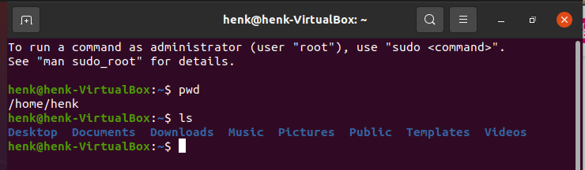
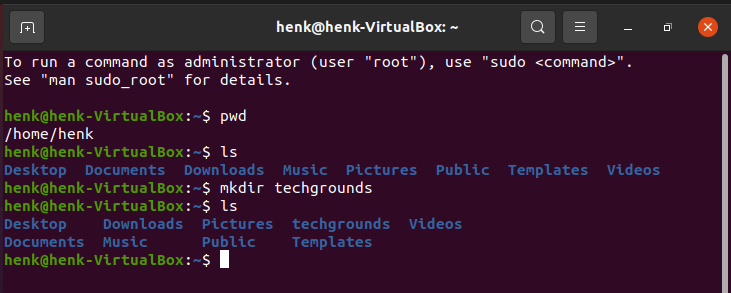
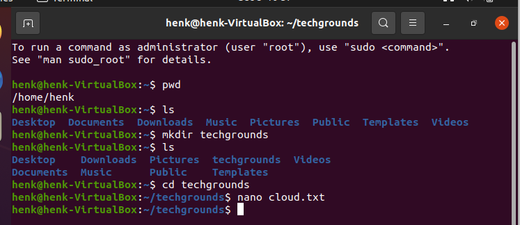
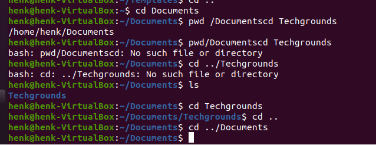

# [Files en Directories]
Linux gebruikt bestanden en mappen, net als op een windows machine.
Bij Linux heten de mappen Directories (net als vroeger bij MS-DOS).

## Key-terms
Files - bestanden  
Folders/Directories - mappen waarin de bestanden staan  
Home - startpunt als je de terminal opent in Linux  
Root directory (/) - Het linux mappen systeem start in de root en wordt weergegeven door een slash (/)  
Tilde - is een alias voor home (~)

## Opdracht
1. Zoek op wat je home directory is
2. Maak een lijst van alle bestanden en directories in je home directory.
3. Maak een directory 'techgrounds' aan in je home directory.
4. Maak in de directory 'techgrounds' een tekst bestand aan.
5. Ga door je directory structuur m.b.v. absolute en relatieve paden.

### Gebruikte bronnen
Ubuntu cheatsheet - https://purplemonkeydishwasher.co.uk/ubuntu-terminal-commands/  
Linux Relative Path and Absolute Path - https://www.linux.com/  training-tutorials/absolute-path-vs-relative-path-linuxunix/

### Ervaren problemen
Geen problemen. Het is lang geleden dat ik met Linux/Unix heb gewerkt, dus het piept en kraakt in mijn hoofd. Meer van hoe zat het ook alweer.

### Resultaat
1. M.b.v. het 'pwd' commando de home directory weergegeven
2. Het commando 'ls -l' gebruikt om alle bestanden en directories te tonen.
3. Het commando 'mkdir' gebruikt om 'techgrounds' aan te maken
4. In deze directory m.b.v. 'nano' een tekst bestand aangemaakt.
5. Gespeeld met de relatieve en absolute paden.

Alle stappen zijn terug te vinden in de afbeeldingen.  

