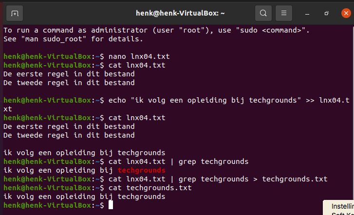

# Working with text (CLI)
Met behulp van de Command Line (CLI) moeten er een aantal taken uitgevoert worden.  
Een tekstbestand met twee regels tekst wordt gebruikt bij deze opdracht. Daarnaast wordt de output van het ene commando gebruikt voor de input van het andere commando (hiervoor wordt het woord techgrounds gebruikt).

## Key-terms
CLI - Command Line Interface  
Pipe - Is het transferen van standaard output naar een andere bestemming. Pipe is een Ubuntu commando  
Echo - Commando om input aan een bestand te geven. Kan ook de inhoud van een bestand tonen op scherm  
Cat - Commando om tekst van één of meer bestanden zichtbaar maken in de terminal. Ook kun je bestanden maken en kopieëren  

## Opdracht
1. Gebruik het echo commando en de output verwijzing om een nieuwe regel in het tekst bestand te schrijven. De nieuwe zin moet het woord 'techgrounds' bevatten.
2. Gebruik een commando om de inhoud van je bestand te tonen in de terminal.
3. Gebruik een commando om de output te filteren, zodat alleen de zin met het woord 'techgrounds' wordt getoond.
4. Doe hetzelfde als in stap 3, echter nu stuur de output naar een nieuw bestand met de naam 'techgrounds.txt'.

### Gebruikte bronnen
Ubuntu voor uitleg over de CLI en Pipe - https://ubuntu.com/tutorials/command-line-for-beginners#1-overview  
Stackoverflow voor het toepassen van de Pipe - https://ubuntu.com/tutorials/command-line-for-beginners#1-overview  
Linux - https://www.edx.org/course/introduction-to-linux (tip van Matias)

### Ervaren problemen
Geen probleem

### Resultaat
Ik heb eerst m.b.v. Nano een bestand met 2 regels gemaakt.
Daarna heb ik m.b.v. het echo commando een regel toegevoegd (gebruik gemaakt van >> file) die het woord Techgrounds bevat.

Dit heb ik gecontroleerd m.b.v. cat. Daarna m.b.v. hetzelfde commando en de toevoeging van de pipe en grep het woord "techgrounds" eruit gefilterd. Daarna met dezelfde instructie en de toevoeging dat de output naar een nieuw bestand gestuurd moet worden, ht nogmaals gedaan.

Dit wederom gecontroleerd m.b.v. cat.

Zie afbeelding voor het resultaat:  

