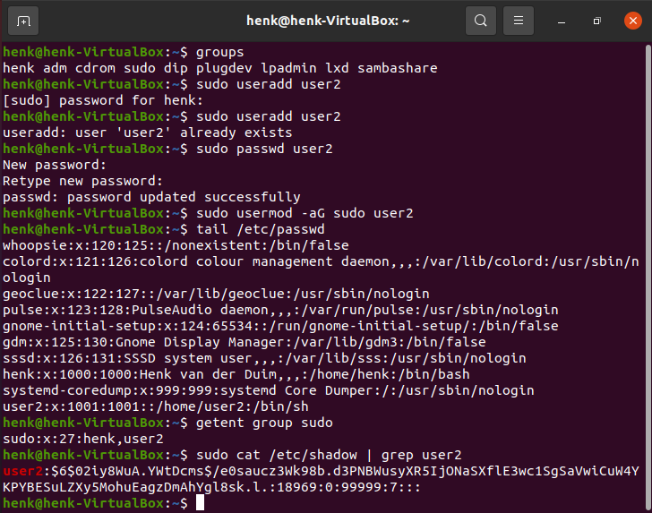

# Users and groups
Linux maakt gebruik van Gebruikers en Groepen, net zoals andere besturingssystemen dat ook doen.  
Elke gebruiker heeft z'n eigen home directory.

Daarnaast kent Linux nog een speciale gebruiker: root  
De gebruiker root mag alles op het Linux systeem. Om tijdelijk gebruik te maken van de root rechten type je 'sudo' voor elk commando. Dit werkt alleen als je permissies hebt om dit te doen.

Gebruikers, wachtwoorden en groepen worden opgeslagen in verschillende bestanden op het Linux systeem.

## Key-terms
root = de supergebruiker in een Linux systeem, gebruikers kunnen tijdelijk gebruik maken van de root rechten door 'sudo' voor een commando te typen.

## Opdracht
1. Create a new user in your VM. 
2. The new user should be part of an admin group that also contains the user you created during installation.
3. The new user should have a password.
4. The new user should be able to use ‘sudo’
5. Locate the files that store users, passwords, and groups. See if you can find your newly created user’s data in there.

### Gebruikte bronnen
User toevoegen aan sudo groep - https://phoenixnap.com/kb/how-to-create-sudo-user-on-ubuntu

### Ervaren problemen
Geen problemen

### Resultaat
Ik heb eerst gekeken of mijn gebruiker lid is van de sudo groep.  
Daarna een nieuwe gebruiker (user2) aangemaakt. Ik moest m'n eigen wachtwoord intoetsen en zag eigenlijk niets gebeuren. Nogmaals het useradd commando uitgevoerd. Kreeg een foutmelding dat de gebruiker al bestaat. En toen realiseerde ik mijn dat Linux niet zo scheutig is met meldingen.  
Wachtwoord gegeven aan user2  
Daarna user2 toegevoegd aan de sudo groep  
Bestanden laten zien die de users, wachtwoorden en groepen bevatten en controleren of user2 daar in voorkomt.  

Zie de afbeelding voor het resultaat:  

