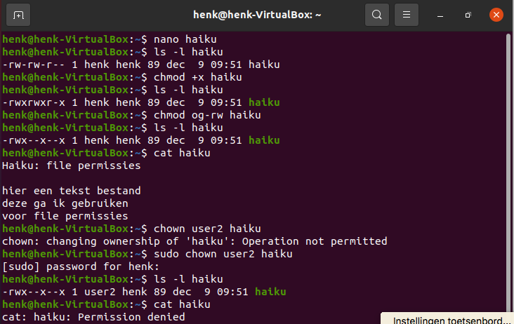
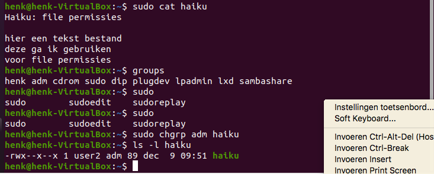

# File Permissions
Elk bestand in Linux heeft een set van rechten. Dit kunnen lees, schrijf of executie rechten zijn (read, write, execute: rwx).  
Daarnaast zijn er nog drie entiteiten die rechten hebben: de eigenaar van het bestand, de groep en alle anderen. De gebruiker root heeft geen rechten nodig voor rwx.

## Key-terms
chmod - commando om rechten aan te passen  
chown - commando om de eigenaar of groep aan te passen

## Opdracht
- Maak een tekst bestand
- Maak een lange lijst van de bestandsrechten. Wie is de eigenaar en welke groep? Welke rechten heeft het bestand?
- Maak het bestand uitvoerbaar (executable) (x).
- Verwijder de lees en schrijf rechten (rw) voor de groep en alle anderen (go). Kun je het bestand nog lezen?
- Verander de eigenaar van het bestand (user2).
- Verander het groep eigenaarschap van het bestand.

### Gebruikte bronnen
Uitleg chown: https://manpages.ubuntu.com/manpages/trusty/man1/chown.1.html  
Uitleg chmod: https://help.ubuntu.com/community/FilePermissions

### Ervaren problemen
Geen probleem

### Resultaat
- Ik heb een tekst bestand aangemaakt m.b.v. Nano  
- Daarna heb ik de lijst van bestandrechten opgevraagd, eigenaar en groep  
- Ik heb het bestand executable gemaakt en gecontroleerd of het is aangepast  
- Permissies rw verwijderd voor de group en other en gecontroleerd  
- Gecontroleerd of ik de inhoud nog steeds kan zien  
- De eigenaar veranderd van het tekst bestand (note to self: wel sudo gebruiken!). Daar gecontroleerd of er een nieuwe eigenaar is. Gekeken of ik (gebruiker: henk) het bestand kan inzien. Dat kan ik niet.  
- Daarna gekeken of ik m.b.v. het commando sudo wel kan kijken. Dat lukt.  
- M.b.v. commando groups gekeken welke groepen ik tot mijn beschikking heb.  
- De group adm wordt eigenaar van het tekst bestand. En ik controleer of deze groep de nieuwe eigenaar is.  

Zie de afbeeldingen voor de resultaten:  
  

  