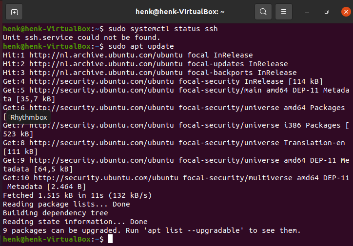
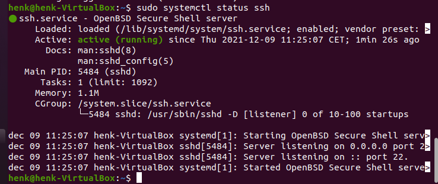
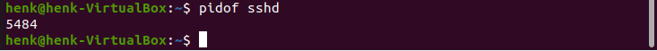
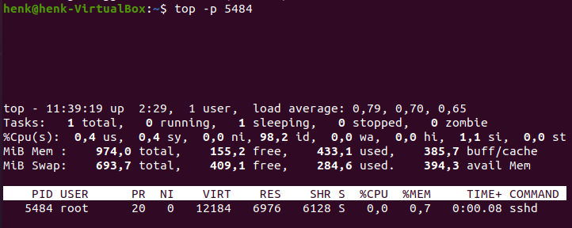
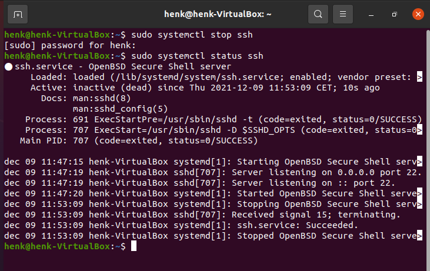

# Processen
Processen binnen Linux kennen drie categorieën:  
1. Daemons  
2. Services  
3. Programma's  

Om een Linux machine op afstand te benaderen kun je gebruik maken van ssh (secure shell). 

## Key-terms
- Daemons: draait in de achtergrond en is niet interactief
- Services: reageert op verzoeken van programma's  
- Programma's: draait en wordt gebruikt door gebruikers  
- PID: de process identifier (process ID or PID) is een nummer dat gebruikt wordt door Linux. Het wordt gebruikt om de actieve processen (uniek) te identificeren.  

## Opdracht
- Start de ssh daemon.
- Wat is de PID van de ssh daemon.
- Hoeveel geheugen gebruikt de sshd.
- Stop of kill het sshd proces.

### Gebruikte bronnen
SSH gebruiken - https://linuxize.com/post/how-to-enable-ssh-on-ubuntu-20-04/  
Stoppen en starten van sshh - https://www.cyberciti.biz/faq/howto-start-stop-ssh-server/  
Hoe monitor ik het geheugen? - https://vitux.com/5-ways-to-check-available-memory-in-ubuntu/  

### Ervaren problemen
Niet echt een probleem. Maar mijn mac book is pre-historisch, dus het installeren van de updates heeft veel tijd gekost.

### Resultaat
- Mijn eerste stap was om te zien of ssh al werkt.  
- Niet aanwezig en dus ssh geïnstalleerd (net als de 9 updates).  
- Wederom gecontroleerd of ssh werkt.
- Opgezocht wat de PID is van sshd (5484).
- M.b.v. top het geheugen gecontroleerd.
- De sshd gestopt.

Zie afbeelingen voor het resultaat:  

  

  

  

  

  