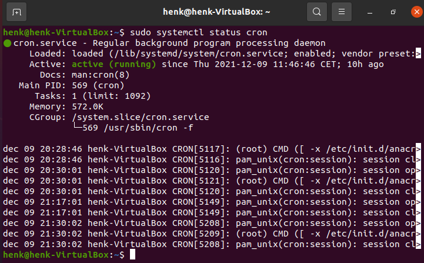
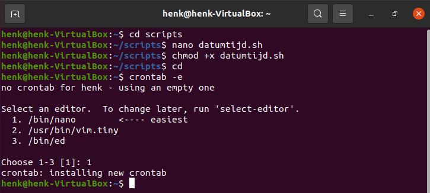
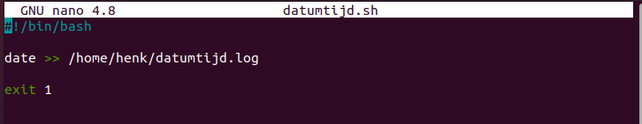
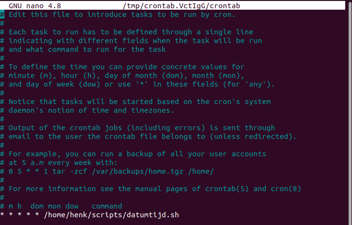
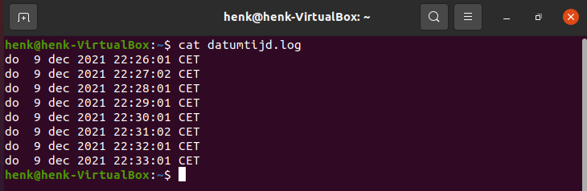
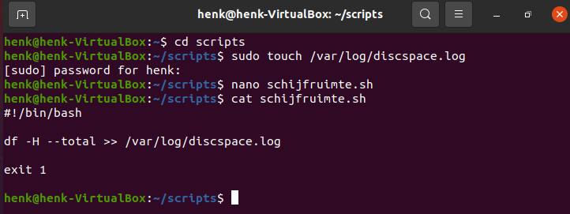
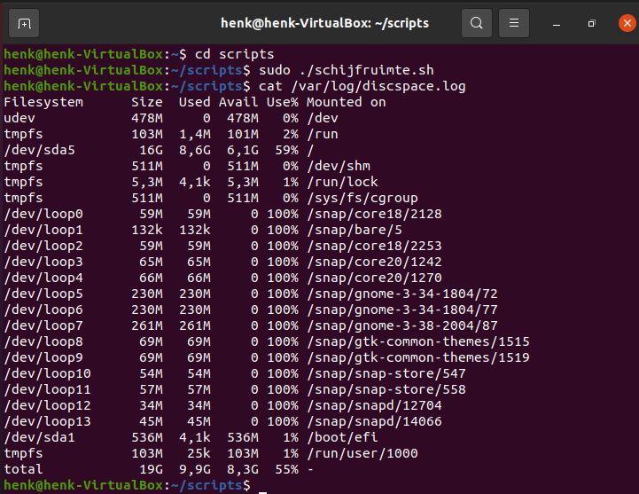
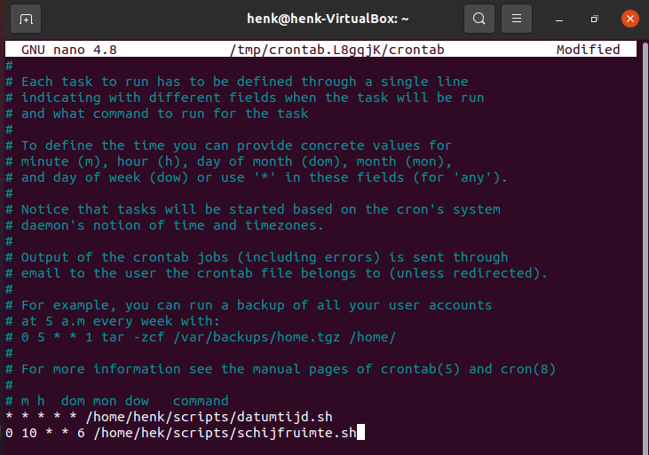

# Cron Jobs
Er zijn processen die je wilt uitvoeren volgens een schema. Bijvoorbeeld een backup die elke dag gemaakt moet worden. Of dagelijks de beschikbare schijfruimte wegschrijven in een log bestand. Of een controle die je 1 keer in de twee weken wilt uitvoeren.  
Dergelijke opdrachten noem je **cron jobs**

## Key-terms
Crontab (cron table) - Een configuratie bestand wat shell commando's die, volgens een bepaald schema, periodiek moeten draaien specificeert. 

## Opdracht
1. Maak een bash script die de huidige datum en tijd wegschrijft naar een bestand in je home directory  
2. Registreer dit script in je crontab zodat het elke minuut wordt gedraait  
3. Maak een script die de beschikbare schijfruimte wegschrijft in een log bestand in '/var/logs'.  
4. Gebruik een cron job zodat dit wekelijks gebeurt.

### Gebruikte bronnen
https://linuxize.com/post/cron-jobs-every-5-10-15-minutes/  
https://linuxhint.com/run_cron_job_every_minute/  
https://askubuntu.com/questions/73160/how-do-i-find-the-amount-of-free-space-on-my-hard-drive  
https://crontab.guru/  

### Ervaren problemen
Geen probleem

### Resultaat
1.1. Ik heb eerst gecontroleerd of cron aanwezig is. Dat was niet het geval, dus eerst deze geïnstalleerd. Daarna nogmaals een controle, die was goed.  
  

1.2. Ik heb een script (datumtijd.sh) aangemaakt, waarin de datum en tijd naar een log bestand wordt geschreven (datumtijd.log).  
  

  

1.3. Daarna heb ik een cron job aangemaakt die elke minuut het bash script start.  
  

1.4. Dit alles levert de volgende output op:  
  

2.1. Eerst een log bestand aangemaakt in /var/log. Daarna het script om de beschikbare schijfruimte weg te schrijven in het log bestand.  
  

2.2. Het bash script gestart om te zien of er daadwerkelijk iets wordt weggeschreven in het log bestand.  
  

2.3. Cron job aangemaakt, zodat het bash script wordt gestart op vrijdag om 10:00 uur 's morgens.  
  
