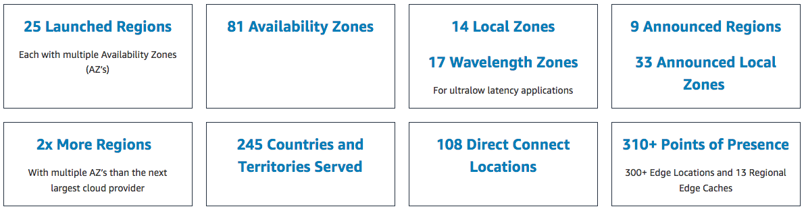
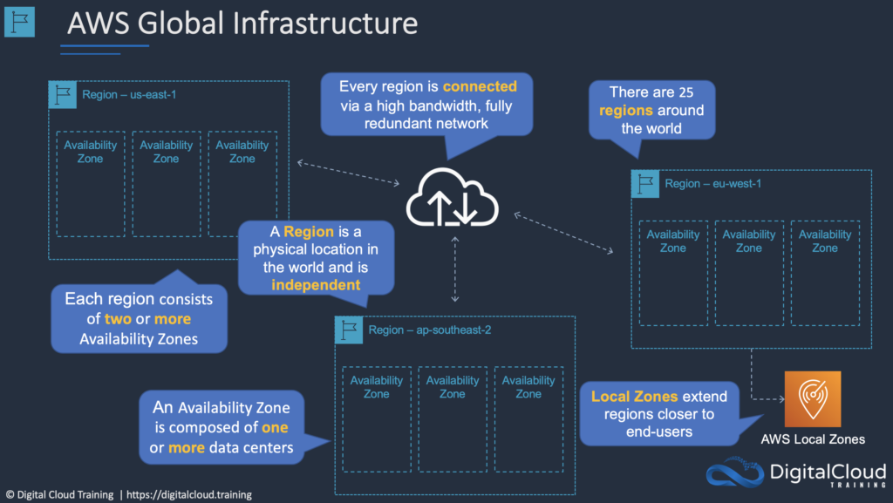
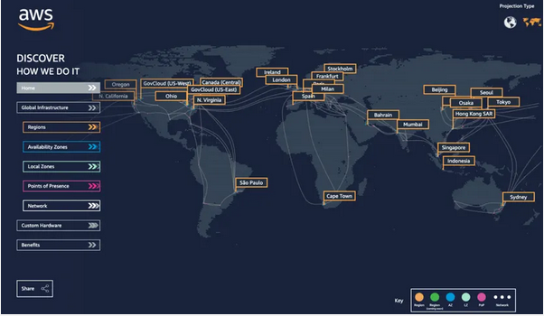
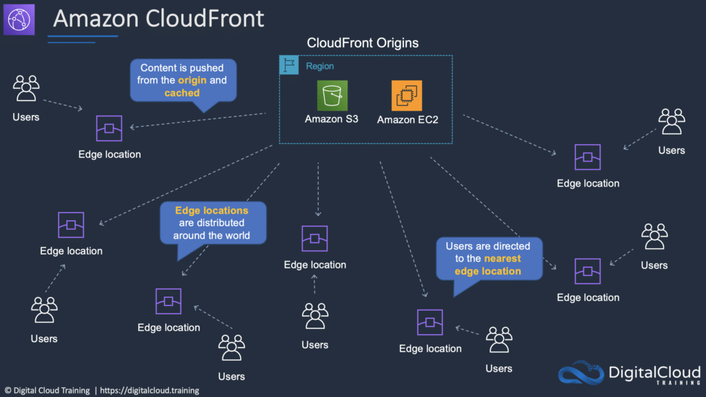
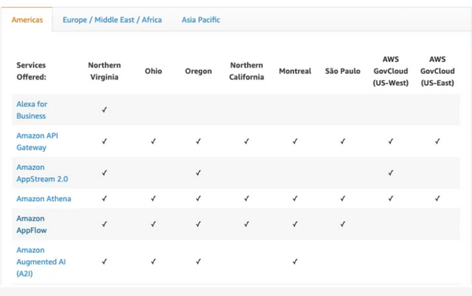

# AWS - Global Infrastucture
Alles is gevirtualiseerd in de Cloud. Van servers tot netwerken. Als klant van AWS hoef je je geen zorgen te maken over de onderliggende fysieke infrastructuur. Daarentegen kan de fysieke locatie van een applicatie wel belangijk zijn.  

De Global Infrastructure van AWS bestaat uit de volgende componenten:  
- Regions  
- Availability Zones (AZ)  
- Edge Locations  

AWS is continu aan het uitbreiden. Op dit moment zijn er:  

## Key-terms
Alle key-terms die betrekking hebben op AWS Cloud Practitioner, zijn te vinden in het document: [AWS-Cloud-Practitioner](../beschrijvingen/aws-cloud-practitioner.md)  
[AWS-Region](../beschrijvingen/aws-cloud-practitioner.md#AWSR)  
[Availability-Zones](../beschrijvingen/aws-cloud-practitioner.md#AZ)  
[Edge- Locations](../beschrijvingen/aws-cloud-practitioner.md#Edge)  
[Datacenter](../beschrijvingen/aws-cloud-practitioner.md#Datacenter)  
[Cloudfront](../beschrijvingen/aws-cloud-practitioner.md#Cloudfront)  
[Redundant](../beschrijvingen/aws-cloud-practitioner.md#Redundant)  
[Low-Latency](../beschrijvingen/aws-cloud-practitioner.md#LowLatency)  
[Instance](../beschrijving/aws-cloud-practitioner.md#Instance)  
[EC2](../beschrijvingen/aws-cloud-practitioner.md#EC2)  
[Elastic-IP](../beschrijvingen/aws-cloud-practitioner.md#Elastic-IP)  
[UPS](../beschrijvingen/aws-cloud-practitioner.md#UPS)  
[Backup](../beschrijvingen/aws-cloud-practitioner.md#Backup)  
[Tier-1](../beschrijvingen/aws-cloud-practitioner.md#Tier-1)  
[Data-Compliance](../beschrijvingen/aws-cloud-practitioner.md#Data-Compliance)  
[AMI](../beschrijvingen/aws-cloud-practitioner.md#AMI)  
[Workload](../beschrijvingen/aws-cloud-practitioner.md#Workload)

## Opdracht
De opdracht is om de volgende zaken te bestuderen:  
1. Wat is een AWS Availability Zone?
2. Wat is een Region?
3. Wat is een Edge Location?
4. Waarom zou je de ene Region verkiezen boven de ander? (bijvoorbeeld: eu-central-1 (Frankfurt) boven us-west-2 (Oregon))

### Gebruikte bronnen
https://nl.wikipedia.org/wiki/Datacenter  
https://aws.amazon.com/about-aws/global-infrastructure/  
https://digitalcloud.training/certification-training/aws-certified-cloud-practitioner/aws-global-infrastructure/  
https://aws.amazon.com/cloudfront/  
https://nl.wikipedia.org/wiki/Redundantie  
https://www.informatica.com/services-and-training/glossary-of-terms/low-latency-definition.html  
https://trailhead.salesforce.com/en/content/learn/modules/aws-cloud-technical-professionals/explore-the-aws-global-infrastructure-technical-professionals  
https://www.concurrencylabs.com/blog/choose-your-aws-region-wisely/  
(Note to self: uitzoeken of ik m.b.v. Python en de AWS Price API de totale kosten per regio kan berekenen en sorteren)  
https://docs.aws.amazon.com/awsaccountbilling/latest/aboutv2/price-changes.html   

### Ervaren problemen
Geen problemen

### Resultaat
#### Wat is een AWS Availability Zone
AWS Availability Zones zijn fysiek gescheiden en geïsoleerd van elkaar.  

AZ's omvatten een of meer datacenters en hebben directe, low latency, hoge doorvoer en redundante netwerkverbindingen tussen elkaar.  

Elke AZ is ontworpen als onafhankelijke storingszone.  

Zodra je in AWS een Instance start, kun je een AZ kiezen of AWS er eentje voor je laten kiezen.  

Als je jouw EC2-instances over meerdere Beschikbaarheidszones distribueert en één instance faalt, dan kunt je jouw toepassing zo ontwerpen dat een instance in een andere AZ de verzoeken kan afhandelen.  

Je kunt ook Elastic IP adressen gebruiken om het falen van een instance in een AZ te maskeren door het adres snel opnieuw toe te wijzen aan een instance in een andere AZ.

Een AZ wordt weergegeven door een regiocode gevolgd door een letter-ID; bijvoorbeeld eu-central-1.

Om ervoor te zorgen dat resources worden verdeeld over de AZ voor een regio, wijst AWS onafhankelijk AZs toe aan namen voor elk AWS-account.

De AZ eu-central-1 voor jouw AWS-account is bijvoorbeeld mogelijk niet dezelfde locatie als eu-central-1 voor een ander AWS-account.

Om AZs tussen accounts te coördineren, moet je de AZ ID gebruiken, een unieke en consistente identificatie voor een AZ.

AZ's zijn fysiek gescheiden binnen een typische grootstedelijke regio en bevinden zich in (overstromings)gebieden met een lager risico.

AZ's gebruiken UPS en onsite backup faciliteiten en worden gevoed via verschillende netten van onafhankelijke leveranciers.

AZ's zijn allemaal redundant verbonden met meerdere tier-1 transit providers.

De volgende afbeelding toont drie AWS-regio's die elk drie beschikbaarheidszones hebben:  
  

#### Wat is een Region
In de tekst gebruik ik het woord regio voor Region.

Een regio is een geografisch gebied.  

Elke regio bestaat uit 2 of meer AZs.

Elke Amazon regio is ontworpen om volledig geïsoleerd te zijn van de andere Amazon regio's.

Elke AWS-regio heeft meerdere AZs en datacenters.

Je kunt gegevens binnen een regio en tussen regio's repliceren met behulp van particuliere of openbare internetverbindingen.

Je behoudt de volledige controle en eigendom over de regio waarin jouw gegevens zich fysiek bevinden, waardoor het gemakkelijk is om te voldoen aan regionale compliance- en gegevensresidentievereisten.

Houd er rekening mee dat er kosten in rekening worden gebracht voor gegevensoverdracht tussen regio's.

Wanneer je een EC2-instance start, moet je een AMI selecteren die zich in dezelfde regio bevindt. Als de AMI zich in een andere regio bevindt, kun je de AMI kopiëren naar de regio die jij gebruikt.

Regio's en eindpunten:
- Wanneer je met een instance werkt met behulp van de CLI of API-acties, moet je het regionale eindpunt opgeven.  
- Om de gegevenslatentie in je toepassingen te verminderen, bieden de meeste Amazon Web Services een regionaal eindpunt waar jij je verzoeken kunt indienen.  
- Een eindpunt is een URL die het toegangspunt is voor een webservice. https://dynamodb.us-west-2.amazonaws.com is bijvoorbeeld een toegangspunt voor de Amazon DynamoDB-service. 

#### Wat is een Edge Locatie
Edge-locaties zijn Content Delivery Network (CDN)-eindpunten voor CloudFront.

Er zijn veel meer Edge locaties dan regio's.

Momenteel zijn er meer dan 200 Edge-locaties.

Regionale Edge-caches bevinden zich tussen je CloudFront Origin-servers en de Edge-locaties.

Een regionale edge-cache heeft een grotere cache-breedte dan elk van de individuele edge-locaties.

Het volgende diagram toont CloudFront Edge-locaties:  
  

#### Waarom zou je ene regio verkiezen boven de ander
Houd rekening met vier hoofdaspecten bij het beslissen in welke AWS-regio jouw applicaties en workloads worden gehost: latency, prijs, beschikbaarheid van services en data compliance.

##### Latency
Als je toepassing gevoelig is voor latency, kies je een regio die dicht bij je gebruikers ligt. Dit voorkomt lange wachttijden voor je klanten. Synchrone toepassingen zoals gaming, telefonie, WebSockets en IoT worden aanzienlijk beïnvloed door een hogere latency, maar zelfs asynchrone workloads, zoals e-commercetoepassingen, kunnen een impact hebben op de gebruikersconnectiviteit.

##### Prijs 
Vanwege de lokale economie en de fysieke aard van de operationele datacenters, kunnen de prijzen van regio tot regio verschillen. De prijsstelling in een regio kan worden beïnvloed door internetconnectiviteit, prijzen van geïmporteerde apparatuur, douane, onroerend goed en meer. In plaats van wereldwijd een vast tarief in rekening te brengen, rekent AWS op basis van de financiële factoren die specifiek zijn voor de locatie.

##### Beschikbaarheid van de dienst
Sommige services zijn mogelijk niet beschikbaar in sommige regio's. De AWS-documentatie biedt een tabel met de regio's en de beschikbare services binnen elke regio.  

##### Data Compliance 
Bedrijven moeten vaak voldoen aan regelgeving die vereist dat klantgegevens in een specifiek geografisch gebied worden opgeslagen. Indien van toepassing, moet je een regio kiezen die voldoet aan jouw data-compliance.

#### Samengevat
Jouw applicaties en infrastructuur bevinden zich in regio's en AZ's. Afhankelijk van de service die je gebruikt, moet je de juiste regio of AZ kiezen voor je workload.