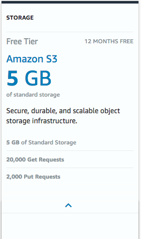
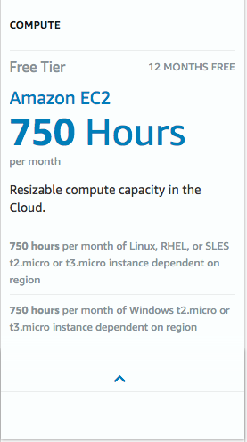

# Pricing
De kosten zijn één van de belangrijkste redenen om over te stappen naar de cloud. Als je het goed inricht en de juiste keuzes maakt, dan kunnen de kosten aanzienlijk lager zijn in vergelijking met de traditionele datacenters. Een belangrijke sleutel hierin is het pay-as-you-go model. Je betaald alleen voor wat je gebruikt.

Je betaald nooit voor inkomende gegevensoverdracht en voor gegevensoverdracht tussen diensten binnen dezelfde regio.

## Key-terms
Alle key-terms die betrekking hebben op AWS Cloud Practitioner, zijn te vinden in het document: [AWS-Cloud-Practitioner](../beschrijvingen/aws-cloud-practitioner.md)  
[TCO](../beschrijvingen/aws-cloud-practitioner.md#TCO)  
[Capex](../beschrijvingen/aws-cloud-practitioner.md#Capex)  
[Opex](../beschrijvingen/aws-cloud-practitioner.md#Opex)  

## Opdracht
- De vier voordelen van het AWS-prijsmodel.  
- AWS gratis laag voor:  
    - S3  
    - EC2  
    - Altijd gratis diensten  
- Begrijp de verschillen tussen capex en opex  

### Gebruikte bronnen
https://digitalcloud.training/certification-training/aws-certified-cloud-practitioner/aws-billing-and-pricing/  
https://aws.amazon.com/pricing/  
https://calculator.aws/#/  
https://www.techmagic.co/blog/aws-pricing-model-overview/  
https://spot.io/resources/aws-pricing-5-models-pricing-for-10-popular-aws-services/  
https://dzone.com/articles/the-cost-of-the-cloud-the-ultimate-aws-pricing-gui  
https://www.cloudhealthtech.com/blog/capex-vs-opex-cloud-cost-management  
e-Book: 
Whitepaper: [Pricing](../00_includes/aws-pricing-overview.pdf)  

### Ervaren problemen
Geen problemen

### Resultaat
#### De vier voordelen van het AWS-prijsmodel
**Principe #1: Betalen naar gebruik**  
- Het principe:  
Dit is het belangrijkste idee achter AWS - in plaats van dure infrastructuur te kopen of te bouwen, huur het. AWS zet zich in om jouw CapEx-uitgaven om te zetten in OpEx.  
Het biedt ook extreme flexibiliteit - je kan 1.000 machines voor een uur huren en ze vervolgens stoppen en alleen voor die 1.000 machine-uren betalen.

Voordeel:  
Daarom zijn organisaties overgestapt naar de cloud. Betalen per gebruik is goed voor de bankrekening omdat het overcapaciteit en verspilde computerbronnen elimineert.

Nadeel:  
Aan flexibiliteit hangt een prijskaartje. Als je echt "pay as you go" wilt, moet je genoegen nemen met Amazon's On-Demand Pricing, die zelfs voor kleine workloads behoorlijk duur kan worden, wanneer deze wordt gebruikt voor doorlopende serverimplementaties.  
Als servers geen enorme pieken of dalen in hun gebruik hebben - dan kan het draaien ervan op dedicated hosting of on-prem goedkoper zijn dan op AWS.

**Principe #2: Betaal minder door meer te gebruiken**  
- Het principe:  
AWS biedt volumekortingen. Amazon S3 en vele andere services bieden gedifferentieerde prijzen en Amazon EC2 biedt volumekortingen voor gebruikers die meer dan $ 500.000 aan initiële kosten uitgeven. Amazon biedt ook een overvloed aan services en opties voor de meeste gebruiksscenario's, zodat je tegen lagere kosten kunt overschakelen naar een service die aan jouw behoefte voldoet. Er zijn bijvoorbeeld verschillende AWS-backup-opties, waaronder de AWS-backup-service en opslagservices zoals S3, Glacier, EBS, EFS, enz. Organisaties kunnen gegevens tussen deze opslagservices verplaatsen om efficiënter te werken.

Voordeel:  
Geavanceerde gebruikers van AWS kunnen veel besparen door de workloads dynamisch tussen services te verplaatsen en schaalvoordelen te creëren.

Nadeel:  
Dit principe is ook een van de verborgen redenen voor de enorme complexiteit van Amazon. Het is waar dat je een gelaagde opslagstrategie kan maken en in veel gevallen 90% of meer besparen. Maar kennen jouw technici of IT-personeel de fijne kneepjes van elke dataservice en hebben ze de knowhow om de relevante gebeurtenissen te detecteren en gegevens selectief op te slaan in verschillende datastores? Amazon biedt de tools om dit allemaal te doen. Maar het vereist tijd en expertise, wat organisaties op zich al serieus geld gaat kosten.

**Principe #3: Bespaar wanneer u reserveert**  
- Het principe:  
De kern van AWS is de computerservice, Amazon EC2. EC2-machines worden aanzienlijk afgeprijsd (in de orde van 30-50%) als u een exemplaar voor 1-3 jaar van tevoren reserveert. Een andere optie is om "spot instances" te gebruiken - machine-instances die toevallig op een bepaald moment beschikbaar zijn en van u worden afgenomen wanneer een andere gebruiker erom vraagt. Dynamisch schakelen tussen workloads tussen spotinstances en Amazon helpen hun vraag te beheren, dat kan je nog grotere kortingen opleveren.

Voordeel:  
Amazon biedt veel prijsflexibiliteit. Je kan de kosten aanzienlijk verlagen door je voor 1 jaar of langer vast te leggen - het is mogelijk om dit selectief te doen voor sommige workloads, terwijl je andere on-demand gebruikt. De optie voor spot-instances is een creatieve optie, waarmee iedereen met expertise en de tijd om een oplossing voor spot-instances te ontwerpen, 60% op de kosten kan besparen.

Nadeel:  
1 tot 3 jaar in de cloud aan een machine-instance binden, klinkt misschien als een contradictio in terminis. Organisaties stappen over naar de cloud om computerresources op aanvraag te krijgen. Een langdurig financieel engagement staat haaks op deze flexibiliteit. Veel AWS-gebruikers beschouwen on-demand prijzen als een gegeven en betalen de prijs van flexibiliteit.

**Principe #4: gratis gebruiksniveau**  
Het principe:  
Amazon verleent 1 jaar gratis gebruik met een royale quota voor veel van zijn services, om risico's te verminderen en cloudadoptie aan te moedigen. Dit was een primaire manier waarop AWS in de beginjaren zijn aanvankelijke marktaandeel won.

De 'Free Tier Grants' zijn te vinden op deze pagina: [AWS-Free-Tier](https://aws.amazon.com/free/?all-free-tier.sort-by=item.additionalFields.SortRank&all-free-tier.sort-order=asc&awsf.Free%20Tier%20Types=*all&awsf.Free%20Tier%20Categories=*all)  

Nadeel:  
De gratis laag heeft veel organisaties en technologen geholpen om "verslaafd" te raken aan het aanbod van Amazon - het is een showcase van de verbazingwekkende diepte, breedte en technisch kunnen van hun serviceprofiel. Amazon biedt - en stimuleert - een enorme hoeveelheid verfijning binnen zijn ecosysteem. Heel vaak selecteren organisaties standaard AWS omdat het een marktleider is en de optie die het meest bekend is bij hun teams. 

#### AWS gratis laag voor
##### S3
Op de eerder genoemde [AWS-Free-Tier](https://aws.amazon.com/free/?all-free-tier.sort-by=item.additionalFields.SortRank&all-free-tier.sort-order=asc&awsf.Free%20Tier%20Types=*all&awsf.Free%20Tier%20Categories=*all) pagina is terug te vinden, wat je tot je beschikking krijgt als je kiest voor de Free Tier S3 optie.  
  

##### EC2
  

##### Always free services
Via deze link op de pagina [Always-Free-Tier](https://aws.amazon.com/free/?all-free-tier.sort-by=item.additionalFields.SortRank&all-free-tier.sort-order=asc&awsf.Free%20Tier%20Types=tier%23always-free&awsf.Free%20Tier%20Categories=*all), met geselecteerd 'Always Free' is het overzicht te vinden wat daaronder valt.

#### Begrijp de verschillen tussen capex en opex
##### Wat is CapEx?

Kapitaaluitgaven (CapEx) zijn investeringen die door een organisatie worden gedaan voor langetermijn voordelen in de toekomst. Computers, servers en andere hardware die nodig zijn voor on-premises datacenters zijn allemaal voorbeelden van CapEx. Het bedrijf betaalt deze kosten vooraf, met de verwachting dat de aankopen het bedrijf nog vele jaren ten goede zullen komen. Alle bijbehorende onderhoudskosten worden ook als CapEx beschouwd, omdat ze de levensduur van het activum verlengen.

Als het op boekhouding aankomt, staat CapEx vermeld op het kasstroomoverzicht onder het gedeelte investeren. De waarde van CapEx wordt over een aantal jaren afgeschreven, dus de volledige initiële kosten worden meestal niet in één keer van de winst- en verliesrekening van het bedrijf afgetrokken - alleen het afgeschreven bedrag wordt afgetrokken voor een bepaald jaar waarin het actief waarde heeft opgeleverd.

##### Wat is Opex

Operationele uitgaven (OpEx) zijn de lopende kosten die verband houden met de dagelijkse bedrijfsvoering. Abonnementskosten voor cloudservices worden als OpEx beschouwd: de cloudprovider doet de investering in infrastructuur vooraf en u betaalt alleen voor de resources die je nodig hebt wanneer jij ze nodig hebt.

OpEx wordt op de winst- en verliesrekening van een bedrijf weergegeven als een contante vermindering of een verhoging van de crediteurenadministratie. De kosten zijn volledig aftrekbaar in het jaar waarin de kosten zijn gemaakt. Dus als een bedrijf gedurende een jaar $ 100k uitgeeft aan cloudservices, claimt dat bedrijf een aftrek van $ 100k op zijn belastingaangifte.

##### CapEx versus OpEx voor cloudkostenbeheer

Voor elke organisatie die overweegt om naar de cloud te migreren of hun cloudgebruik uit te breiden, zijn er belangrijke verschillen tussen CapEx en OpEx om te overwegen voordat ze zich op de een of andere manier committeren.  

CAPEX | OPEX
:---- | :---
Hogere kosten vooraf betekent minder geld voor dagelijkse activiteiten of nieuwe investeringen | Geen grote initiële kosten, dus bedrijven hebben dagelijks meer cashflow en kunnen indien nodig investeren in nieuwe diensten of producten
Bedrijven zitten vast aan een langetermijn verplichting en kunnen niet gemakkelijk wijzigingen aanbrengen | De betalingstermijnen zijn korter, zodat bedrijven hun investeringen gemakkelijk kunnen aanpassen als dat nodig is
Omdat CapEx meestal aanzienlijke kosten met zich meebrengt, kan het interne goedkeuringsproces voor de aankoop lang duren | OpEx zijn over het algemeen kleinere kosten, dus het goedkeuringsproces voor de aankoop duurt niet zo lang
Bedrijven hebben volledige controle over hun infrastructuur, maar interne middelen moeten worden besteed aan het runnen, onderhouden en repareren van de infrastructuur | Externe experts (cloudproviders en/of MSP's) beheren en onderhouden de cloudinfrastructuur. Interne middelen kunnen zich richten op het creëren van waarde voor het bedrijf
Er kunnen extra onverwachte kosten nodig zijn voor onderhoud en reparaties aan de infrastructuur | De cloudprovider is verantwoordelijk voor eventuele onderhouds- of reparatiekosten
CapEx wordt gezien als een investering in het verbeteren van het bedrijf dat in de toekomst waarde zal opleveren. Dit is meestal een goed teken voor potentiële investeerders | Het kan voor een bedrijf moeilijk zijn om toekomstige waarde aan een potentiële investeerder te tonen, omdat ze betalen zoals ze gaan (tranches)
Met de snel veranderende wereld van technologie kunnen investeringen in technologie overbodig of achterhaald worden voor het einde van hun levensduur | Als er wijzigingen moeten worden aangebracht, kan het bedrijf zich snel aanpassen door het abonnement in korte tijd te annuleren, aan te passen of te upgraden
ROI wordt meestal pas lang na de aankoop gerealiseerd omdat de infrastructuur moet worden opgezet en medewerkers moeten worden opgeleid | Het bedrijf kan in veel gevallen direct ROI behalen omdat de infrastructuur wordt beheerd door de cloudprovider
Als een bedrijf zijn netto-inkomen voor een bepaald jaar wil verhogen, kan het in CapEx investeren en dat jaar slechts een klein bedrag aan kosten aftrekken | Bedrijven die OpEx betalen, hebben niet veel opties om hun winst- en verliesrekeningen er binnen een bepaald jaar anders uit te laten zien, omdat uitgaven worden afgetrokken wanneer ze worden gemaakt
Bedrijven geven vaak te veel uit om ervoor te zorgen dat ze voldoende middelen hebben voor hun behoeften (of ze kunnen te weinig uitgeven omdat ze hun behoeften hebben onderschat) | Het bedrijf kan nauwkeuriger voorspellingen doen voor het aantal resources dat ze op korte termijn nodig hebben. Als ze zich moeten aanpassen, kunnen ze op de een of andere manier snel wijzigingen aanbrengen

De mogelijkheid om over te stappen op OpEx voor investeringen in IT-infrastructuur drijft veel organisaties ertoe om workloads te verschuiven van on-premises hardware naar de openbare cloud.