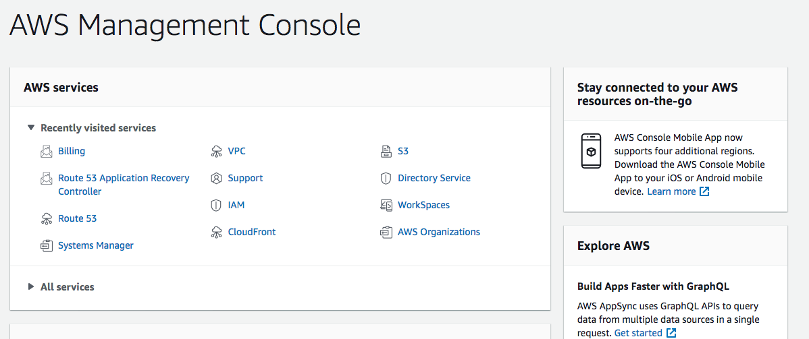
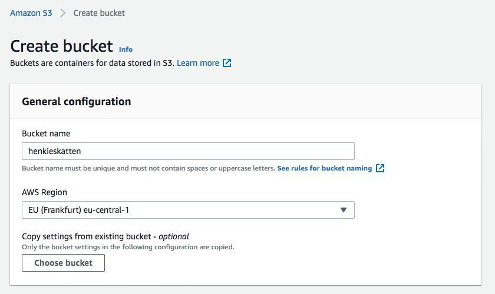
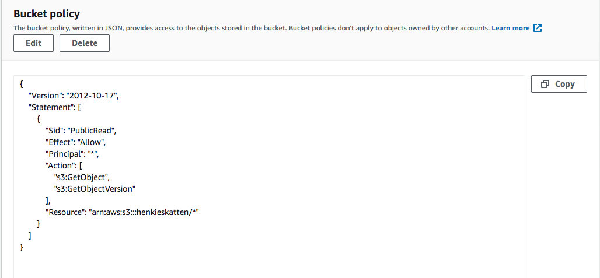
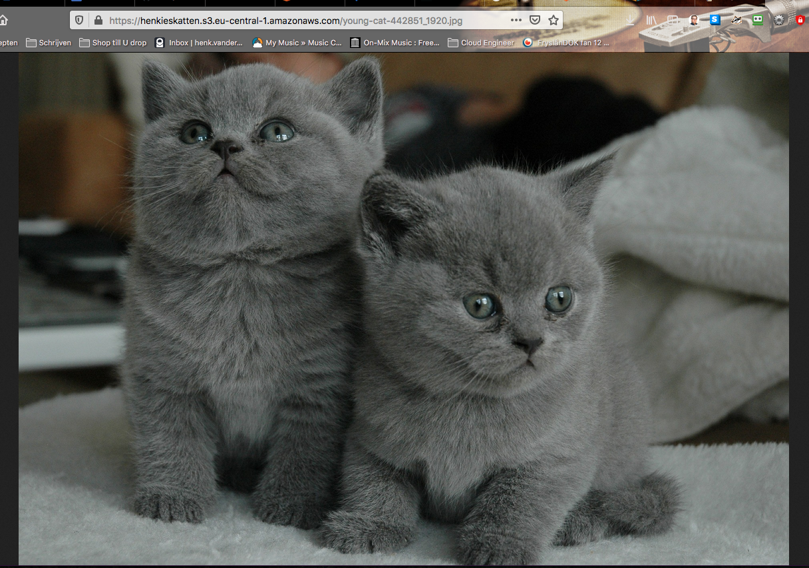
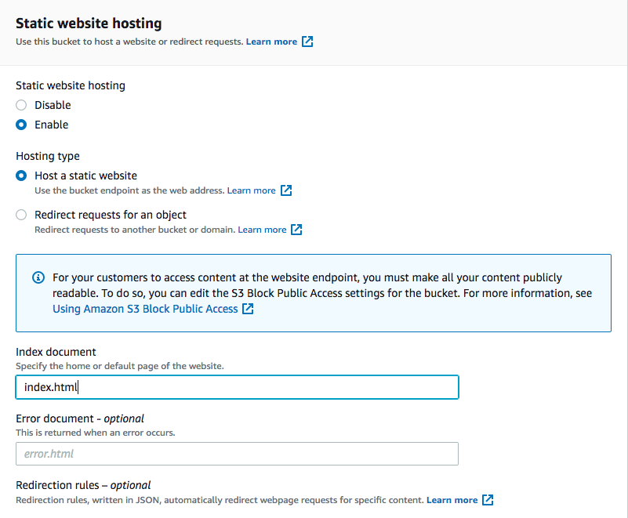
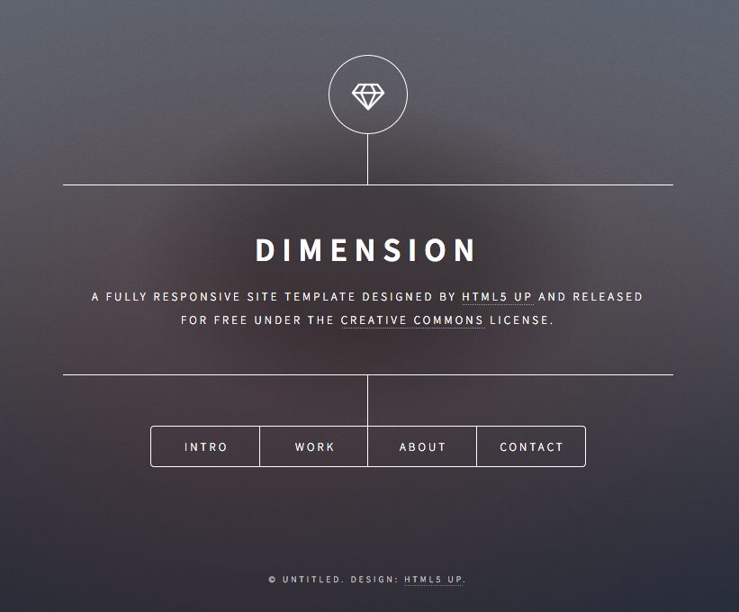

# S3
Amazon Simple Storage Service (S3) is een opslag service. Het biedt schaalbaarheid, beschikbaarheid, veiligheid en prestatie.  
Je kunt elke hoeveelheid data opslaan en beschermen. O.a. voor: data, websites, mobiele apps, backup en restore, archief, IoT devices, big data.  
Je kunt m.b.v. S3 je data optimaliseren, organiseren en configureren. Zodat je voldoet aan de specifieke eisen en compliances.

S3 kent verschillende _storage classes_

## Key-terms
Alle key-terms die betrekking hebben op AWS Cloud Practitioner, zijn te vinden in het document: [AWS-Cloud-Practitioner](../beschrijvingen/aws-cloud-practitioner.md)  
[Storage Classes](../beschrijvingen/aws-cloud-practitioner.md#StorageClasses)  
[Object Storage](../beschrijvingen/aws-cloud-practitioner.md#ObjectStorage)  
[File Storage](../beschrijvingen/aws-cloud-practitioner.md#FileStorage)  
[API](../beschrijvingen/aws-cloud-practitioner.md#API)  
[REST API](../beschrijvingen/aws-cloud-practitioner.md#REST)  
[Storage Classes](../beschrijvingen/aws-cloud-practitioner.md#StorageClasses)  

## Opdracht
### Opdracht 1
- Start je sandboxlab en open de AWS console
- Ga naar het S3 menu.
- Maak een nieuwe bucket met de volgende instellingen:
    - Region: Frankfurt (eu-central-1)
    - Public access enabled
- Upload een foto van een kat/poes in je bucket.
- Deel de object URL van je kattenfoto met een teamgenoot. Zorg ervoor dat zij de foto kunnen zien.

### Opdracht 2
- Maak een nieuwe bucket met de volgende instellingen:
    - Region: Frankfurt (eu-central-1)
    - Public access enabled
- Upload de vier bestanden van de AWS demo site.
- Enable static website hosting.
- Deel de bucket website met een teamgenoot. Zorg ervoor dat zij de website kunnen zien.

### Gebruikte bronnen
https://docs.aws.amazon.com/AmazonS3/latest/userguide/Welcome.html  
https://docs.aws.amazon.com/AmazonS3/latest/userguide/storage-class-intro.html  
https://medium.com/@kyle.galbraith/how-to-host-a-website-on-s3-without-getting-lost-in-the-sea-e2b82aa6cd38  

### Ervaren problemen
- De kattenfoto URL gaf een foutmelding (access denied). Na enig zoeken kwam ik tot de conclusie dat ik de permissions moest aanpassen en een policy moest maken. Dat heb ik in de bewuste bucket gemaakt. En daar was de foto zichtbaar.  
- De vier bestanden van de AWS Demo Website zijn nergens te vinden.
Daarom heb ik deze gebruikt: https://github.com/cloudacademy/static-website-example

### Resultaat
**Opdracht 1**  
- Sandboxlab gestart en ik ben naar de management console gegaan.  
  

- Vervolgens naar het S3 menu   

- Nieuwe bucket aangemaakt met de gevraagde instellingen.  
  

- Foto geupload naar de bucket  
- Probleem met de zichtbaarheid (access denied)  
ik heb de volgende policy gemaakt, daarna is de kattenfoto zichtbaar:  
  

- URL van de kottenfoto gedeeld met mijn teamgenoten. Die bevestigen dat ze de website zien.  
  

**Opdracht 2**  
Aantekening: op het moment van uitvoeren van deze opdracht (12-12-2021) ontbraken de benodigde bestanden. Ik ben zo vrij geweest om gebruik te maken van de bestanden uit de Github die ik noem onder de kop 'Ervaren problemen'.  

- Nieuwe bucket aangemaakt met de gevaagde instellingen.  
- De benodigde bestanden geupload  
- Toen de bucket klaargemaakt voor Static Website Hosting.
  

- Bucket gedeeld met mijn teamgenoten. En die bevestigen dat ze de website zien.  
[Henkies Website](https://henkieswebsite.s3.eu-central-1.amazonaws.com/index.html)  
  