# Elastic Compute Cloud (EC2)
EC2 is de service waarbinnen je een VM kunt draaien. Connectie met de VM maak je via internet. Als je een Linux VM hebt doe je dat middels SSH, als je een Windows VM hebt dan doe je dat via RDP

## Key-terms
Alle key-terms die betrekking hebben op AWS Cloud Practitioner, zijn te vinden in het document: [AWS-Cloud-Practitioner](../beschrijvingen/aws-cloud-practitioner.md)  
[EC2](../beschrijvingen/aws-cloud-practitioner.md#EC2)  
[SHH](../beschrijvingen/aws-cloud-practitioner.md#SSH)  
[RDP](../beschrijvingen/aws-cloud-practitioner.md#RDP)  
[AMI](../beschrijvinen/aws-cloud-practitioner.md#AMI)  
[EBS](../beschrijingen/aws-cloud-practitioner.md#EBS)  
[Firewall](../beschrijvingen/aws-cloud-practitioner.md#Firewall)  

## Opdracht
**Opdracht 1**  
- Start je sandbox en open de AWS console
- Ga naar het EC2 menu
- Launch een EC2 instance met de volgende voorwaarden:
    - AMI: Amazon Linux 2 AMI (HVM), SSD Volume Type
    - Instance type: t2.micro
    - Default network, no preference for subnet
    - Termination protection: enabled
    - User data:
        - #!/bin/bash
        yum -y install httpd
        systemctl enable httpd
        systemctl start httpd
        echo '<html><h1>Hello From Your Web Server!</h1></html>' > /var/www/html/index.html
    - Root volume: general purpose SSD, Size: 8 GiB
    - New Security Group:
        - Name: Web server SG
        - Rules: Allow SSH, HTTP and HTTPS from anywhere
    - Key Pair: vockey (this can be downloaded from the sandbox lab environment)  

**Opdracht 2**  
- Wacht tot alle Status Checks uit de initialisatie fase zijn. Als je op de Status Checks tab klikt, zou je moeten zien dat de System reachability en de Instance reachability checks gedaan moeten zijn.  
- Vind de EC2 system logs. Controleer dat de HTTP Package is geïnstalleerd.

**Opdracht 3**  
- Stop je EC2 instance (kies NIET voor terminate).
- Verander het instance type in t2.small.
- Verander het EBS volume naar 10GiB.
- Start je EC2 instance.

**Opdracht 4**  
- Terminate je EC2 instance.  
Tip: je moet eerst de terminate protection uitzetten.

### Gebruikte bronnen

### Ervaren problemen
Bij de launch van de EC2 instance krijg ik de melding dat ik niet de juiste rechten heb.
![fout][../00_includes/fout.png]  
Ik heb op Google gezocht naar oorxaken en oplossing. Inmiddels heb ik AWS CLI op de Macbook geïnstalleerd en geconfigureerd om te kunnen zien wat er aan de hand is. Ik zie een aantal melding van 'False' maar heb verder geen idee hoe dit op te lossen.  
In de AWS CLI heb ik het volgende commando gegeven:  
  
Daar kwam o.a. het volgende uit:  
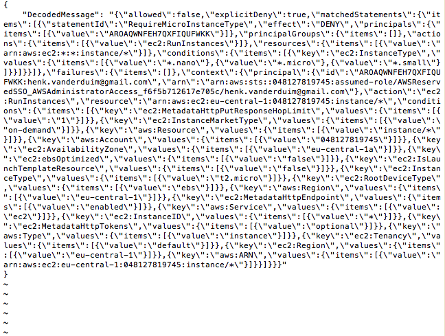  

Casper heeft in Slack aangegeven dat hij het probleem heeft gefixt. En daarna kunnen wij gewoon de EC2 instance aanmaken.

### Resultaat  
**Opdracht 1**  
In het EC2 menu kies ik voor de Launch van een Instance:  
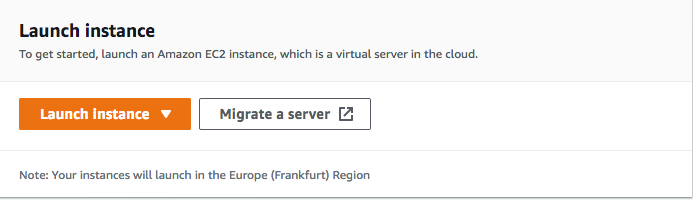  

Na alles ingevuld te hebben is dit het resultaat:  
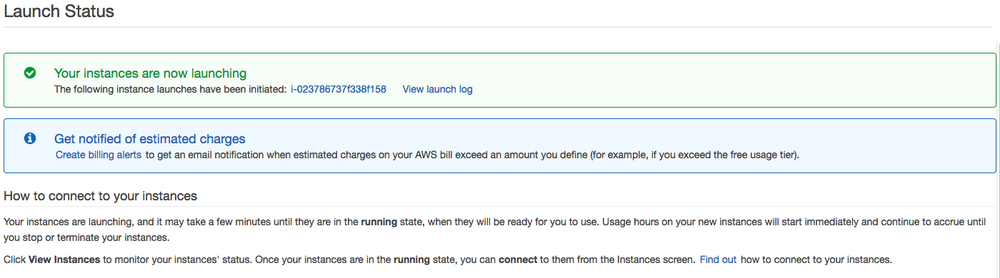  

**Opdracht 2**  
Hier zijn de status checks:  
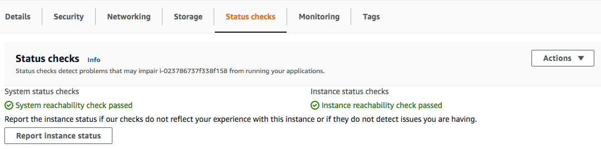  

De controle van het HTTP Package:  
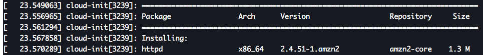  

**Opdracht 3**  
Stop de Instance:  
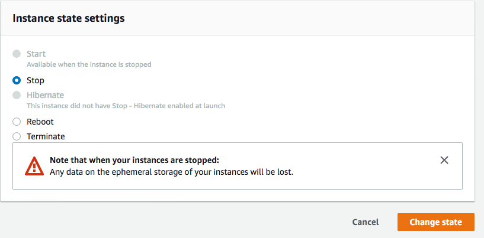

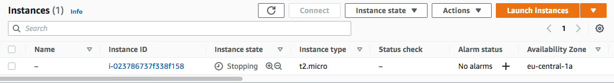

Verander het instance type:  
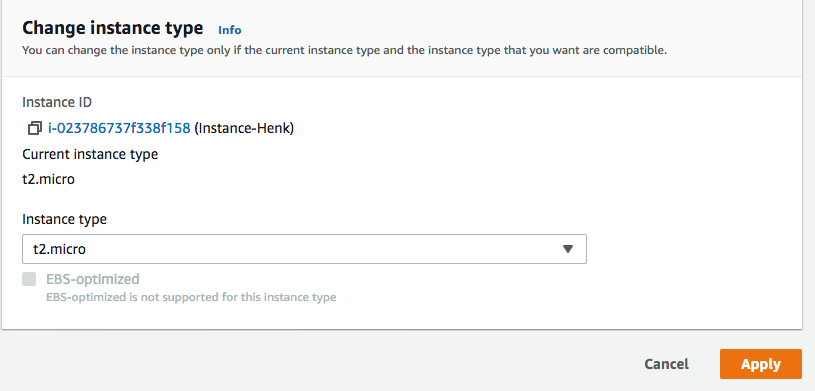

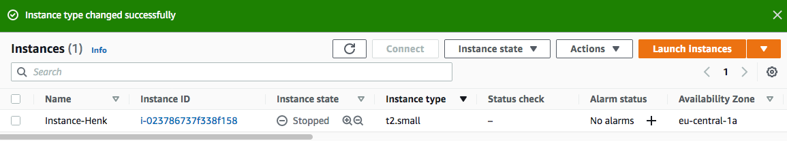

Verander het EBS volume:  
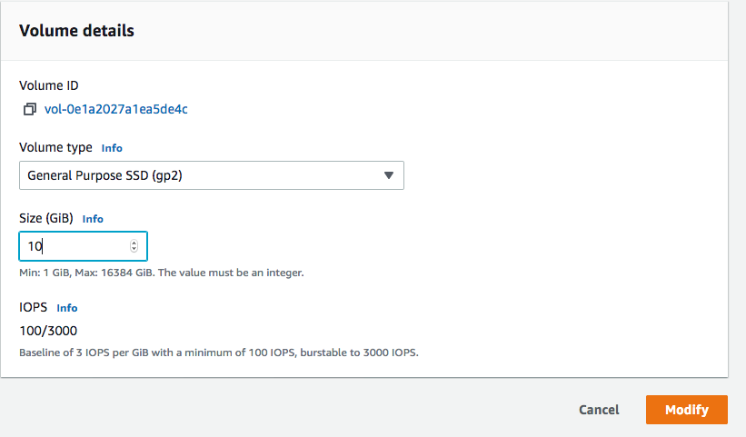

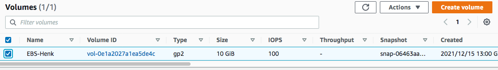

Start de EC2 instance:  
[Start](../00_includes/AWS-06k.png)

**Opdracht 4**  
Termineer je EC2 Instance  
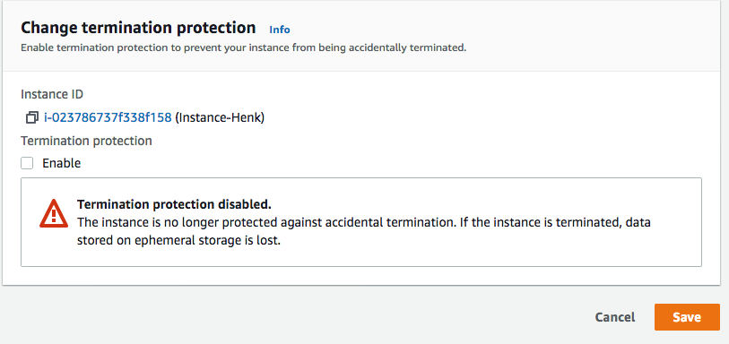

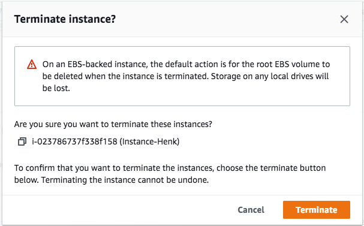

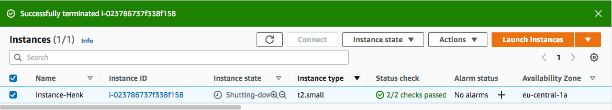
