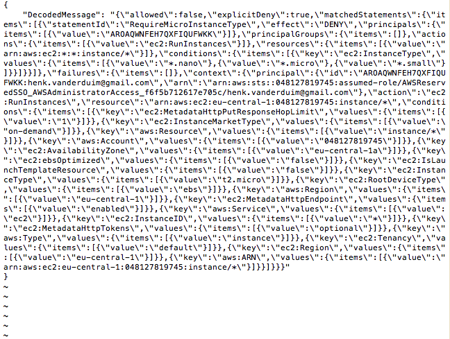

# Uitwerking Foutmelding bij Opdracht 6
Bij de launch van de EC2 instance krijg ik de melding dat ik niet de juiste rechten heb.  
Onderstaande afbeelding van de foutmelding is cryptisch. Dat doet AWS omdat er mogelijk privacy gevoelige informatie in de foutmelding zit.  
  
Ik heb op Google gezocht naar oorzaken en oplossing. Inmiddels heb ik AWS CLI op de Macbook geïnstalleerd en geconfigureerd om te kunnen zien wat er aan de hand is. Ik zie een aantal meldingen van 'False', maar er zit nog weinig logica in.   
In de AWS CLI heb ik het volgende commando gegeven:  
  
Daar kwam o.a. het volgende uit:  
  

Als ik dit in VS Code stop dan laat het een JSON overzicht zien:  
  
etc.  

Dat is al een stuk beter, maar ik kan er nog niet zoveel mee. Het heeft te maken met Policies en IAM. Dus opgezocht hoe zo'n policy opgebouwd wordt.  
In de basis zo:  
  

Dat maakt het allemaal een stuk logischer, ware het niet dat de output die ik krijg gecompliceerd is. Hier haak ik op dit moment af. Wegens een stuitend gebrek aan kennis.  

Casper heeft aangegeven dat hij het heeft gefixt. En wel op de volgende manier:  
  

Samengevat gaat het om StringNotEquals en StringNotLike, omdat je met wildcards werkt.

Om dat voor elkaar te krijgen heeft Casper de policy aangepast:  
  

Na het doornemen van alle bronnen snap ik bovenstaande. Hoe hij er achter is gekomen dat het te maken heeft met StringNotLike, daar ben ik nog niet achter. Dat is de volgende uitdaging.

### Gebruikte bronnen
- [Cloudonaut](https://iam.cloudonaut.io/reference/ec2.html)  
- https://aws.amazon.com/premiumsupport/knowledge-center/ec2-not-auth-launch/  
- https://docs.aws.amazon.com/IAM/latest/UserGuide/access_policies_manage-edit.html  
- https://www.slideshare.net/AmazonWebServices/become-an-iam-policy-ninja  
- https://docs.aws.amazon.com/IAM/latest/UserGuide/reference_policies_elements_condition_operators.html  
- https://docs.aws.amazon.com/cli/latest/reference/iam/list-policies.html  
- https://support.turbot.com/hc/en-us/articles/360042567891-Decode-an-Encrypted-Authorization-Error-message  
