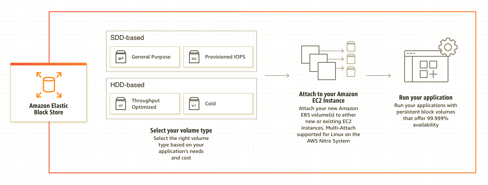
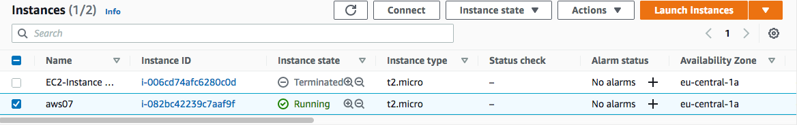
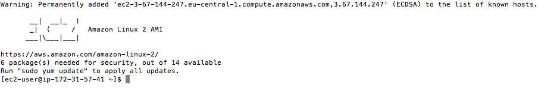

# Elastic Block Store (EBS)
EBS is als een virtuele harde schijf in de cloud. Het kan gebruikt worden als een externe harde schijf of als een interne harde schijf (root disk). Een instance bij EBS heet een volume. Je kunt een volume maar aan één EC2 instance koppelen. Je kunt wel het volume wat functioneert als een externe harde schijf koppelen en ontkoppelen aan een EC2 instance.  

## Key-terms
Alle key-terms die betrekking hebben op AWS Cloud Practitioner, zijn te vinden in het document: [AWS-Cloud-Practitioner](../beschrijvingen/aws-cloud-practitioner.md)  
[EBS](../beschrijvingen/aws-cloud-practitioner.md#EBS)  
[SSD](../beschrijvingen/aws-cloud-practitioner.md#SSD)  
[Snapshot](../beschrijvingen/aws-cloud-practitioner.md#Snapshot)  

## Opdracht
### Opdracht 1
- Start je sandbox lab en open de AWS console.
- Ga naar het EC2 menu.
- Creëer een t2.micro Amazon Linux 2 machine met alle default settings (de sleutel kun je downloaden van je sandbox lab)
- Creëer een nieuw EBS volume met de volgende randvoorwaarden:
    - Volume type: General Purpose SSD (gp2)
    - Size: 1 GiB
    - Availability Zone: dezelfde als je EC2 (eu-central-1)
- Wacht op de status melding dat het beschikbaar is.

### Opdracht 2
- Koppel je nieuwe EBS volume aan je EC2 instance.
- Verbind je met je EC2 instance m.b.v. SSH.
- Activeer (mount) het EBS volume op je instance.
- Creëer een tekstbestand en schrijf het naar je actieve EBS volume.

### Opdracht 3
- Creëer een snapshot van je EBS volume.
- Verwijder het tekstbestand van je originele EBS volume.
- Creëer een nieuw volume m.b.v. je snapshot.
- Ontkoppel je originele EBS volume.
- Koppel het nieuwe volume (snapshot) aan je EC2 instance en activeer het (mount).
- Zoek je tekstbestand op het nieuwe EBS volume.

### Gebruikte bronnen
https://aws.amazon.com/ebs/  
https://towardsaws.com/aws-instance-launching-and-disk-partition-85ae1dd34c9c  
https://www.youtube.com/watch?v=6h13JGeiE2Y  
https://aws.amazon.com/ebs/snapshots/  
https://aws.amazon.com/ebs/features/  

### Ervaren problemen
Kon de instance niet benaderen via SSH. Chis kwam met de oplossing. Zie Youtube link onder het kopje: bronnen (Internet Gateway toevoegen aan VPC/Route Table)  

### Resultaat
### Opdracht 1
  

### Opdracht 2
  

D.m.v. SSH de extra schijf klaargemaakt voor gebruik en het tekstbestand geplaatst:  

### Opdracht 3
Snapshot maken:  

Tekstbestand verwijderen:  

Nieuw volume m.b.v. Snapshot:  

Volume (Snapshot) benaderbaar maken via SSH:  

Tekstbestand is er weer:  
