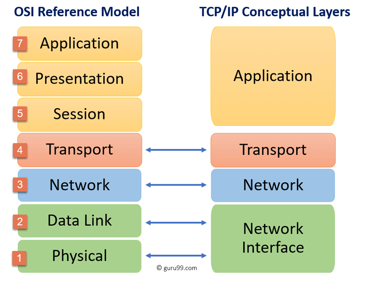
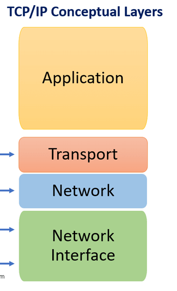
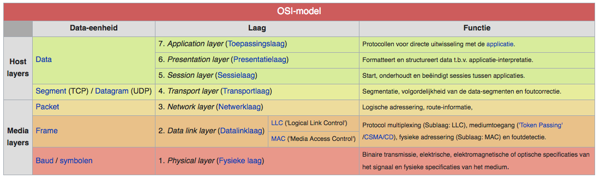

# Protocols
Een protocol is een afspraak die wij mensen gemaakt hebben over hoe computers met elkaar communiceren.

Een afbeelding met de verschillen tussen het OSI model en het TCP/IP model.  

## Key-terms
Alle key-terms die betrekking hebben op AWS Cloud Practitioner, zijn te vinden in het document: [AWS-Cloud-Practitioner](../beschrijvingen/aws-cloud-practitioner.md)  
[OSI Model](../beschrijvingen/aws-cloud-practitioner.md#OSI-model)  
[TCP](../beschrijvingen/aws-cloud-practitioner.md#TCP)  
[HTTP](../beschrijvingen/aws-cloud-practitioner.md#HTTP)  
[UDP](../beschrijvingen/aws-cloud-practitioner.md#UDP)  
[BGP](../beschrijvingen/aws-cloud-practitione.md#UDP)  
[IAB](../beschrijvingen/aws-cloud-practitioner.md#IAB)  
[IETF](../beschrijvingen/aws-cloud-practitioner.md#IETF)  
[IESG](../beschrijvingen/aws-cloud-practitioner.md#IESG)  
[RFC](../beschrijvingen/aws-cloud-practitioner.md#RFC)  

## Opdracht
- Begrijp hoe een HTTPS TCP/IP-pakket opgebouwd is
- Begrijp wie bepaalt welke protocols wij gebruiken en wat je zelf moet doen om een nieuw protocol te introduceren.
- Identificeer op zijn minst één protocol per OSI-laag.
- Facebook was recent een lange tijd niet beschikbaar. Ontdek waarom. Tip: BGP.

### Gebruikte bronnen
https://www.guru99.com/difference-tcp-ip-vs-osi-model.html  
https://nl.wikipedia.org/wiki/OSI-model  
https://nl.wikipedia.org/wiki/TCP/IP-pakket  
https://www.transip.nl/knowledgebase/artikel/2086-wat-is-tcp-udp/  
https://nl.myservername.com/7-layers-osi-model  
https://www.informit.com/articles/article.aspx?p=21406  
https://blog.cloudflare.com/october-2021-facebook-outage/  
https://engineering.fb.com/2021/10/04/networking-traffic/outage/  
https://engineering.fb.com/2021/10/05/networking-traffic/outage-details/  

### Ervaren problemen
Geen problemen

### Resultaat
#### Hoe is een HTTPS TCP/IP-pakket opgebouwd?  
Een TCP/IP pakket is opgebouwd uit vier lagen:  
  

Het HTTPS protocol bevindt zich in de Application laag van TCP/IP en in de Session laag van het OSI model. Op internet is veel discussie over de laag waar het zich in bevindt. Al deducerend kom ik tot bovenstaande conclusie.

HTTPS is in wezen een versleutelde communicatietunnel die HTTP-verkeer bevat. Deze tunnels gebruikten eerst Secure Sockets Layer (SSL) als coderingsprotocol. Tegenwoordig maakt het meeste HTTPS-verkeer gebruik van Transport Layer Security (TLS).

#### Wie bepaalt welke protocols wij gebruiken?  
Veel van de protocollen waaruit de TCP/IP-protocolsuite bestaat, zijn gestandaardiseerd of bevinden zich in het proces van standaardisatie. Bij universele overeenstemming is een organisatie die bekend staat als de **Internet** **Society** verantwoordelijk voor de ontwikkeling en publicatie van deze normen. 

De Internet Society is een professionele ledenorganisatie die toezicht houdt op een aantal raden en taakgroepen die betrokken zijn bij de ontwikkeling en standaardisatie van internet. Drie organisaties onder de Internet Society zijn verantwoordelijk voor het daadwerkelijke werk van de ontwikkeling en publicatie van normen:  
1. **Internet-architectuur Board (IAB)**:  
Verantwoordelijk voor het definiëren van de algemene architectuur van internet, het bieden van begeleiding en brede richting aan de IETF.  
2. **Internet Engineering-taak Force (IETF)**:  
De protocol engineering- en ontwikkelingstak van internet.  
3. **Internet Engineering Steering Group (IESG)**: Verantwoordelijk voor technisch beheer van IETF-activiteiten en het proces van internetstandaarden.  
#### Wat moet je doen om een protocol te introduceren?  
De daadwerkelijke ontwikkeling van nieuwe standaarden en protocollen voor internet wordt uitgevoerd door werkgroepen die zijn gecharterd door de IETF. Het lidmaatschap van een werkgroep is vrijwillig; elke geïnteresseerde kan deelnemen.  
Om deel te nemen kun je deze link volgen: [Getting Started in the IETF](https://www.ietf.org/about/participate/get-started/#participatinginmeetings).  
#### Identificeer één protocol in elke laag van het OSI model  
  

OSI Laag | Protocol
:------- | :-------
Applicatie laag (7) | **DNS**: Het Domain Name System (DNS) is het systeem en netwerkprotocol dat op het internet gebruikt wordt om namen van computers naar numerieke adressen (IP-adressen) te vertalen en omgekeerd. Hoewel dit "vertalen" genoemd wordt, is het niet meer dan opzoeken van namen in tabellen waaraan nummers gekoppeld zijn.
Presentatie laag (6) | **SNMP**: Simple Network Management Protocol (SNMP) is een toepassingslaag-protocol dat zorgt voor een gemakkelijke overdracht van managementinformatie tussen netwerkmachines. Het werkt op verscheidene protocols zoals UDP, IP, CLNS, DDP en IPX.
Sessie laag (5) | **FTP**: File transfer protocol (FTP) is een protocol dat uitwisseling van bestanden tussen computers vergemakkelijkt. Het standaardiseert een aantal handelingen die tussen besturingssystemen vaak verschillen.
Transport laag (4) | **TCP**: Het Transmission Control Protocol (TCP) is een verbindingsgeoriënteerd protocol dat veel gebruikt wordt voor gegevensoverdracht over netwerkverbindingen op het internet en op computernetwerken zoals local area networks en thuisnetwerken.
Netwerk laag (3) | **IP**: Het internetprotocol, meestal afgekort tot IP, is een netwerkprotocol waarmee computers op een computernetwerk met elkaar kunnen communiceren, zoals op het internet.
Data Link laag (2) | **PPP**: Point-to-Point Protocol (PPP) is een communicatieprotocol dat wordt gebruikt om een verbinding tot stand te brengen tussen twee computers, bijvoorbeeld een PC van een gebruiker en de inbelserver van diens internetprovider.
Fysieke laag (1) | **Ethernet (IEEE 802.3)**: De IEEE 802.3 protocolstandaarden definiëren de fysieke laag en MAC-sublaag van de datalinklaag van bekabeld Ethernet. Ethernet kan ook draadloos zijn.

#### Waarom was Facebook lange tijd niet bereikbaar?  
De urenlange downtime waar Facebook en zijn diensten mee te maken had, kwam door een wijziging bij de backbonerouters voor zijn datacenters. Het lag aan een BGP-update bij Facebook. De BGP informeert de router over de veranderingen in de prefix of trekt deze terug. Doordat dit stopte kon er niet meer verbonden worden met de Nameservers.

Details over de configuratiewijzigingen die tot de grootschalige problemen leidden heeft Facebook niet gegeven. Wel heeft Facebook aangegeven dat de verstoring resulteerde in een sneeuwbaleffect waardoor de diensten van het bedrijf onbereikbaar werden. "De onderliggende oorzaak van de uitval had ook impact op veel interne tools en systemen die we in ons dagelijks werk gebruiken, waardoor het moeilijk was om snel het probleem te constateren en te verhelpen", meldt het bedrijf.  

Door deze storing bij Facebook kwamen er veel meer DNS problemen voor. Applicaties accepteren vaak geen fouten en blijven het dan gewoon proberen. Deze drukte zorgde voor vertraging op andere pagina's.