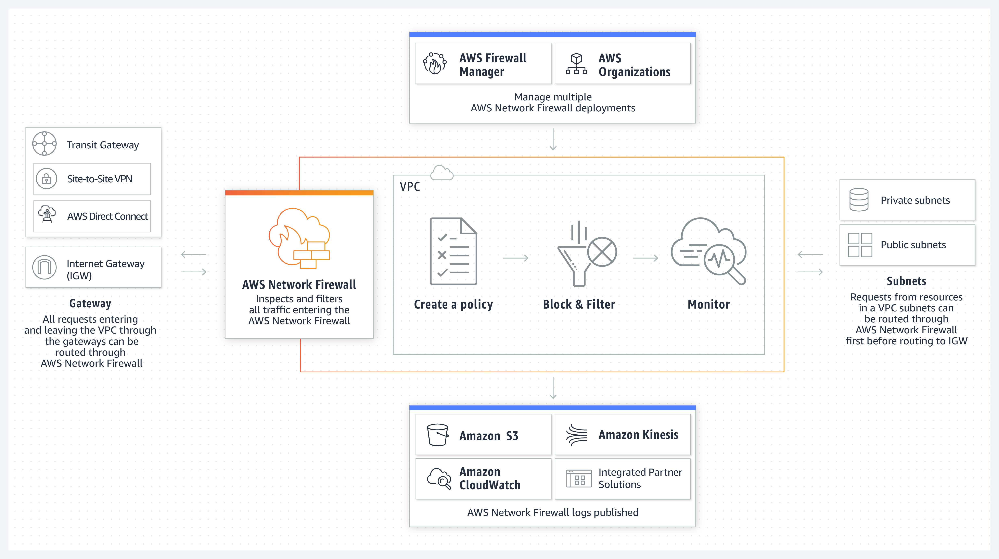

# Security Groups
Security Groups zijn virtuele stateful firewalls, die gekoppeld zijn aan instances. Ze draaien in de VPC. 

Een Security Group kan gekoppeld worden aan meerdere instances. Een instance maximaal 5 Security Groups hebben.

Een NACL (Network Access Control List) is een stateless firewall, die draait op een subnet in een VPC. Standaard is een NACL geconfigureerd om al het inkomende en uitgaande verkeer van het netwerk toe te staan.

  

## Key-terms
Alle key-terms die betrekking hebben op AWS Cloud Practitioner, zijn te vinden in het document: [AWS-Cloud-Practitioner](../beschrijvingen/aws-cloud-practitioner.md)  
[VPC](../beschrijvingen/aws-cloud-practitioner.md#VPC)  
[Firewall](../beschrijvingen/aws-cloud-practitioner.md#Firewall)  
[StatefulFirewall](../beschrijvingen/aws-cloud-practitioner.md#StatefulFirewall)  
[StatelessFirewall](../beschrijvingen/aws-cloud-practitioner.md#StatelessFirewall)  
[SecurityGroups](../beschrijvingen/aws-cloud-practitioner.md#SecurityGroups)  
[NACL](../beschrijvingen/aws-cloud-practitioner.md#NACL)  
[Suricata](../beschrijvingen/aws-cloud-practitioner.md#Suricata)  
[IDS](../beschrijvingen/aws-cloud-practitioner.md#IDS)  
[IPS](../beschrijvingen/aws-cloud-practitioner.md#IPS)  
[NSM](../beschrijvingen/aws-cloud-practitioner.md#NSM)  
[PCAP](../beschrijvingen/aws-cloud-practitioner.md#PCAP)    

## Opdracht
Geen opdracht

### Gebruikte bronnen
- https://aws.amazon.com/network-firewall/?whats-new-cards.sort-by=item.additionalFields.postDateTime&whats-new-cards.sort-order=desc  
- https://docs.aws.amazon.com/network-firewall/latest/developerguide/firewall-rules-engines.html  
- https://suricata.io/  
- https://docs.aws.amazon.com/index.html  

### Ervaren problemen
Geen probleem

### Resultaat
Geen opdracht.