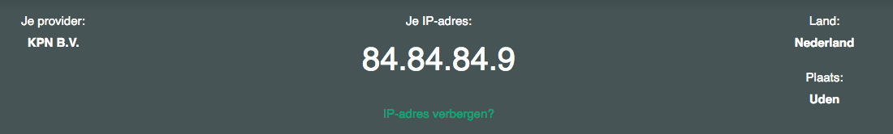
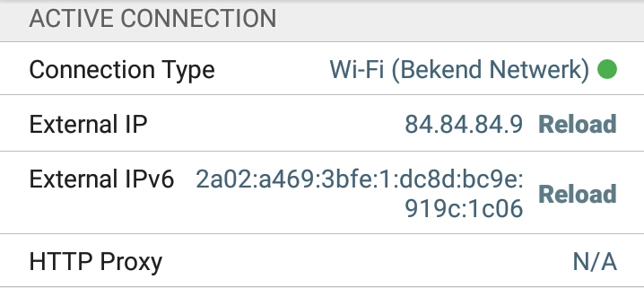
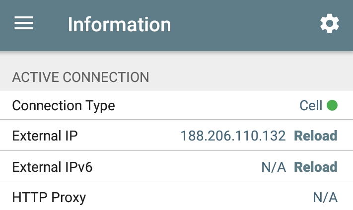
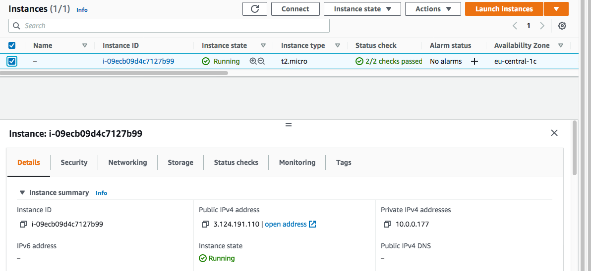
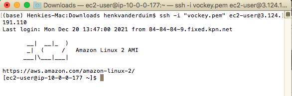
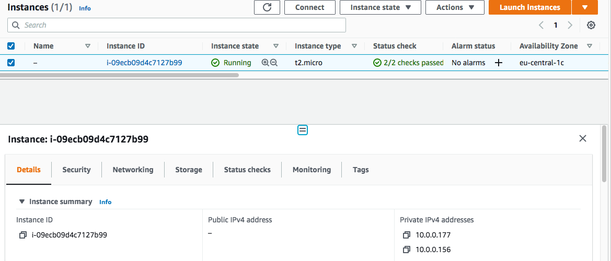
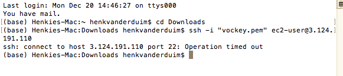

# IP Adressen
Met een IP-adres wordt een computer herkend die op internet is aangesloten. Zo’n adres is vergelijkbaar met een telefoonnummer. Elk apparaat dat met internet wordt verbonden krijgt een unieke code. Zo’n numeriek label wordt ook toegewezen bij deelname aan andere computernetwerken die op basis van IP communiceren.

## Key-terms
Alle key-terms die betrekking hebben op AWS Cloud Practitioner, zijn te vinden in het document: [AWS-Cloud-Practitioner](../beschrijvingen/aws-cloud-practitioner.md)  
[IP-adres](../beschrijvingen/aws-cloud-practitioner.md#IP-adres)  
[IPv4](../beschrijvingen/aws-cloud-practitioner.md#IPv4)  
[IPv6](../beschrijvingen/aws-cloud-practitioner.md#IPv6)  
[Public-IP](../beschrijvingen/aws-cloud-practitioner.md#Public-IP)  
[Private-IP](../beschrijvingen/aws-cloud-practitioner.md#Private-IP)  
[NAT](../beschrijvingen/aws-cloud-practitioner.md#NAT)  

## Opdracht
- Ontdek wat je publieke IP adres is van je laptop en mobiel op wifi
- Ontdek wat je publieke IP adres is op je mobiel via mobiel internet (als mogelijk)
- Maak een VM in je cloud met een publiek IP. Maak verbinding met deze VM.
- Verwijder het publieke IP adres van je VM. Begrijp wat er gebeurt met je verbinding.

### Gebruikte bronnen
- https://www.kpn.com/zakelijk/blog/wat-is-een-ip-adres-wat-kun-je-ermee-en-hoe-werkt-het.htm  
- https://stackoverflow.com/questions/38533725/can-i-remove-the-public-ip-on-my-instance-without-terminating-it  

### Ervaren problemen
Geen probleem

### Resultaat
Publieke IP adres van de laptop:  
  

Publieke IP adres van de smartphone:  
  

Publieke IP adres van de smartphone (zonder WiFi):  
  

VM met Public IP  
  

Benaderd via Terminal (CLI)  
  

Public IP verwijderd  

Geprobeert te benaderen via de Terminal. Er verschijnt een time-out. Dat klopt want het public IP is verdwenen.  
