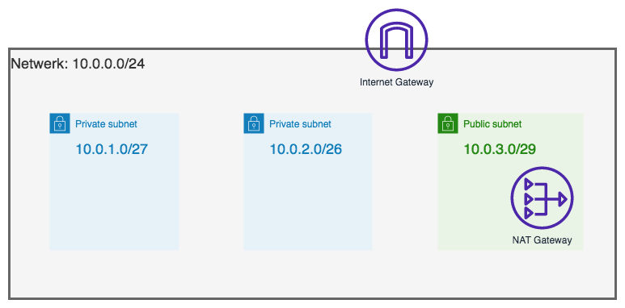

# Subnetting
Een subnet, of subnetwerk, is een netwerk binnen een netwerk. Subnetten maken netwerken efficiënter. Door middel van subnetting kan netwerkverkeer een kortere afstand afleggen zonder onnodige routers te passeren om zijn bestemming te bereiken.  

  

Opbouw IP Subnet:  

## Key-terms
Alle key-terms die betrekking hebben op AWS Cloud Practitioner, zijn te vinden in het document: [AWS-Cloud-Practitioner](../beschrijvingen/aws-cloud-practitioner.md)  
[Subnet](../beschrijvingen/aws-cloud-pratitioner.md#Subnet)  
[Public Subnet](../beschrijvingen/aws-cloud-practitioner.md#Public-Subnet)  
[Private Subnet](../beschrijvingen/aws-cloud-practitioner.md#Private-Subnet)  
[NAT Gateway](../beschrijvingen/aws-cloud-practitioner.md#NAT)  
[Internet Gateway](../beschrijvingen/aws-cloud-practitioner.md#Internet-Gateway)  
[CIDR](../beschrijvingen/aws-cloud-practitioner.md#CIDR)  
[LAN](../beschrijvingen/aws-cloud-practitioner.md#LAN)  
[Subnet Mask](../beschrijvingen/aws-cloud-practitioner.md#Subnet-Mask)  
[VLSM](../beschrijvingen/aws-cloud-practitioner.md#VLSM)  

## Opdracht
- Maak een netwerkarchitectuur die voldoet aan de volgende eisen:
    - 1 private subnet dat alleen van binnen het LAN bereikbaar is. Dit subnet moet minimaal 15 hosts kunnen plaatsen.
    - 1 private subnet dat internet toegang heeft via een NAT gateway. Dit subnet moet minimaal 30 hosts kunnen plaatsen (de 30 hosts is exclusief de NAT gateway).
    - 1 public subnet met een internet gateway. Dit subnet moet minimaal 5 hosts kunnen plaatsen (de 5 hosts is exclusief de internet gateway).
- Plaats de architectuur die je hebt gemaakt inclusief een korte uitleg in de Github repository die je met de learning coach hebt gedeeld.

### Gebruikte bronnen
- https://nl.wikipedia.org/wiki/Subnet  
- https://www.digitalocean.com/community/tutorials/understanding-ip-addresses-subnets-and-cidr-notation-for-networking  
- https://www.youtube.com/watch?v=ecCuyq-Wprc  
- https://docs.aws.amazon.com/AmazonECS/latest/developerguide/create-public-private-vpc.html  
- https://subnettingpractice.com/vlsm.html  

### Ervaren problemen
Geen probleem

### Resultaat
#### Opdracht 1
1 private subnet, niet van buitenaf benaderbaar en minimaal 15 hosts.

Subnet | Hosts | Subnet Mask
:----- | :---- | :----------
8 | 32 | /27

Network IP adres: 10.0.0.0

Dan kom ik tot het volgende private subnet:  
Network ID | Broadcast ID  | Mask | Slash | Range | Wildcard
:--------- | :------------ | :--- | :---- | :---- | :-------
10.0.1.0 | 10.0.1.31 | 255.255.225.224 | /27 | 10.0.1.1 - 10.0.1.30 | 0.0.0.31

#### Opdracht 2
1 private subnet, internet toegang via NAT Gateway (public subnet) en minimaal 30 hosts.

Subnet | Hosts | Subnet Mask
:----- | :---- | :----------
4 | 64 | /26

Private IP adres: 10.0.2.0  

Dan kom ik tot het volgende private subnet:  
Network ID | Broadcast ID  | Mask | Slash | Range | Wildcard
:--------- | :------------ | :--- | :---- | :---- | :-------
10.0.2.0 | 10.0.2.31 | 255.255.255.192 | /26 | 10.0.2.1 - 10.0.2.30 | 0.0.0.31

#### Opdracht 3
1 public subnet, Internet Gateway en minimaal 5 hosts.

Subnet | Hosts | Subnet Mask
:----- | :---- | :----------
32 | 8 | /29

Public IP adres: 10.0.3.0

Dan kom ik op het volgende subnet:  
Network ID | Broadcast ID  | Mask | Slash | Range | Wildcard
:--------- | :------------ | :--- | :---- | :---- | :-------
10.0.3.0 | 10.0.3.7 | 255.255.255.248 | /29 | 10.0.3.1 - 10.0.3.6 | 0.0.0.7

De architectuur van de opdrachten is als volgt weergegeven:  
