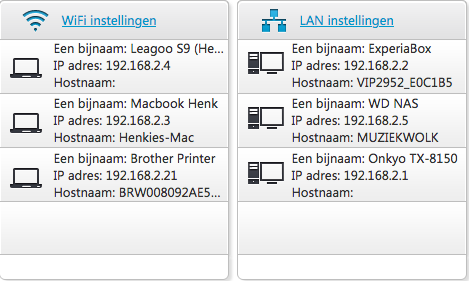
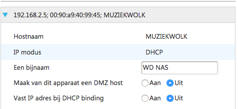
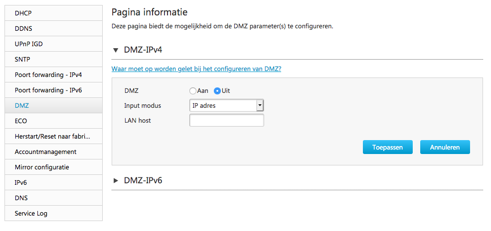
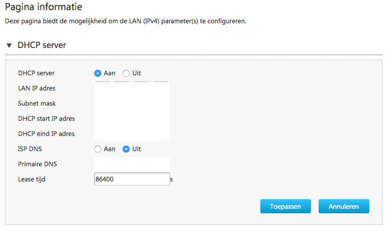

# Netwerkapparatuur
Er bestaat geen netwerk zonder netwerkapparatuur als je meer dan twee computers aan elkaar wilt schakelen. 

Een korte, en zeker niet complete, lijst van netwerkapparatuur volgt:
- router
- switch
- repeaters
- access point 

Elk apparaat in de lijst dragen bij dat je data bezorgd wordt bij de juiste computer. En vaak zijn ze slim genoeg om samen te onderhandelen zodat jij, als gebruiker, geen zorgen hoeft te maken over de instellingen. Je netwerkapparaten blijven het doen zelfs als je computers toegevoegd of verwijderd van je netwerk. Protocollen zijn hier belangrijk in.

Implementaties van netwerkapparatuur kan ook verschillen: er bestaan meerdere vormen van een switch die werken op verschillende lagen van het OSI-model.

## Key-terms
Alle key-terms die betrekking hebben op AWS Cloud Practitioner, zijn te vinden in het document: [AWS-Cloud-Practitioner](../beschrijvingen/aws-cloud-practitioner.md)  
[Netwerkapparaten](../beschrijvingen/aws-cloud-practitioner.md#Netwerkapparaten)  
[DHCP](../beschrijvingen/aws-cloud-practitioner.md#DHCP)  
[UDP](../beschrijvingen/aws-cloud-practitioner.md#UDP)  

## Opdracht
- Benoem en beschrijf de functies van veel voorkomend netwerkapparatuur
- Meeste routers hebben een overzicht van alle verbonden apparaten, vindt deze lijst. Welke andere informatie heeft de router over aangesloten apparatuur?
- De standaard instellingen
- Waar staat je DHCP server op jouw netwerk? Wat zijn de configuraties hiervan?
- Bekijk wat netwerkapparatuur voor bedrijven meer kunnen doen.

### Gebruikte bronnen
- https://www.netinbag.com/nl/internet/what-are-network-devices.html  

### Ervaren problemen
Geen probleem

### Resultaat
#### Benoem en beschrijf de functies van veel voorkomende netwerkapparatuur
 - Router: De router is het equivalent van een elektronische verkeersagent die gegevensverkeer tussen de computers verwerkt.

Hoe weet de router waar het verkeer heen moet? 
Het antwoord is dat op elke computer in het netwerk een netwerkkaart moet zijn geïnstalleerd. Deze netwerkapparaten bevatten elk een uniek adres. In een bedraad netwerk loopt speciale bekabeling, Ethernet genaamd, van de netwerkkaart naar de hub. In een draadloos netwerk communiceren de netwerkkaarten en router/hub met behulp van radiogolven. 
 - Netwerkkaarten: Een netwerkkaart is een stukje hardware dat ervoor zorgt dat je je computer of laptop kunt aansluiten op een netwerk of internet. Vaak wordt een netwerkkaart aangegeven met de afkorting NIC, dit staat voor Network Interface Card.

Netwerkkaarten identificeren zichzelf op het netwerk en verzenden alle aanvragen naar de router met het unieke retouradres inbegrepen. De router leest het "Aan" -adres en het "Van" -adres en routeert het verkeer dienovereenkomstig.
 - Switch: Een switch is een apparaat in de infrastructuur van pakketgeschakelde computernetwerken dat tot doel heeft toestellen met elkaar te verbinden door het ontvangen, verwerken en doorzenden van ontvangen frames.
 - Access Point: In computernetwerken is een WAP ofwel wireless access point een apparaat dat het wificlients mogelijk maakt om verbinding te maken met een draadloos netwerk volgens een van de wifistandaarden. Bij publiek toegankelijke wifinetwerken geeft de WAP toegang tot internet nadat de persoon is geautoriseerd bij het netwerk.
 - Firewall: Een firewall is een systeem dat de middelen van een netwerk of computer kan beschermen tegen misbruik van buitenaf. Het beschermde netwerk is vaak een intranet of intern netwerk en dit wordt beschermd tegen het internet. 

 In de thuissituatie zit deze vaak in de router al ingebouwd.
 - Repeater: Een repeater is een zend-ontvanginstallatie die een signaal ontvangt en op een andere frequentie, signaalniveau en/of hoger vermogen realtime weer uitzendt. Het doel is een groter bereik te verkrijgen en zo communicatie over grotere afstanden mogelijk te maken. 

 #### Overzicht verbonden apparaten
 Ik heb de IP adressen veranderd t.b.v. screenshots  
   

 Extra informatie:  
 

 #### De standaard instellingen
 

 #### DHCP server
 

 #### Wat kan netwerkapparatuur nog meer voor bedrijven doen
 Afhankelijk van waar het netwerk zich bevindt kan netwerkapparatuur van betekenis zijn voor bedrijven.  
 Stel het bevindt zich in een industriële omgeving, dan zullen de eisen voor de apparatuur anders zijn dan bij een kantooromgeving.  
 Zwaardere en robuustere apparaten zijn dan nodig, die onder extreme omstandigheden blijven functioneren.  
 Terwijl er in de kantooromgeving - die fijnmaziger is - voor meer van hetzelfde zal nodig zijn.

 Daarnaast zal netwerkapparatuur een bijdrage levereen in het verdelen van de load van het verkeer.  

 Ook de bouwkundige omvang bepaalt welke netwerkapparatuur geschikt is voor bedrijven. Als er afstanden overbrugt moeten voor verbindingen tussen twee gebouwen, zal deze voor koperbedrading nooit meer dan 90 meter mogen zijn. Dat bepaalt mede de apparatuur. Lange dan 90 meter, dan komt glasvezel al snel om de hoek kijken. En dus andere apparatuur.
