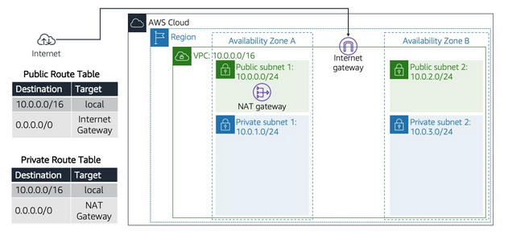
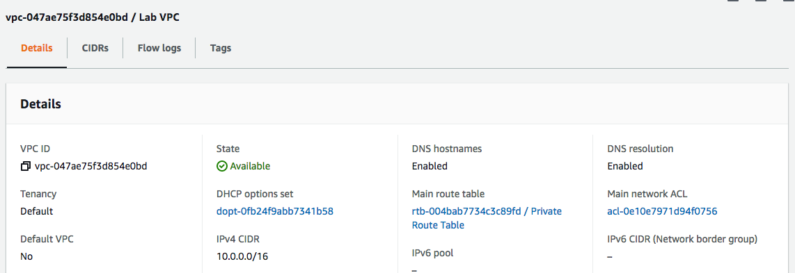

# Virtual Private Cloud (VPC)
Amazon VPC wordt doorgaans beschreven als een virtueel privédatacenter in de cloud. Het is een virtueel netwerk dat logisch geïsoleerd is van andere VPC's.  
Met een VPC heb je volledige controle over het ontwerp van het netwerk. Je kunt subnetten, internetgateways (igw), NAT-gateways, VPN-verbindingen en meer maken.

Er is altijd een standaard VPC wanneer je een nieuw AWS-account aanmaakt, maar je kunt maximaal 5 niet-standaard VPC's per regio per account toevoegen. Dit is een zachte limiet. Dat wil zeggen, je kunt verzoeken om de limiet te verhogen.
Bij veel services, zoals EC2, RDS en ECS, moet een VPC worden geplaatst.

Wanneer je een VPC aanmaakt, moet je een CIDR-blok toewijzen. Kies jouw CIDR-blok en subnetmasker zorgvuldig, aangezien ze voldoende subnetten en hosts moeten toestaan en niet kunnen worden gewijzigd nadat ze zijn gemaakt.

Subnetten kunnen openbaar of privé zijn. Het enige verschil is dat privé-subnetten geen vermelding hebben voor de internetgateway (igw) in hun routetabel, waar openbare subnetten dat wel hebben. Met andere woorden, privé-subnetten hebben geen toegang tot internet zonder een NAT-gateway of een NAT-instantie.

VPC's werken op regionaal niveau, terwijl subnetten slechts in één enkele beschikbaarheidszone kunnen worden geplaatst.

Elastische IP's zijn ook beschikbaar via het VPC-menu. EIP's zijn openbare IP-adressen die dynamisch kunnen worden toegewezen aan bronnen zoals EC2-instanties of NAT-gateways.

## Key-terms
Alle key-terms die betrekking hebben op AWS Cloud Practitioner, zijn te vinden in het document: [AWS-Cloud-Practitioner](../beschrijvingen/aws-cloud-practitioner.md)  
[CIDR](../beschrijvingen/aws-cloud-practitioner.md#CIDR)  
[Elastic IP - EIP](../beschrijvingen/aws-cloud-practitioner.md#Elastic-IP)  

## Opdracht
### OPDRACHT 1
- Navigeer naar het VPC-menu in jouw sandbox-omgeving.
- Wijs een elastisch IP-adres toe aan jouw account.
- Gebruik de optie Launch VPC Wizard om een nieuwe VPC te maken met de volgende vereisten:
    - Regio: Frankfurt (eu-central-1)
    - VPC met een openbaar en een privé subnet
    - Naam: Lab VPC
    - CIDR: 10.0.0.0/16
- Vereisten voor het openbare subnet:
    - Naam: Openbaar subnet 1
    - CIDR: 10.0.0.0/24
    - AZ: eu-central-1a
- Vereisten voor het privé-subnet:
    - Naam: Privé subnet 1
    - CIDR: 10.0.1.0/24
    - AZ: eu-central-1a

### OPDRACHT 2
- Maak een extra openbaar subnet met de volgende vereisten:
    - VPC: Lab-VPC
    - Naam: Openbaar subnet 2
    - AZ: eu-central-1b
    - CIDR: 10.0.2.0/24
- Maak een extra privé-subnet met de volgende vereisten:
    - VPC: Lab-VPC
    - Naam: Privé-subnet 2
    - AZ: eu-central-1b
    - CIDR: 10.0.3.0/24
- Bekijk de hoofdroutetabel voor Lab VPC. Het moet een vermelding hebben voor de NAT-gateway. Hernoem deze routetabel naar Private Route Table.
- Koppel de privéroutetabel expliciet aan uw twee privésubnetten.
- Bekijk de andere routetabel voor Lab VPC. Het moet een vermelding hebben voor de internetgateway. Hernoem deze routetabel naar Public Route Table.
- Koppel de openbare routetabel expliciet aan uw twee openbare subnetten.

### OPDRACHT 3
- Maak een beveiligingsgroep met de volgende vereisten:
    -= Naam: Web SG
    - Beschrijving: HTTP-toegang inschakelen
    - VPC: Lab-VPC
    - Inkomende regel: HTTP-toegang overal toestaan
    - Uitgaande regel: al het verkeer toestaan

### OPDRACHT 4
- Start een EC2-instantie met de volgende vereisten:
    - AMI: Amazon Linux 2
    - Type: t3.micro
    - Subnet: Openbaar subnet 2
    - Openbare IP automatisch toewijzen: Inschakelen
    - Gebruikersgegevens:
        '#!/bin/bash
        '# Install Apache Web Server and PHP
        'yum install -y httpd mysql php
        '# Download Lab files
        'wget https://aws-tc-largeobjects.s3.amazonaws.com/CUR-TF-100-RESTRT-1/80-lab-vpc-web-server/lab-app.zip
        'unzip lab-app.zip -d /var/www/html/
        '# Turn on web server
        chkconfig httpd on
        service httpd start
    - Tag:
        - Key: Name
        - Value: Webserver
        - Security Group: Web SG
        - Key pair: no key pair
- Maak verbinding met uw server via de openbare IPv4-DNS-naam.

### Gebruikte bronnen
- https://docs.aws.amazon.com/vpc/latest/userguide/what-is-amazon-vpc.html  
- https://aws.amazon.com/premiumsupport/knowledge-center/intro-elastic-ip-addresses/  

### Ervaren problemen
Bij opdracht 3 moeten wij HTTP Access geven. Echter als er dan m.b.v. de IPv4 DNS opgestart wordt, komt er automatisch HTTPS in de browserbalk te staan. 'S' weghalen en het werkt.

### Resultaat
### Opdracht 1

### Opdracht 2

### Opdracht 3

### Opdracht 4

