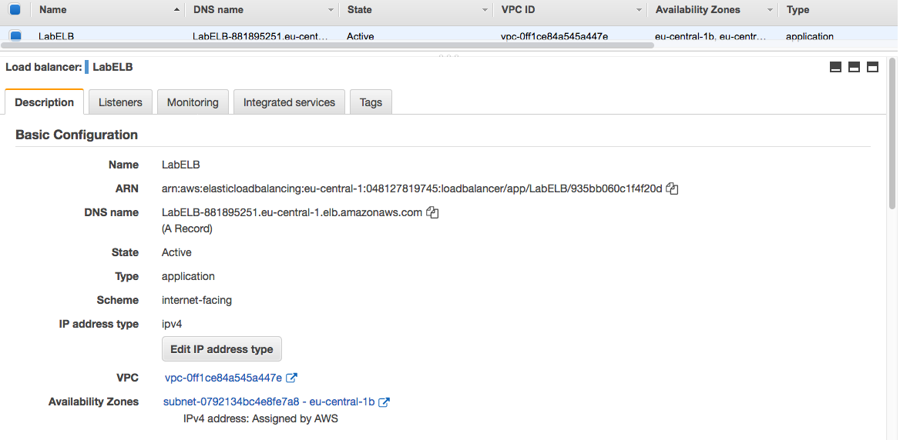

# Elastic Load Balancing (ELB) & Auto Scaling
Een van de belangrijkste voordelen van de cloud is dat je niet hoeft te raden hoeveel capaciteit je nodig hebt. Je kunt altijd op- en afschalen met on-demand services. Een van de services die dit mogelijk maakt, is Auto Scaling.

Wanneer je een toepassing uitvoert met een workload die hoge pieken kent, kun je de toepassing hosten op een groep van EC2-instanties in plaats van op een enkele server. Wanneer de vraag naar de applicatie groot is, kan Auto Scaling automatisch instanties aan de groep toevoegen. Wanneer de vraag lager is, kan het op dezelfde manier instanties verwijderen.

Om ervoor te zorgen dat alle servers hetzelfde zijn, maakt Auto Scaling gebruik van een (aangepaste) AMI. Automatisch schalen maakt gebruik van CloudWatch-statistieken om te bepalen of instanties moeten worden toegevoegd of verwijderd.

De ELB-services van AWS is een beheerde service die load balancing biedt voor een reeks instanties. Er zijn vier soorten ELB's:
- **Application Load Balancer**: deze ELB werkt met HTTP- en HTTPS-protocollen (laag 7 van de OSI-stack).
- **Network Load Balancer**: deze ELB werkt met TCP en UDP (laag 4 van de OSI-stack).
- **Gateway Load Balancer**: deze ELB gebruik je om virtuele apparaten, zoals de firewall, te implementeren, schalen en beheren.
- **Klassieke Load Balancer**: deze ELB is verouderd en niet aanbevolen voor gebruik. AWS is (tot nu toe) nooit gestopt met het ondersteunen van services. De reden hiervoor is dat het bestaande applicaties kan schaden.

## Key-terms
Alle key-terms die betrekking hebben op AWS Cloud Practitioner, zijn te vinden in het document: [AWS-Cloud-Practitioner](../beschrijvingen/aws-cloud-practitioner.md)  
[AMI](../beschrijvingen/aws-cloud-practitioner.md#AMI)  
[ELB](../beschrijvingen/aws-cloud-practitioner.md#ELB)  
[Auto Scaling](../beschrijvingen/aws-cloud-practitioner.md#Auto-Scaling)  

## Opdracht
### Opdracht 1
- Start een EC2-instantie met de volgende vereisten:
    - Regio: Frankfurt (eu-central-1)
    - AMI: Amazon Linux 2
    - Type: t3.micro
    - Gebruikersgegevens:
        '#!/bin/bash  
        '# Installeer Apache Web Server en PHP  
        'yum install -y httpd mysql php  
        '# Lab-bestanden downloaden  
        'wget https://aws-tc-largeobjects.s3.amazonaws.com/CUR-TF-100-RESTRT-1/80-lab-vpc-web-server/lab-app.zip
        'unzip lab-app.zip -d /var/www/html/  
        '# Schakel webserver in  
        'chkconfig httpd op  
        'service httpd start  
    - Security Group: HTTP toestaan
- Wacht tot de statuscontroles zijn voltooid.
- Maak een AMI van uw instantie met de volgende vereisten:
    - Image name: Web server AMI

### Opdracht 2
- Maak een load balancer voor toepassingen met de volgende vereisten:
    - Name: LabELB
    - Listener: HTTP op poort 80
    - AZ's: eu-central-1a en eu-central-1b
    - Subnet: moet public zijn
    - Security Group:
        - Name: ELB SG
        - Rules: HTTP-toegang toestaan
    - Target Group:
        - Name: LabTargetGroup
        - Targets: to be registered by Auto Scaling

### Opdracht 3
- Maak een startconfiguratie voor de Auto Scaling Group. Het moet identiek zijn aan de server die momenteel wordt uitgevoerd.
- Maak een Auto Scaling Group met de volgende vereisten:
    - Name: Lab ASG
    - Launch Configuration: Web server launch configuraion
    - Subnets: moet in eu-central-1a en eu-central-1b zijn
    - Load Balancer: LabELB
    - Group metrics collection in Cloudwatch moet 'enabled' zijn.
    - Group size:
        - Gewenste capaciteit: 2
        - Minimale capaciteit: 2
        - Maximale capaciteit: 4
        - Scaling policy: target tracking met als doel 60% gemiddeld CPU-utilization

### Opdracht 4
- Controleer of de EC2-instanties online zijn en deel uitmaken van de target group voor de load balancer.
- Verkrijg toegang tot de server via de ELB met behulp van de DNS-naam van de ELB.
- Voer een load test uit op uw server(s) met behulp van de website op uw server om Auto Scaling te activeren. Er kan een vertraging optreden bij het maken van nieuwe servers in uw vloot, afhankelijk van de instellingen in uw Auto Scaling Group.

### Gebruikte bronnen
- https://docs.aws.amazon.com/elasticloadbalancing/?id=docs_gateway  
- https://aws.amazon.com/elasticloadbalancing/  
- https://aws.amazon.com/autoscaling/  
- https://aws.amazon.com/cloudwatch/  
- https://docs.aws.amazon.com/toolkit-for-visual-studio/latest/user-guide/tkv-create-ami-from-instance.html  
- https://docs.aws.amazon.com/elasticloadbalancing/latest/application/application-load-balancer-getting-started.html  
- https://aws.amazon.com/ec2/autoscaling/getting-started/  

### Ervaren problemen
Bij opdracht 2 kwam ik er niet uit. Ik heb daarom de stappen gevolgd, zoals beschreven op [Load Balancer Getting Started](https://docs.aws.amazon.com/elasticloadbalancing/latest/application/application-load-balancer-getting-started.html). Daarna kon ik weer verder.  
Ook merk ik dat ik op gezette tijden uit AWS gegooid word. Dan moet ik een refresh doen en kan ik op zoek naar waar ik was gebleven. Niet zozeer een probleem, maar irritant. Coen heeft dat opgelost door de timeout op 8 uur te zetten.

### Resultaat
### Opdracht 1
EC2 Instance klaargemaakt.  
  

AMI gemaakt.  
  

### Opdracht 2

### Opdracht 3
  

### Opdracht 4
