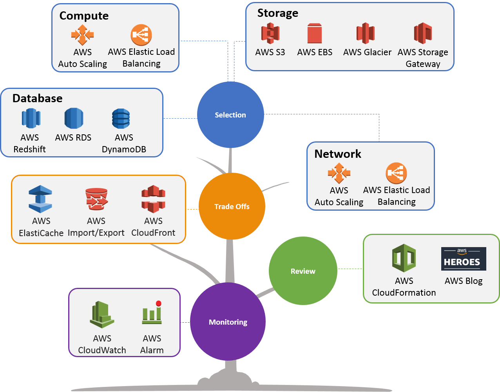

Well Architected Framework
Cloudcomputing breidt zich elk jaar uit, wat aangeeft dat er volop kansen zijn. Het creëren van een cloudoplossing vereist een sterke architectuur. Als de basis niet solide is, wordt de oplossing geconfronteerd met integriteitskwesties en systeembelasting. AWS 5-pijlers helpen cloudarchitecten om een veilige, goed presterende, veerkrachtige en efficiënte infrastructuur te creëren.  

### Operation Excellence
Deze pijler is een combinatie van processen, continue verbetering en monitoringsysteem dat bedrijfswaarde levert en ondersteunende processen en procedures continu verbetert.  

#### Ontwerpprincipes
- Voer bewerkingen uit als code: definieer dezelfde technische discipline die zal worden gebruikt voor applicatiecode, volledige werklast en infrastructuur
- Documentatie annoteren: Automatiseer documentatie over elke build die door systemen en mensen kan worden gebruikt
- Breng frequente, kleine, omkeerbare wijzigingen aan: ontwerp infrastructuurcomponenten om wijzigingen in kleine stappen met regelmatige tussenpozen toe te passen
- Verfijn operatieprocedures vaak: aangezien operatieprocedures zijn ontworpen, moeten we het proces blijven controleren en evalueren voor de laatste updates
- Anticipeer op storingen: voer tests uit met vooraf gedefinieerde storingsscenario's om de impact ervan te begrijpen. Voer dergelijke tests regelmatig uit om de infrastructuur te controleren met gesimuleerde gebeurtenissen
- Leer van alle operationele storingen: houd alle storingen en gebeurtenissen bij

### Security
Beveiligingspijler draait om het beschermen van informatie, systemen en bedrijfsmiddelen, samen met het leveren van zakelijke behoeften.  

#### Design Principles
Ontwerpprincipes
- Implementeer een sterke identiteitsbasis: implementeer de minste bevoegdheden en dwing geautoriseerde toegang tot AWS-bronnen af. Ontwerp centraal privilegebeheer en verklein het risico op langdurige inloggegevens
- Traceerbaarheid en beveiligingsgebeurtenissen inschakelen: realtime bewaken, alarmeren, auditen, reageren op incidenten van acties en wijzigingen in de omgeving. Voer incidentresponssimulaties uit en gebruik automatiseringstools om de snelheid te verhogen voor detectie, onderzoek en herstel
- Beveiliging toepassen op alle lagen: Beveiliging toepassen op alle lagen, b.v. Netwerk, database, OS, EC2 en applicaties. Voorkom applicatie en infrastructuur door mens en machine aanvallen.
- Automatiseer best practices op het gebied van beveiliging: Creëer veilige architecturen, inclusief implementatie van gedefinieerde, op software gebaseerde beveiligingsmechanismen en beheerd als code in versiegestuurde sjablonen.
- Beveilig gegevens in transit en in rust: categoriseer gegevens in gevoeligheidsniveaus en mechanismen, zoals versleuteling, tokenisatie en toegangscontrole.
- Houd mensen uit de buurt van gegevens: creëer mechanismen en hulpmiddelen om de noodzaak van directe toegang tot of handmatige verwerking van gegevens te verminderen of te elimineren om het risico op verlies als gevolg van menselijke fouten te verminderen.

### Reliability
Betrouwbaarheidspijler zorgt ervoor dat een bepaald systeem is ontworpen om gedurende een bepaalde periode aan operationele drempels te voldoen, te voldoen aan de verhoogde werkbelasting en te herstellen van storingen met minimale onderbreking of geen onderbreking.  

#### Design Principles
- Testherstelproces: gebruik automatisering om verschillende storingen te simuleren of om scenario's na te bootsen die tot storingen hebben geleid. Dit verkleint het risico van componenten die niet zijn getest voordat ze defect raken.
- Automatisch herstel na een storing: schakel de systeembewaking door KPI's in, waardoor automatisering wordt geactiveerd wanneer een drempel wordt bereikt. Schakel automatische melding en tracering van storingen in, en geautomatiseerde herstelprocessen die de storing herstellen.
- Horizontaal schalen om de totale systeembeschikbaarheid te vergroten: Vervang één grote resource door meerdere kleine resources om de impact van een enkele storing op het totale systeem te verminderen.
- Stop met het raden van capaciteit: bewaak de vraag en het systeemgebruik en automatiseer het toevoegen of verwijderen van resources om het optimale niveau te behouden.
- Beheer verandering in automatisering: Wijzigingen in de infrastructuur moeten worden gedaan via automatisering.

### Performance Efficiency
Prestatie-efficiëntie richt zich op het verzekeren dat een systeem/workload maximale prestaties levert voor een set van gebruikte AWS-bronnen (instanties, opslag, database en lokaliteit)  

#### Design Principles
- Democratiseer geavanceerde technologieën: gebruik beheerde services (zoals SQL/NoSQL-databases, transcodering van media, opslag en machine learning) die tijd en moeite kunnen besparen, en het team kan zich concentreren op ontwikkeling, resourcevoorziening en beheer
- Ga binnen enkele minuten wereldwijd: implementeer het systeem in meerdere AWS-regio's over de hele wereld voor een lagere latentie en een betere ervaring voor klanten tegen minimale kosten
- Gebruik serverloze architecturen: verminder de overhead van het uitvoeren en onderhouden van servers en gebruik de beschikbare AWS-optie om de infrastructuur te hosten en te bewaken
- Experimenteer vaker: met een virtueel en geautomatiseerd systeem en implementatie is het heel eenvoudig om het systeem en de infrastructuur te testen met verschillende soorten instanties, opslag of configuraties

### Cost Optimization
Kostenoptimalisatie richt zich op het bereiken van de laagste prijs voor een systeem/workload. Optimaliseer de kosten terwijl u rekening houdt met de accountbehoeften zonder factoren als beveiliging, betrouwbaarheid en prestaties te negeren.  

#### Design Principles
- Gebruik een verbruiksmodel: betaal alleen voor de computerbronnen die u verbruikt en verhoog of verlaag het gebruik, afhankelijk van de zakelijke vereisten, niet met uitgebreide prognoses
- Meet de algehele efficiëntie: meet de bedrijfsoutput van het systeem en de werkbelasting en begrijp de behaalde winst door de output te verhogen en de kosten te verlagen
- Adopteer beheerde services en geef geen geld meer uit aan datacenteractiviteiten: beheerde services nemen de operationele last weg van het onderhouden van servers voor taken zoals het verzenden van e-mail of het beheren van databases, zodat het team zich kan concentreren op uw klanten en zakelijke projecten in plaats van op de IT-infrastructuur
- Analyseren en toewijzen van uitgaven: Identificeer het gebruik en de kosten van systemen, wat een transparante toerekening van IT-kosten aan inkomstenstromen en individuele bedrijfseigenaren mogelijk maakt

## Key-terms
- Alle key-terms die betrekking hebben op AWS Cloud Practitioner, zijn te vinden in het document: [AWS-Cloud-Practitioner](../beschrijvingen/aws-cloud-practitioner.md) 
- Verder zijn er geen key terms toegevoegd. Wat ik belangrijk vind staat op deze pagina.
## Opdracht
Bestudeer
### Gebruikte bronnen
- https://aws.amazon.com/architecture/well-architected/
- https://volansys.com/pillars-of-aws-well-architected-framework/

### Ervaren problemen
Geen
