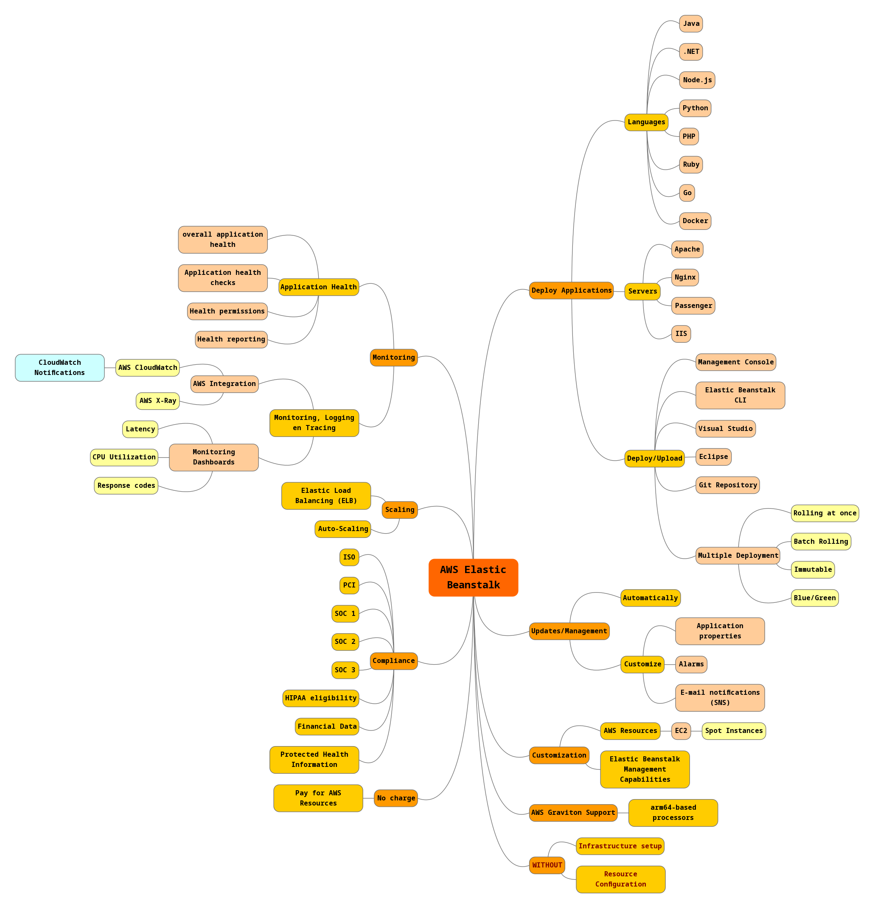
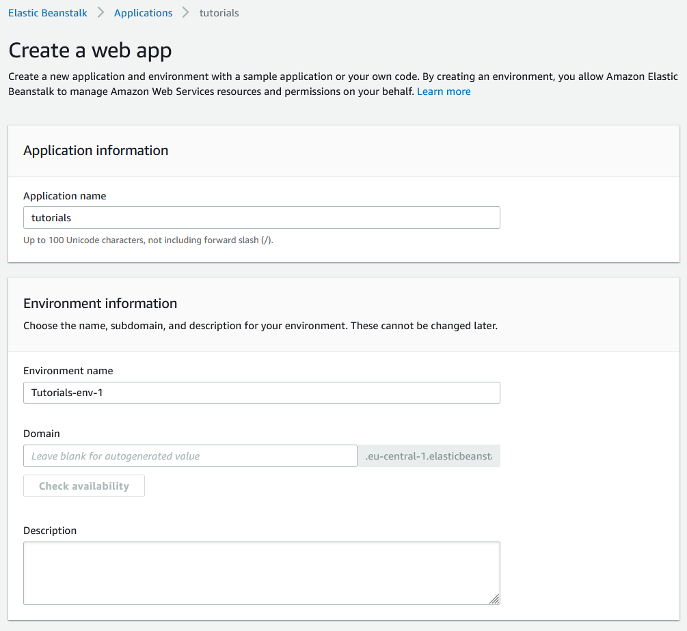
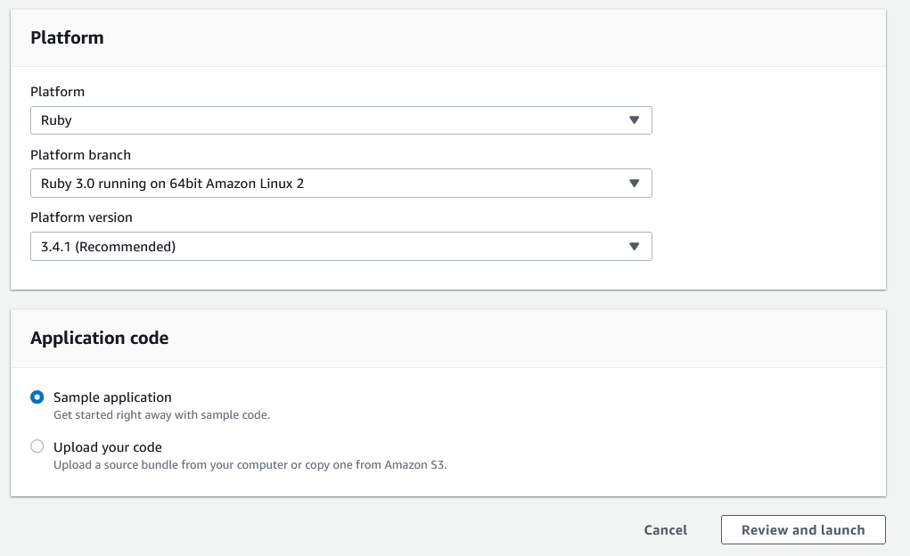
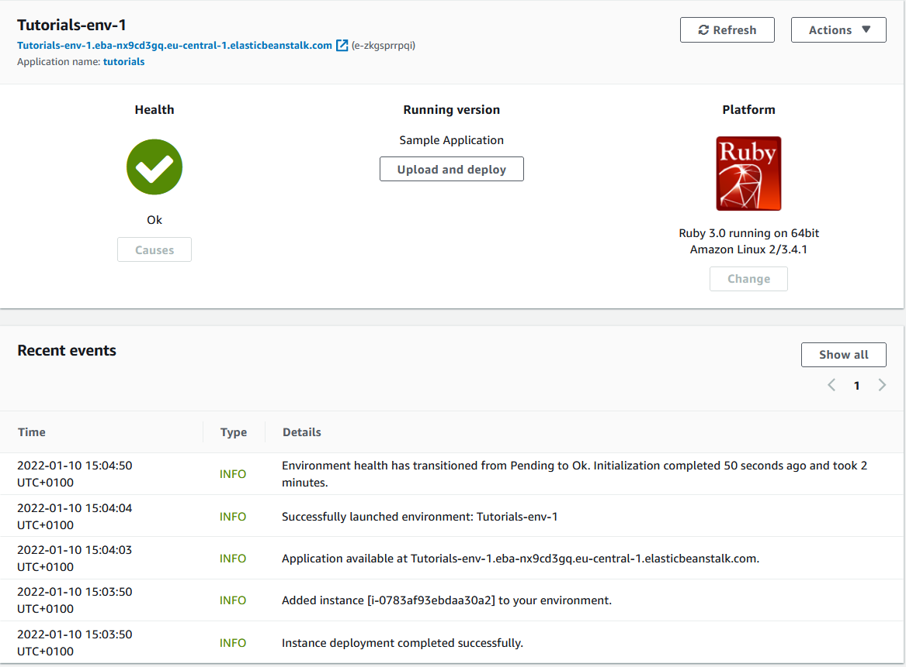
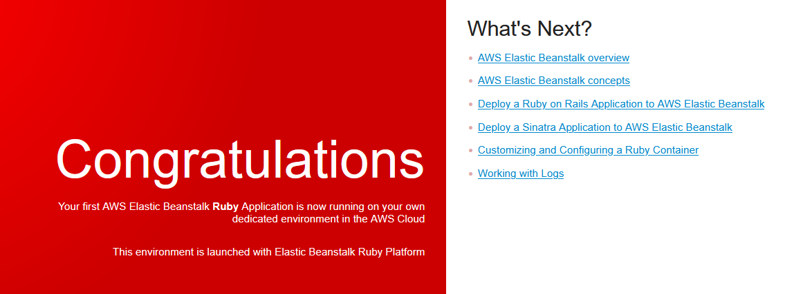

# Elastic Beanstalk
AWS Elastic Beanstalk is een eenvoudig te gebruiken service om  web-applicaties en diensten te deployen en te schalen. De applicaties kunnen o.a. gebouwd zijn in: Java, .NET, Node.js, PHP, Python, Ruby, Go, Docker. En kunnen draaien op o.a. de volgende servers: Apache, Nginx, IIS, Passenger.

Ik heb een mindmap gemaakt waarin alle termen en features naar voren komen.  

## Key-terms
Alle key-terms die betrekking hebben op AWS Cloud Practitioner, zijn te vinden in het document: [AWS-Cloud-Practitioner](../beschrijvingen/aws-cloud-practitioner.md)  
[CloudWatch](../beschrijvingen/aws-cloud-practitioner.md#CloudWatch)  
[AWS X-Ray](../beschrijvingen/aws-cloud-practitioner.md#x-ray)  
[Lightsail](../beschrijvingen/aws-cloud-practitioner.md#LightSail)  
[S3](../beschrijvingen/aws-cloud-practitioner.md#S3)  
[SNS](../beschrijvingen/aws-cloud-practitioner.md#SNS)  
[Load Balancing](../beschrijvingen/aws-cloud-practitioner.md#ELB)  
[Auto Scaling](../beschrijvingen/aws-cloud-practitioner.md#Auto-Scaling)  
[Application Health](../beschrijvingen/aws-cloud-practitioner.md#Application-Health)  
[AWS Graviton](../beschrijvingen/aws-cloud-practitioner.md#Graviton)  

## Opdracht
Bestudeer AWS Elastic Beanstalk
Ik heb ervoor gekozen om [Ruby on Rails](https://docs.aws.amazon.com/elasticbeanstalk/latest/dg/ruby-rails-tutorial.html) te gebruiken om te zien wat er gebeurt als je Elastic Beanstalk gebruikt.
### Gebruikte bronnen
- https://aws.amazon.com/elasticbeanstalk/details/  
- https://docs.aws.amazon.com/elasticbeanstalk/latest/dg/ruby-rails-tutorial.html
- https://docs.aws.amazon.com/elasticbeanstalk/latest/dg/eb-cli3-install-advanced.html

### Ervaren problemen
In mijn enthousiasme voor de kerstvakantie alles verwijderd. Dus ook de default VPC. Die opnieuw aangemaakt en dan loopt alles door.

### Resultaat

