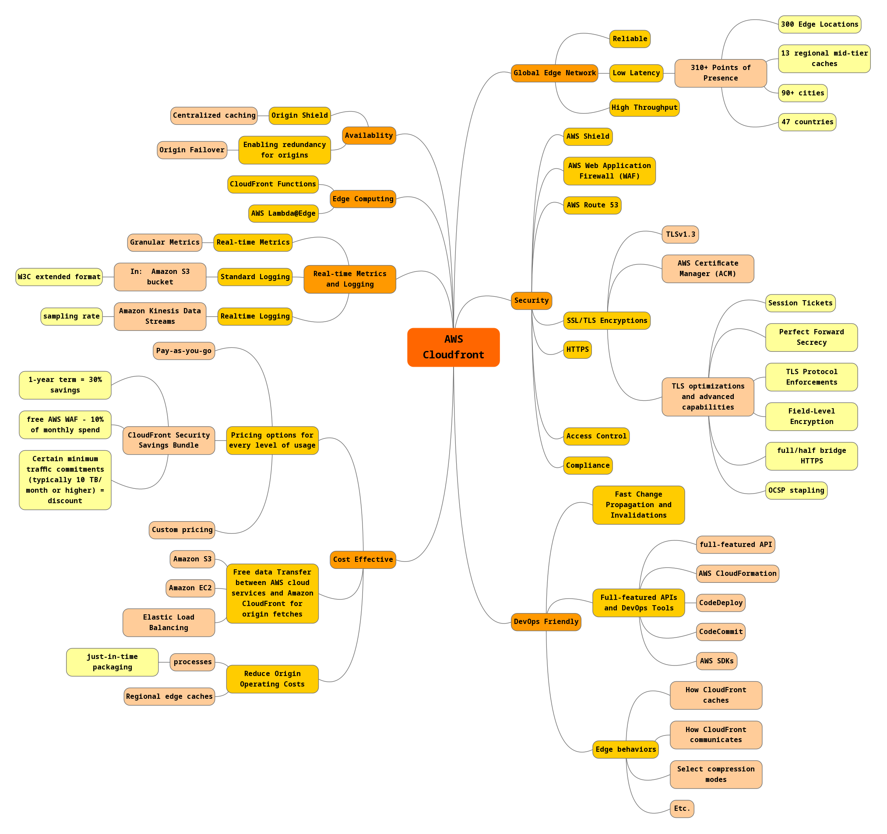
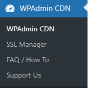
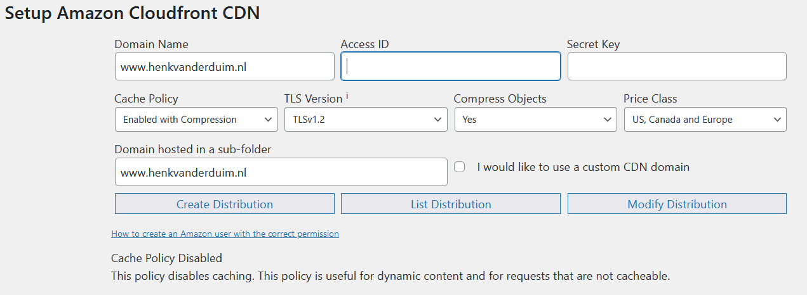
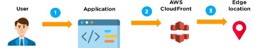
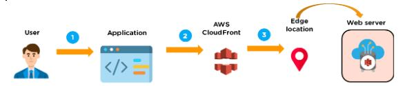
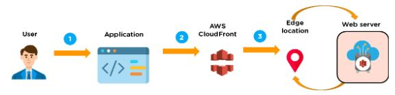

# CloudFront
CloudFront is een Content Delivery Network (CDN) dat onderdeel is van Amazon Web Services. CloudFront zorgt ervoor dat jouw content geleverd wordt door middel van een wereldwijd verspreidt netwerk van data centers, met hoge snelheid en lage latency.

## Voordelen
- Het zal de content cachen op edge-locaties en de werklast verminderen, wat resulteert in een hoge beschikbaarheid van applicaties.
- Het is eenvoudig te gebruiken en zorgt voor productiviteitsverbetering.
- Het biedt een hoge beveiliging met de functie 'Content Privacy'.
- Het faciliteert GEO-targetingservice voor contentlevering aan specifieke eindgebruikers.
- Het gebruikt HTTP- of HTTPS-protocollen voor snelle levering van inhoud.
- Het is minder duur, omdat het alleen kosten in rekening brengt voor de gegevensoverdracht (in de AWS Free Tier ontvang je 1TB aan uitgaande data).

Ik heb een mindmap gemaakt van de features van CloudFront:  

Op mijn eigen website [Henk van der Duim](https://www.henkvanderduim.nl) maak ik gebruik van CloudFront. Hiervoor gebruik ik de Wordpress Plugin WPAdmin CDN.

## Key-terms
Alle key-terms die betrekking hebben op AWS Cloud Practitioner, zijn te vinden in het document: [AWS-Cloud-Practitioner](../beschrijvingen/aws-cloud-practitioner.md)  
[Origin Shield](../beschrijvingen/aws-cloud-practitioner.md#OriginShield)  
[Latency](../beschrijvingen/aws-cloud-practitioner.md#LowLatency)  
[DDoS Attacks](../beschrijvingen/aws-cloud-practitioner.md#DDoS)  

## Opdracht
Bestudeer CloudFront
### Gebruikte bronnen
- https://aws.amazon.com/cloudfront/  
- https://www.henkvanderduim.nl  
- https://docs.aws.amazon.com/AmazonCloudFront/latest/DeveloperGuide/Introduction.html  
- https://docs.aws.amazon.com/AmazonCloudFront/latest/DeveloperGuide/WordPressPlugIn.html  

### Ervaren problemen
Geen

### Resultaat
De gebruiker gaat naar je website en gaat een bestand downloaden (een pdf).  

De DNS route het verzoek van de gebruiker naar de dichtsbijzijnde edge locatie door middel van CloudFront om het verzoek af te handelen.  

Op de edge locatie zoekt CloudFront naar het aangevraagde cache bestand. Zodra deze is gevonden zendt CloudFront deze naar de gebruiker.  

Als het bestand niet wordt gevonden door CloudFront, dan worden de requirements vergeleken met de specifications en deelt dit met de server.  

De server reageert op het verzoek door het bestand te versturen naar de edge locatie.  

Zodra CloudFront het bestand heeft ontvangen, wordt deze gedeeld met de gebruiker en voegt het bestand toe aan de edge locatie.
