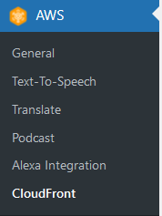
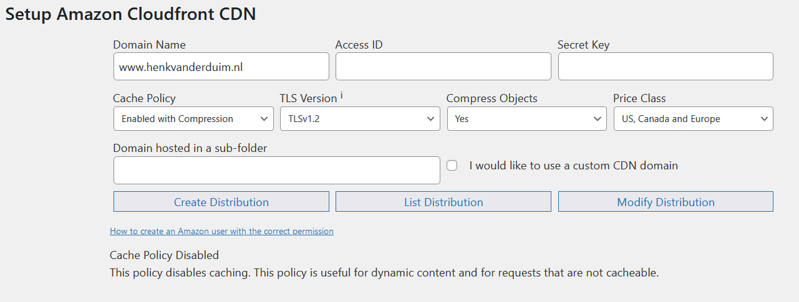

# CloudFront
klsfsdkfsdhf

## Key-terms
Alle key-terms die betrekking hebben op AWS Cloud Practitioner, zijn te vinden in het document: [AWS-Cloud-Practitioner](../beschrijvingen/aws-cloud-practitioner.md)  

## Opdracht
Bestudeer CloudFront
### Gebruikte bronnen
- https://aws.amazon.com/cloudfront/  
- https://www.henkvanderduim.nl  
- https://docs.aws.amazon.com/AmazonCloudFront/latest/DeveloperGuide/Introduction.html  
- https://docs.aws.amazon.com/AmazonCloudFront/latest/DeveloperGuide/WordPressPlugIn.html  

### Ervaren problemen
Geen

### Resultaat
#### Wordpress CloudFront Plugin
  

De velden om in te vullen (leeggemaakt!)  

