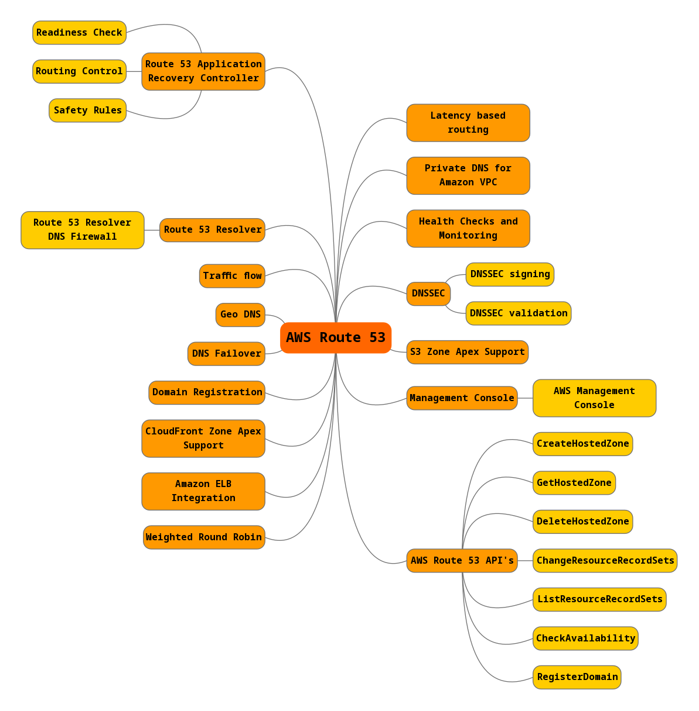

# Route 53
Dit is een DNS service met hoge beschikbaarheid en die schaalbaar is. Route 53 verbindt requests aan de infrastructuur die draait in AWS. Bijvoorbeeld: EC2 Instances, ELB's, S3 buckets.  
Daarnaast kan het gebruikt worden om gebruikers te routeren naar infrastructuur buiten AWS.

Ik heb een mindmap gemaakt van de key-features van Route 53.  

## Route 53 Application Recovery Controller
Deze geeft je inzicht in of je applicaties en bronnen klaar zijn voor herstel, en helpt je bij het beheren en coördineren van failover met behulp van gereedheidscontrole en routing control functions. Deze functies bewaken voortdurend het vermogen van je applicatie om te herstellen en stellen je in staat om je applicatieherstel in meerdere AWS-regio's, beschikbaarheidszones en on-premises te beheren. Deze mogelijkheden maken applicatieherstel eenvoudiger en betrouwbaarder door de handmatige stappen te elimineren die nodig zijn voor traditionele tools en processen.

## Key-terms
- Alle key-terms die betrekking hebben op AWS Cloud Practitioner, zijn te vinden in het document: [AWS-Cloud-Practitioner](../beschrijvingen/aws-cloud-practitioner.md)  
- [Weighted Round Robin](../beschrijvingen/aws-cloud-practitioner.md#WRR)  
## Opdracht
Bestudeer Route 53
### Gebruikte bronnen
- https://aws.amazon.com/route53/
- https://docs.aws.amazon.com/Route53/latest/DeveloperGuide/Welcome.html

### Ervaren problemen
Geen
