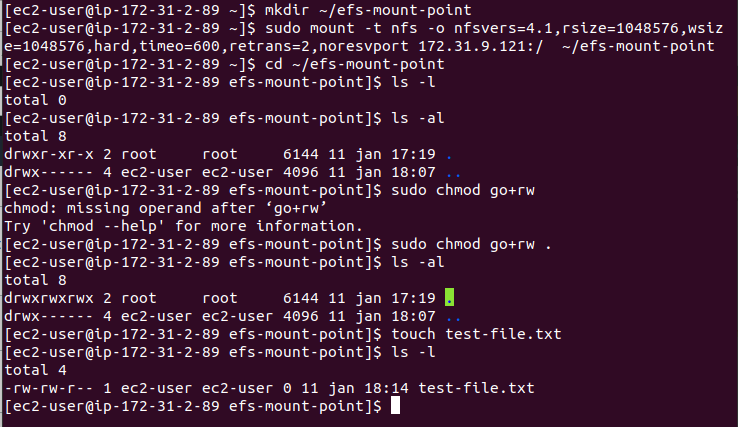

# EFS
Amazon Elastic File System. EFS biedt een simpele, serverless, set-and-forget elastich bestandssysteem. Met EFS kun je bestanden delen zonder dat je de opslag hoeft in te richten of te beheren. Je kunt het gebruiken in combinatie met andere AWS diensten en on-premises diensten. Het is gebouwd om on-demand te kunnen schalen naar petabytes, zonder dat hierbij de applicaties onderbroken worden.

Als je gebruik maakt van de AWS Free Tier, dan krijg je 5GB standard storage tot je beschikking (12 maanden0.)

Ik heb een mindmap gemaakt van de features van EFS.  

## Key-terms
- Alle key-terms die betrekking hebben op AWS Cloud Practitioner, zijn te vinden in het document: [AWS-Cloud-Practitioner](../beschrijvingen/aws-cloud-practitioner.md)  
- Verder geen key-term specifiek voor dit onderwerp.
## Opdracht
Maak een EFS file system en mount deze op een EC2 instance m.b.v. AWS CLI.
- https://docs.aws.amazon.com/efs/latest/ug/wt1-getting-started.html  
### Gebruikte bronnen
- https://aws.amazon.com/efs/  
- https://docs.aws.amazon.com/efs/latest/ug/wt1-create-ec2-resources.html  
- https://docs.aws.amazon.com/cli/latest/userguide/cli-services-ec2-sg.html#deleting-a-security-group  

### Ervaren problemen
Een typefout is zo gemaakt en dan is het zoeken. Ik heb veel gebruik gemaakt van de help functie (aws [commando] [subcommando] help) om te achterhalen wat er fout gaat. En ik heb zowaar een fout ontdekt in de oefening op de site van AWS.
Verder een hele leerzame exercitie om alles via de AWS CLI te doen.  
Wat gedoe gehad met het key-pair. Pas na goed lezen erachter gekomen waar mijn fout zat.

### Resultaat
Ik heb in de kerstvakantie een laptop volledig ingericht met Linux (Ubuntu). Die heb ik gebruikt voor deze oefening.  
#### Setting up AWS CLI
Dat had ik al gedaan. Ik heb wel het profile van de adminuser in het config file gezet.
#### Stap 1: Maak de Amazon EC2 resources
**Stap 1.1: maak 2 security groups**  
EC2 Instance Security Group  
  

EFS Mount Target Security Group  
  

Verificatie van de Security Groups  
  

**Stap 1.2: voeg regels toe aan de security groups, om inbound/outbound toegang te autoriseren**  
Inkomende SSH connecties toestaan.  
  

Controleren of het daadwerkelijk gelukt is.  
  

Inbound toegang verlenen aan de security group voor de Amazon EFS mount target.  
  

En de onvermijdelijke check op biede security groups.  
  

**Stap 1.3: Lanceren van de EC2 Instance**  
Om te beginnen moest ik wat informatie opzoeken en klaarzetten. Ik heb o.a. het subnet opgevraagd.  
  

Vervolgens de EC2 Instance aangemaakt.  
  

Uit bovenstaande afbeelding heb ik weer informatie gehaald, die ik in het verdere verloop nodig heb.  

#### Stap 2: Maak de Amazon EFS resources
**Stap 2.1: Creëren van een Amazon EFS file system**  
  

De FileSystemId die in bovenstaande afbeelding is te vinden, heb ik verderop weer nodig.  

**Stap 2.2: Zet het lifecycle management aan**  
  

**Stap 2.3: Creëren van een mount target**  
Zo gezegd, zo gedaan  
  

En de beschrijving van de zojuist gecreërde mount target:  
  

#### Stap 3: Mount het file system op de EC2 Instance en test het
**Stap 3.1: verzamel informatie**  
O.a. gebruik gemaakt van de AWS web-omgeving om de informatie op te halen en om te zien of er daadwerkelijk iets is gebeurt.  
  

**Stap 3.2: Installeer de NFS client op de EC2 Instance**  
Gedaan!

**Stap 3.3: Mount het file system op de EC2 Instance en test het**  
  

Bij het chmod commando gaat het nog even mis. Ik zie de stip aan voor een vlekje op m'n beeldscherm. Bril gepoetst en toen was het weer goed.  

#### Stap 4: Clean Up
De hele handel wordt weer verwijderd.  

### De uitsmijter van de dag
De oplettende lezer - indien je inmiddels niet met hoofdpijn bent afgehaakt - zal denken: jij had het over een fout die je had gevonden op de website van AWS bij deze oefening. Waar is die gebleven?  

Het gaat om dit stukje bij Stap 2.1:  
  

De tweede regel bevat een fout.  
--encrypted true \  
Dat kan helemaal niet. Het is:  
--encrypted  
of  
--no-encrypted  

Daarom is de help functie binnen AWS CLI zo handig.