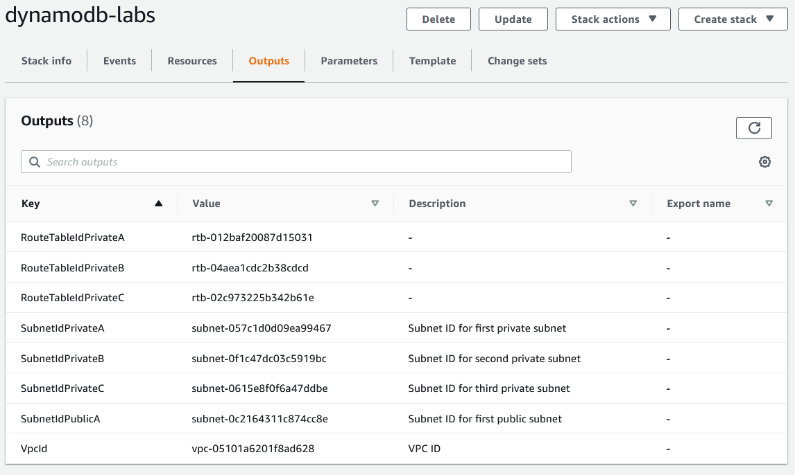
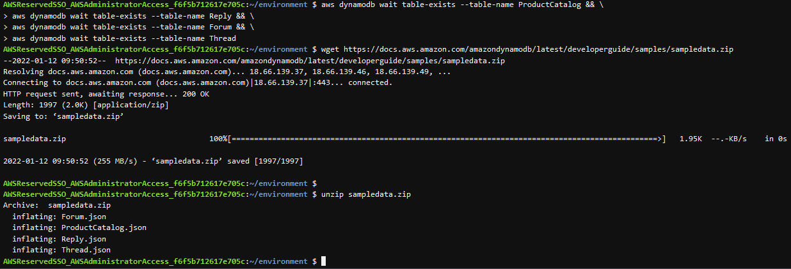
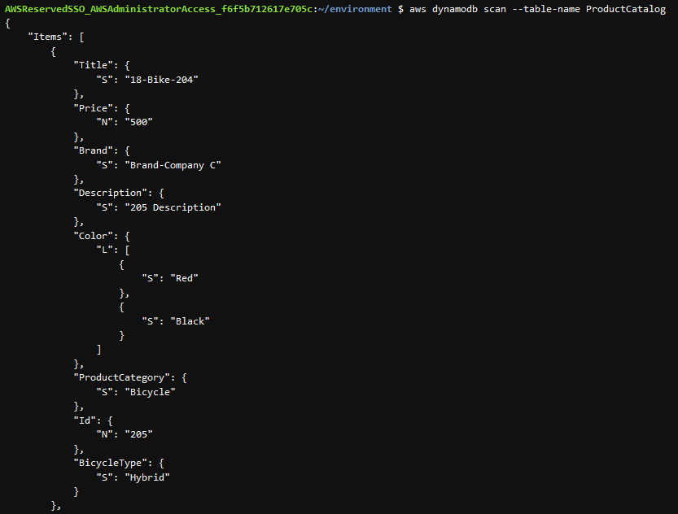

# DynamoDB
DynamoDB is een serverless NoSQL database, die automatische ultraschaalbaar is, op basis van snelle SSD's. Meerdere AZ's (3 per regio). Elastic MapReduce-integratie. Back-up naar S3. Het ondersteunt Key-value en een document data structuur.

De structuur lijkt volgens mij op een Tuple. Die ken ik dan weer vanuit Python.

Ik heb een mindmap gemaakt van de features van DynbamoDB.  

## Key-terms
- Alle key-terms die betrekking hebben op AWS Cloud Practitioner, zijn te vinden in het document: [AWS-Cloud-Practitioner](../beschrijvingen/aws-cloud-practitioner.md)  
- [NoSQL](../beschrijvingen/aws-cloud-practitioner.md#NoSQL)  

## Opdracht
Ik heb de stappen in de workshop: Hands-on Labs fo Amazon DynamoDB gevolgd.
- https://amazon-dynamodb-labs.workshop.aws/hands-on-labs.html  

De architectuur die in deze oefening gebouwd wordt ziet er als volgt uit:  

### Gebruikte bronnen
- https://aws.amazon.com/dynamodb/
- https://amazon-dynamodb-labs.workshop.aws/hands-on-labs.html  
- https://docs.aws.amazon.com/amazondynamodb/latest/developerguide/Introduction.html

### Ervaren problemen
Geen

### Resultaat
**Environment Setup**  
*Creating the Stack*  
  

  

De Stack is klaar:  

**Launch Cloud9**  

**Create the DynamoDB tables**  
De schermafdruk is een fragment van de code!  

**Load sample data**  
Download en unzip de data  
  

Het laden van de sample data  
  

**Explore DynamoDB with the CLI**  
Scan de database (een fragment)  

1 item uit de database  
  

Nu met een aantal opties  

Scan op tabel met Partition key en Sort key  

Uitlezen van Thread 1  

**Oefening: return only the first reply to a thread** 
Het was even zoeken in de developerguide.  

**Oefening: return only the most recent reply for a thread**  

**Oefening: Explore the data in the Forum table and write a scan command to return only the Forums that have more than 1 thread and more than 50 views.**  
De tabel structuur:  

De scan:  

**Oefening: Update the ProductCatalog item where Id=201 to add new colors “Blue” and “Yellow” to the list of colors for that bike type. Then use the API to remove those “Blue” and “Yellow” list entries to return it to the original state.**  
Item opvragen:  

Blauw en Geel toevoegen:  

Verwijder blauw en geel:  

**Oefening: Find all the Replies written by User A sorted, using the query command instead of the scan command.**  
GSI query:  

**CleanUp**  
