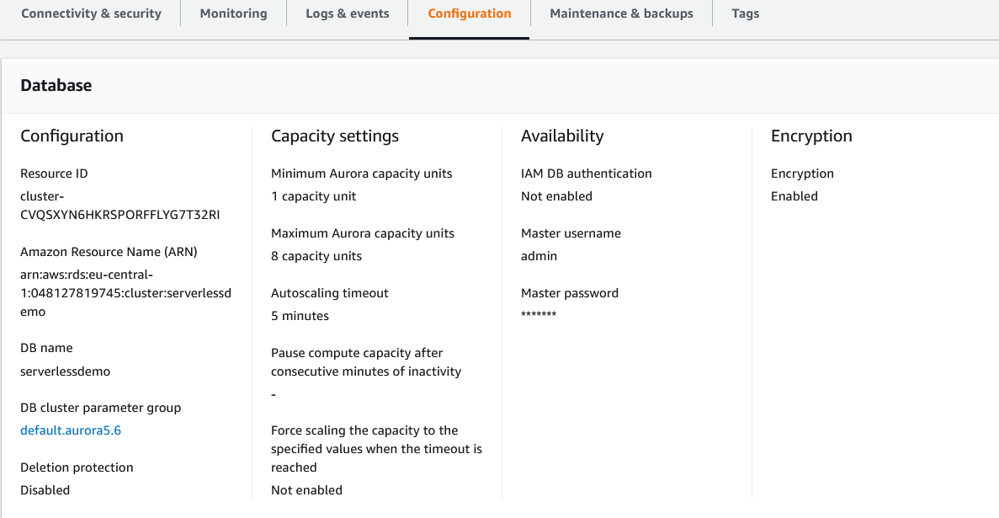
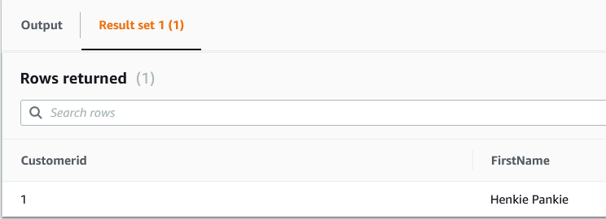

# RDS
Amazon RDS staat voor Amazon Relational Database Service. Het biedt een eenvoudige manier om relationele databases in de cloud in te stellen, te schalen en te gebruiken. Het biedt een aanpasbare en kostenefficiënte capaciteit terwijl je databasebeheertaken uitvoert, zodat jij je kunt concentreren op je bedrijf en toepassingen. Het heeft zes database-engines waaruit je kunt kiezen, namelijk Amazon Aurora, MariaDB, MySQL, PostgreSQL, Microsoft SQL Server en Oracle.  

Ik heb een mindmap gemaakt van de features van Amazon RDS:  

# Aurora
Aurora is een database-engine die is ontworpen om met gemak en betrouwbaarheid de betrouwbaarheid en snelheid te bieden die horen bij hoogwaardige commerciële databases. Het is compatibel met MySQL en geeft vijf keer de doorvoer van MySQL op vergelijkbare hardware. Het helpt DBA's om tijd te besparen bij het plannen van back-up opslagschijven, omdat het continu een back-up maakt van gegevens naar AWS S3 in realtime zonder negatieve invloed op de prestaties. Het elimineert ook de noodzaak voor geautomatiseerde back-upscripts en back-uptijdstippen.  
  

Bij Aurora heb ik geen mindmap gemaakt, omdat daar voor verschillende database engines uitleg gegeven wordt. Wel ik heb het document: [High Availability, Durability, and Disaster Recovery for your Relational Databases](../00_includes/IG1_RDS1_AvailabilityDurability_Final.pdf) grondig bestudeeerd.

Zowel RDS als Aurora vallen onder de Database-as-a-service (DBaaS) cloudservices en bieden gebruikers de mogelijkheid om databases te gebruiken zonder de fysieke infrastructuur te hoeven configureren en zonder software te installeren. Dit brengt veel gemak voor veel particulieren en bedrijven. Aangezien organisaties de operationele kosten moeten verlagen, is DBaaS in de meeste organisaties het beste alternatief voor gegevensopslag geworden.
## Key-terms
- Alle key-terms die betrekking hebben op AWS Cloud Practitioner, zijn te vinden in het document: [AWS-Cloud-Practitioner](../beschrijvingen/aws-cloud-practitioner.md)  
- [Serverless](../beschrijvingen/aws-cloud-practitioner.md#Serverless)  

## Opdracht
- [Aurora Serverless Tutorial](https://www.youtube.com/watch?v=ciRbXZqBl7M)

### Gebruikte bronnen
- https://aws.amazon.com/rds/aurora) 
- https://aws.amazon.com/rds/  
- https://www.youtube.com/watch?v=1vFg1z-2E7Y
- https://hevodata.com/learn/aws-aurora-vs-rds/

### Ervaren problemen
Geen

### Resultaat
In de Amazon RDS Console wordt een database aangemaakt.  
  

Een Amazon Aurora engine wordt gebruikt. De DB cluster identifier wordt ingevuld (de underscore is verwijderd, want dat werkt dus niet).  

De Capacity settings worden ingevuld. De rest laten we voor wat het is.  

Connectivity laten we voor het grootste deel ook voor wat het is. Additional configuration wordt wel aangeklikt. Er wordt een vinkje gezet bij Web Service Data API. Zodat we straks via de Query Editor aan de slag kunnen.  

De database options worden ingevuld (wederom is de underscore verwijderd).  

De database is na zo'n vijf minuten klaar.  

Als je op de naam 'serverlessdemo' klikt komt er meer informatie over de database:  

**Connectivity & Security**  

**Monitoring**  

**Configuration**  

**Maintenance & backups**  

**Query Editor**  

Nadat alles is ingevuld, laat ik de reeds geplaatste SQL opdracht draaien.  

Output:  

Nog een paar SQL statements en de output:  
  

Output  

SQL Statement  

Output  

SQL Statement  

Output  

M.b.v. Python kun je ook de database benaderen. Dit werk ik verder uit in de Amazon Lambda opdracht.  
