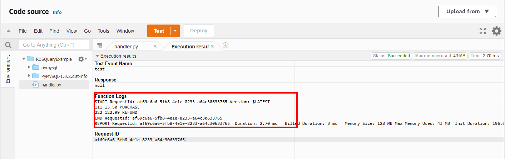

# Lambda
AWS Lambda is een 'event-driven', serverless computerplatform dat door Amazon wordt aangeboden als onderdeel van Amazon Web Services. Daarom hoeft jij je geen zorgen te maken over welke AWS-bronnen je moet starten of hoe jij ze gaat beheren. In plaats daarvan moet je de code op Lambda zetten en dan werkt het.

In AWS Lambda wordt de code uitgevoerd op basis van de respons op gebeurtenissen in AWS-services (meer dan 200) en Software as a service (Saas) applicaties, zoals bestanden toevoegen/verwijderen in S3-bucket, HTTP-verzoek van Amazon API-gateway, enz. Amazon Lambda kan echter alleen worden gebruikt om achtergrondtaken uit te voeren.

De AWS Lambda-functie helpt je te concentreren op jouw kernproduct en bedrijfslogica in plaats van het beheer van toegangscontrole van het besturingssysteem (OS), OS-patching, juiste grootte, provisioning, schaling, enz.

In de AWS Free Tier versie krijg je de beschikking over 1 miljoen requests.

Ik heb een mindmap gemaakt van de features van AWS Lambda:  

## Key-terms
- Alle key-terms die betrekking hebben op AWS Cloud Practitioner, zijn te vinden in het document: [AWS-Cloud-Practitioner](../beschrijvingen/aws-cloud-practitioner.md)  
- [SQL Workbench](../beschrijvingen/aws-cloud-practitioner.md#SQLWorkbench)
- [Python](../05_Cloud_4/opdracht.md#python)
- [pymysql](../beschrijvingen/aws-cloud-practitioner.md#pymysql)
- [SDK](../beschrijvingen/aws-cloud-practitioner.md#SDK)
- [Framework](../beschrijvingen/aws-cloud-practitioner.md#framework)
- [Machine Learning](../beschrijvingen/aws-cloud-practitioner.md#ML)
## Opdracht
Hoe een RDS MySQL uitvragen via AWS Lambda in Python.  
https://www.youtube.com/watch?v=vyLvmPkQZkI
### Gebruikte bronnen
- https://aws.amazon.com/lambda/
- https://stackoverflow (zie ervaren problemen)
- https://twitter.com/BeABetterDevv (zie ervaren problemen)

### Ervaren problemen
Ik moest voor de opdrach SQL Workbench installeren, die installatie verliep moeizaam.  
De python library pymysql is veranderd t.o.v. de versie die in de video wordt getoond. Kostte veel tijd om uit te zoeken waar de foutmelding vandaan kwam en hoe deze op te lossen. Achteraf gezien een kleinigheidje.

### Resultaat
**Database aanmaken**  

Via SQL Workbench contact maken:  

**Database aanmaken en de tabel:**  

**En we vullen de tabel met 2 rijen data:**  

**Script geschreven in Python** om verbinding met de MySQL te maken en de rijen uit te lezen.  

**Ook controleren of het werkt:**  

**In het python bestand** pas ik de regel met def handler(): aan, zodat het er als volgt komt uit te zien:  
def lambda_handler(event, context):  

En ik verwijder de regel met handler() onderaan het bestand.

Alles wordt opgeslagen en ik maak er een zip-file van en verander de naam van deze in 'function'.  

**In de Lambda console wordt de functie aangemaakt:**  

**Nu worden de permissions aangepast. daarvoor klikken we op de Role name:**  

**In IAM wordt de policy AWSLambdaVPCAccessExecutionRole toegevoegd. En daarna wordt het zip bestand geupload.**

**Daarna kan de knop 'Test' ingedrukt worden. En dan zien we dat het werkt. De twee rijen worden weergegeven.**  

Met een whopping 'execution duration' van 2.70ms. Die dan wel weer naar een 'billing duration' van 3.0ms wordt afgerond!