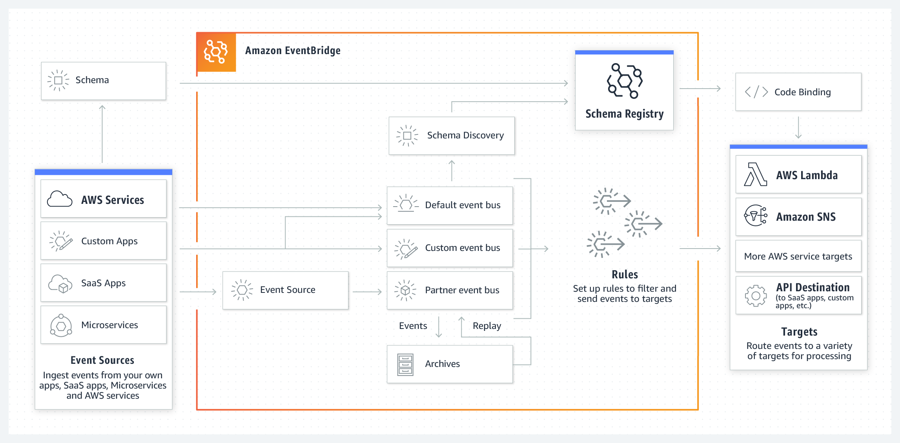

# SNS, SQS, Event Bridge
## Amazon SQS — Message Queues
Amazon SQS is een dienst voor het in de wachtrij plaatsen van berichten. Zoals de naam al doet vermoeden, creëert het in feite een wachtrij waar de bron en het doelsysteem/de dienst de berichten kunnen pushen of beluisteren. SQS is ontworpen om berichten uit een wachtrij te halen, met behulp van Short Polling of Long Polling. De Lambda-integratie maakt intern gebruik van de Long Polling-techniek om de kosten en verspilling van middelen te minimaliseren.  

## Amazon SNS — Publish and Subscribe
Amazon SNS is een van de meest gebruikte en populaire services op AWS. Het is ontworpen om evenementen onder veel abonnees te verspreiden. AWS gebruikt SNS om miljoenen e-mails, sms-berichten en pushmeldingen te verzenden, waarbij elk adres/eindpunt als abonnee is geregistreerd.  

## Amazon EventBridge — Enterprise Event Bus
Amazon EventBridge is een relatief nieuwe dienst. Het is een uitbreiding van de bestaande CloudWatch Events-service, waarmee ontwikkelaars gebeurtenisregels kunnen maken en gebeurtenistriggers kunnen plannen om services te targeten. EventBridge is gebaseerd op de concepten van een Enterprise Event Bus, die voornamelijk wordt gebruikt om berichten tussen een klein aantal services of systemen te coördineren zonder voor elk een afzonderlijk communicatie-eindpunt te creëren.

EventBridge gebruikt het concept van Event Buses om gebeurtenissen van een bron naar verschillende bestemmingen te routeren. Elk AWS-account heeft één standaard gebeurtenisbus, geautoriseerde AWS-partnerbussen en aangepaste bussen.  

## Key-terms
- Alle key-terms die betrekking hebben op AWS Cloud Practitioner, zijn te vinden in het document: [AWS-Cloud-Practitioner](../beschrijvingen/aws-cloud-practitioner.md)  

## Opdracht
Using AWS Lambda with Amazon CloudWatch and SNS to Implement a Slack Chat Bot.  
- https://amazon.qwiklabs.com/focuses/25327?catalog_rank=%7B%22rank%22%3A2%2C%22num_filters%22%3A0%2C%22has_search%22%3Atrue%7D&parent=catalog&search_id=15106052 
### Gebruikte bronnen
- https://beabetterdev.com/2021/09/10/aws-sqs-vs-sns-vs-eventbridge/
- https://aws.amazon.com/eventbridge/
- https://aws.amazon.com/sqs/
- https://aws.amazon.com/sns/

### Ervaren problemen
Geen

### Resultaat
Aanmaken van een incoming Webhook in Slack.  

In Amazon SNS wordt het Topic en de Subscription aangemaakt.  

E-mail met de vraag om het abonnement te bevestigen:  

De bevestiging van het abonnement:  

Een functie aanmaken in AWS Lambda:  

De code deployen in Lambda:  

Een alarm aanmaken in AWS Cloudwatch:  

De functie kan nu getest worden om te zien of er een bericht in Slack verschijnt.

Tot mijn opperste verbazing en lichte verbijstering is het bericht verschenen:  

En zoals ingesteld, ook een mailtje vanuit het 'SlackAlarm':  
