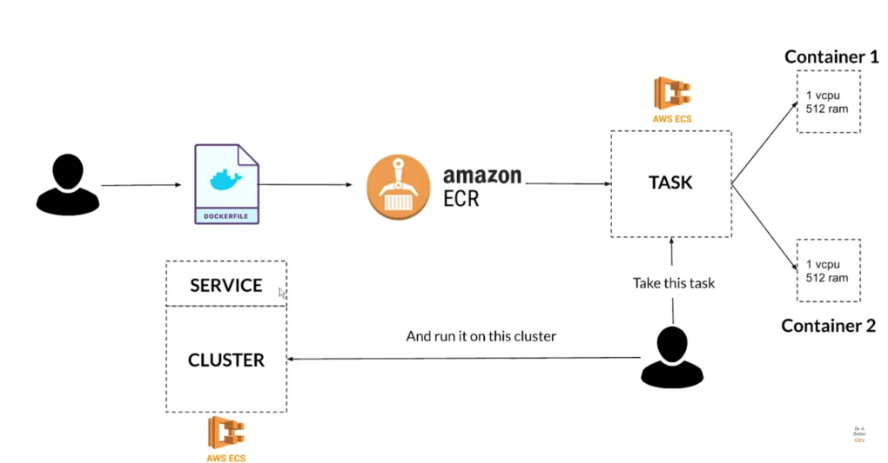
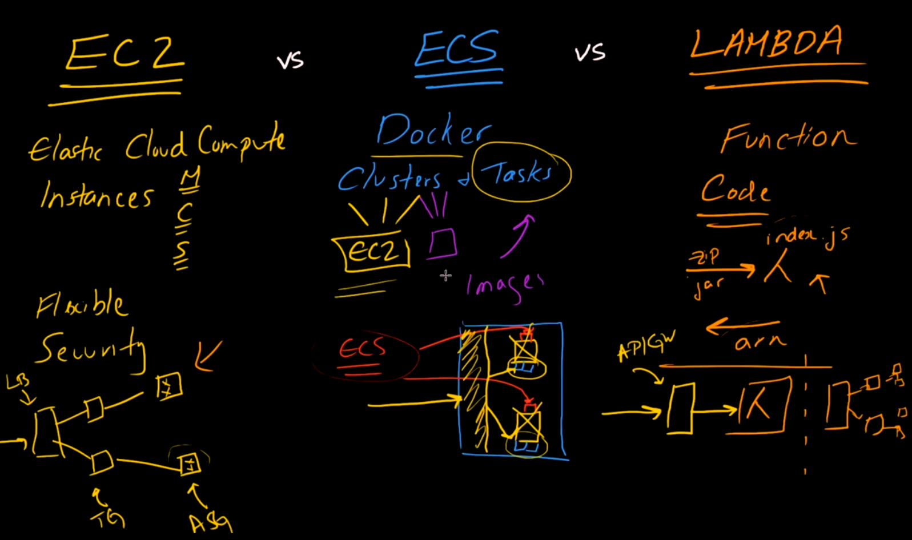

# Amazon ECS
Wat is Elestic Container Service:
- Managed service die containers draait (Docker)
- Serverless (met Fargate) en managed (met EC2) opties
- Ondersteunt auto-scaling om een variabel volume aan te kunnen
- Het is goed voor adhoc opdrachen of full scale services
- Het is cost effective
- ECS zit tussen Lambda en EC2 in

## Hoe werkt ECS

**Stap 1: Definieer je Docker bestand**  
Het eerste en belangrijkste dat je bedenkt, is dat je een docker-bestand definieert om je taken uit te voeren.  

**Stap 2: Upload Docker bestand naar ECR**  
Zodra je klaar bent met je docker-bestand, dan bouw je dat in een image (image is een lichtgewicht, op zichzelf staand, uitvoerbaar softwarepakket dat alles bevat wat je nodig hebt om een toepassing uit te voeren, dwz code, runtime, systeemtools, systeembibliotheken en instellingen) en upload die naar Amazon ECR.

Amazon ECR staat voor elastisch containerregister en het is een plaats waar je images worden gehost die op je ECS-containers worden gelanceerd.

**Stap 3: Definieer je ECS Taak**  
Nadat je jouw docker-afbeelding naar ECR hebt geüpload en deze aan een naam hebt gekoppeld, komt de ECS; het eerste dat je moet doen, is een taak definiëren. Je kunt een taak zien als een abstractie bovenop een container, en het is in wezen een constructie van richtlijnen in ECS die ECS vertelt hoe je je docker-containers wilt draaien. Gewoonlijk kan een taak meer dan één container met dezelfde of verschillende configuraties bevatten om verschillende bewerkingen in een toepassing te ondersteunen.

**Stap 4: Je Cluster opzetten**  
Nu, nadat je je taken hebt ingesteld, wordt het leuk, in termen van het opzetten van het cluster, en met een cluster kun je in wezen zien als een abstracte bronvorm. Dus als je EC2-instanties gebruikt, zou je jouw instanties binnen dit cluster instellen, en ze worden doelen voor alles wat je in taken definieert.

Wat er in deze relatie gebeurt, is wanneer je deze taak opgeeft en deze toewijst aan dit cluster, waarna je een gebruiker gebruikt om de taak op dit cluster uit te voeren.

In het geval dat jij EC2 gebruikt en niet Fargate, specificeer je EC2's met een clusterresultaat dat een ECS-agent op jouw EC2-instanties installeert. Die ECS-agent communiceert met je ECS-cluster en ontvangt verzoeken om nieuwe software te lanceren of iets relevants voor dat cluster te doen. De agent is verantwoordelijk voor een naadloze interne communicatie tussen jouw cluster en jouw EC2-instanties.

## EC2 vs. ECS vs. Lambda
  

| EC2 | ECS | Lambda |
| --- | --- | ------ |
|Als je exact weet hoe je het wilt hebbeb | Als je min of meer weet hoe je het wilt hebben | Als je het snel wilt |
| Veel management | Minder management | Nauwelijks management |
| Veel controle | minder Controle | nauwelijks controle |
## Key-terms
- Alle key-terms die betrekking hebben op AWS Cloud Practitioner, zijn te vinden in het document: [AWS-Cloud-Practitioner](../beschrijvingen/aws-cloud-practitioner.md)  
- [Docker](../beschrijvingen/aws-cloud-practitioner.md#Docker)
- [Fargate](../beschrijvingen/aws-cloud-practitioner.md#Fargate)
- [Auto Scaling](../beschrijvingen/aws-cloud-practitioner.md#Auto-Scaling)
- [ECR](../beschrijvingen/aws-cloud-practitioner.md#ECR)

## Opdracht
Bestudeer
### Gebruikte bronnen
- https://docs.aws.amazon.com/AmazonECS/latest/developerguide/Welcome.html
- https://aws.amazon.com/ecs/

### Ervaren problemen
Geen

### Resultaat
N.v.t.