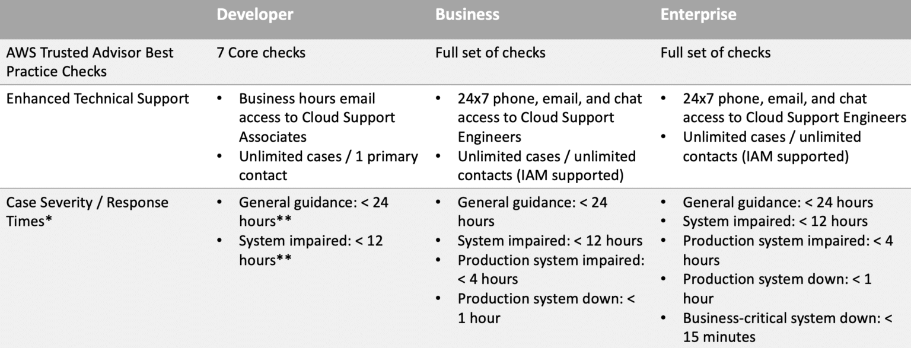
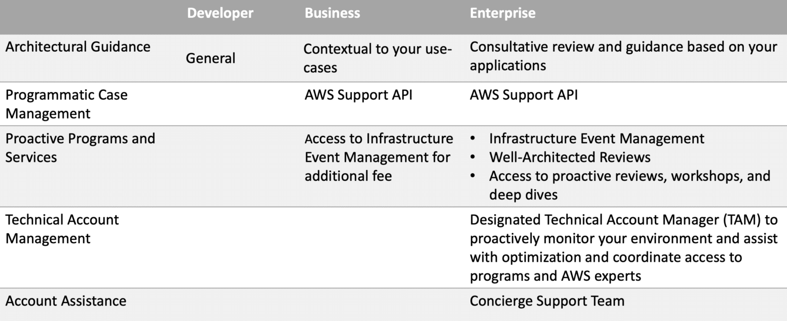

# AWS Support Plans
Er zijn vier AWS Support Plans beschikbaar:  
- Basic: alleen facturering en accountondersteuning (alleen toegang tot forums).
- Developer: ondersteuning tijdens kantooruren via e-mail. En staat één persoon toe om onbeperkt cases te openen. 
- Business: 24×7 e-mail, chat en telefonische ondersteuning. En staat onbeperkt contacten toe om onbeperkt cases te openen.
- Enterprise: 24×7 e-mail, chat en telefonische ondersteuning, inclusief een Technical Account Manager (TAM). En staat onbeperkt contacten toe om onbeperkt cases te openen.

AWs Support Plans is gekoppeld aan de [AWS Trusted Advisor](https://aws.amazon.com/premiumsupport/technology/trusted-advisor/), de [AWS Personal Health Dashboard](https://aws.amazon.com/premiumsupport/technology/personal-health-dashboard/) en de [AWS Health API](https://docs.aws.amazon.com/health/latest/ug/getting-started-api.html).  
AWs Support Plans voorziet ook in drie programma's:
1. [AWS Infrastructure Event Management-IEM](https://aws.amazon.com/premiumsupport/programs/iem/)
2. [AWs Well Architected](https://aws.amazon.com/architecture/well-architected/)
3. [Proactive Services](https://aws.amazon.com/premiumsupport/technology-and-programs/proactive-services/)

## Key-terms
- Alle key-terms die betrekking hebben op AWS Cloud Practitioner, zijn te vinden in het document: [AWS-Cloud-Practitioner](../beschrijvingen/aws-cloud-practitioner.md)  
- Ik heb verder geen - voor mij relevante - key terms gevonden.

## Opdracht
Bestudeer
### Gebruikte bronnen
- https://aws.amazon.com/premiumsupport/plans/
- https://docs.aws.amazon.com/awssupport/latest/user/getting-started.html

### Ervaren problemen
Geen

### Resultaat
N.v.t.
