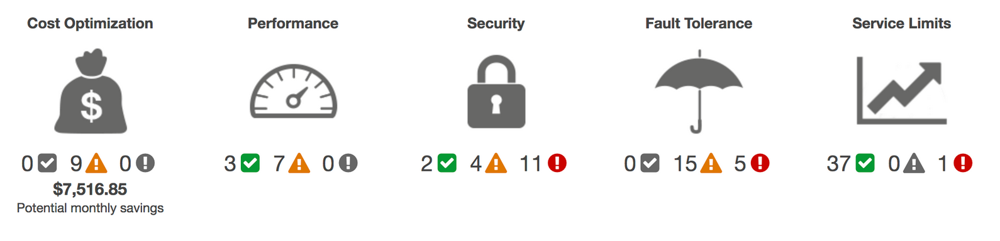

# Trusted Advisor
Trusted Advisor-controles helpen bij het optimaliseren van je AWS-infrastructuur, het verbeteren van de beveiliging en prestaties, het verlagen van je totale kosten en het bewaken van servicelimieten.

Klanten van AWS Basic Support en AWS Developer Support krijgen toegang tot 6 beveiligingscontroles (S3 Bucket Permissions, Security Groups – Specific Ports Unrestricted, IAM Use, MFA on Root Account, EBS Public Snapshots, RDS Public Snapshots) en 50 servicelimietcontroles.

Klanten van AWS Business Support en AWS Enterprise Support krijgen toegang tot alle 115 Trusted Advisor-controles (14 kostenoptimalisatie, 17 beveiliging, 24 fouttolerantie, 10 prestaties en 50 servicelimieten) en aanbevelingen.

## 5 pijlers

De Check Level Status:
- Error (rood): als één resource zich in de error state bevindt. 'action recommended'
- Warning (geel): als één resource zich in de warning state bevindt en er geen resource in de error state is. 'investigation recommended'
- OK (groen): als geen resource zich in de error of warning state bevindt. 'no problems detected'

| Business/Enterprise | Developer/Basic |
| ------------------- | --------------- |
|Access to all Trasted Advisor checks | Limited access to Trusted Advisor checks (6 sdecurity checks en all service limt checks) |
| Access checks via Support API | Access checks via Management Console |
|Setup CloudWatch events to consume check results | |
| Check status automatically refreshed every week | | 

## Key-terms
- Alle key-terms die betrekking hebben op AWS Cloud Practitioner, zijn te vinden in het document: [AWS-Cloud-Practitioner](../beschrijvingen/aws-cloud-practitioner.md)  
- Geen andere - voor mij relevante - key terms gevonden
## Opdracht
### Gebruikte bronnen
- https://aws.amazon.com/premiumsupport/technology/trusted-advisor/
- https://docs.aws.amazon.com/awssupport/latest/user/trusted-advisor.html

### Ervaren problemen
Geen

### Resultaat
N.v.t.
