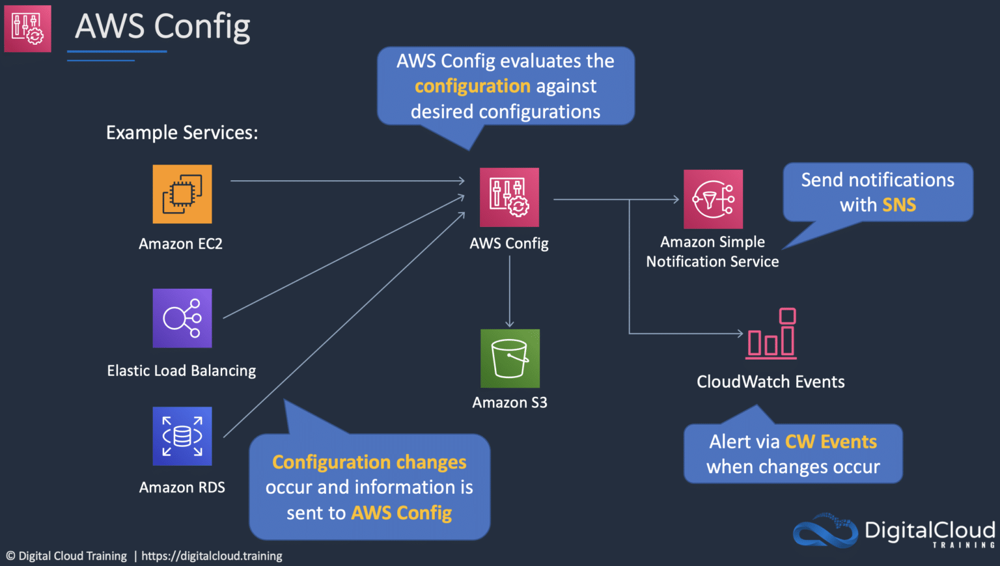
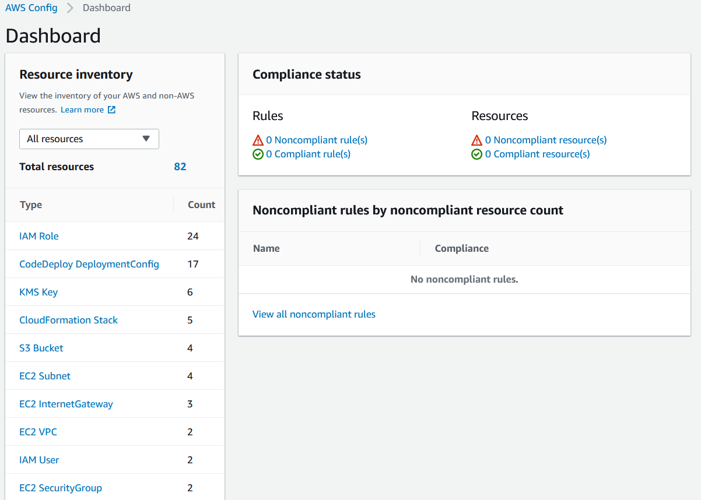
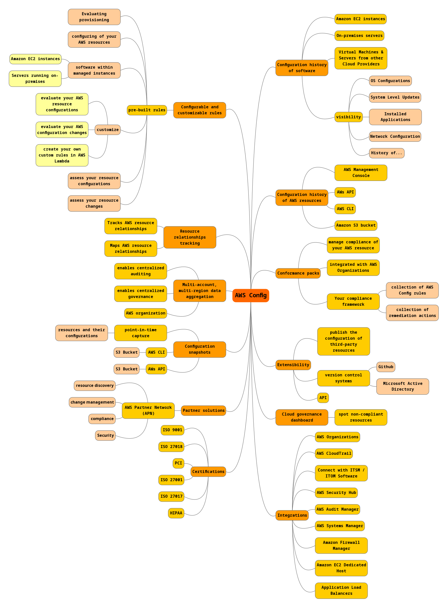

# Config
AWS Config is een volledig beheerde service die je voorziet van een AWS resource inventaris, configuratie geschiedenis en configuratie wijzigingsmeldingen om beveiliging en naleving van de regelgeving mogelijk te maken.

Met AWS Config kun je bestaande en verwijderde AWS-bronnen ontdekken, je algehele naleving van regels bepalen en op elk moment in de configuratiedetails van een bron duiken. AWS Config maakt nalevingscontrole, beveiligingsanalyse, het volgen van resourcewijzigingen en probleemoplossing mogelijk.  

Config Dashboard:  

Ik heb een mindmap gemaakt van de features van AWS Config:  

## Key-terms
- Alle key-terms die betrekking hebben op AWS Cloud Practitioner, zijn te vinden in het document: [AWS-Cloud-Practitioner](../beschrijvingen/aws-cloud-practitioner.md)  
- [ITSM](../beschrijvingen/aws-cloud-practitioner.md#ITSM)
- [ITOM](../beschrijvingen/aws-cloud-practitioner.md#ITOM)
- [Security Hub](../beschrijvingen/aws-cloud-practitioner.md#SecurityHub)
- [Audit Manager](../beschrijvingen/aws-cloud-practitioner.md#AuditManager)
- [Systems Manager](../beschrijvingen/aws-cloud-practitioner.md#SystemsManager)
- [AWS Organization](../beschrijvingen/aws-cloud-practitioner.md#Organization)

## Opdracht
### Gebruikte bronnen
- https://aws.amazon.com/config/
- https://eu-central-1.console.aws.amazon.com/config/home?region=eu-central-1#/dashboard

### Ervaren problemen
Geen

### Resultaat
N.v.t.