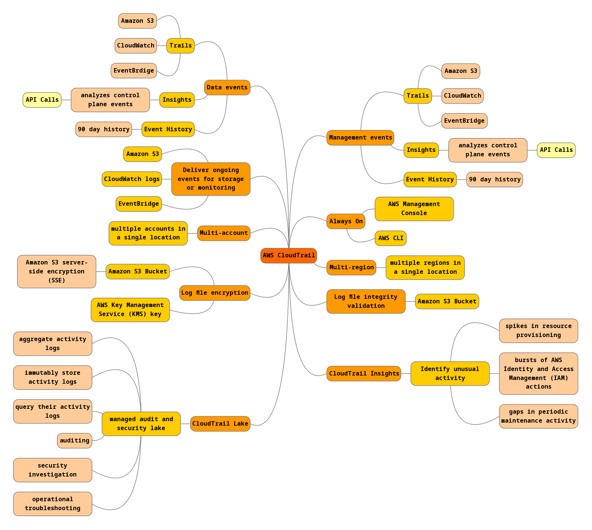

# CloudTrail
 Het stelt gebruikers in staat om governance, compliance, operationele audits en risico-audits van het AWS-account uit te voeren. Dit is erg handig in termen van wie wat doet in jouw applicatie, vooral wanneer we een ecosysteem hebben waar we een hele reeks AWS-accounts en veel gebruikers gebruiken. Het is een soort audittabel of een auditservice die logt en bijhoudt wie toegang heeft tot wat en wanneer in jouw AWS-ecosysteem.

Hoe werkt het:  

Ik heb een mindmap gemaakt van de features van AWS CloudTrail:  

## Key-terms
- Alle key-terms die betrekking hebben op AWS Cloud Practitioner, zijn te vinden in het document: [AWS-Cloud-Practitioner](../beschrijvingen/aws-cloud-practitioner.md)  
- Ik heb verder geen - voor mij relevante - key terms gevonden

## Opdracht
Bestudeer
### Gebruikte bronnen
- https://aws.amazon.com/cloudtrail/
- https://docs.aws.amazon.com/awscloudtrail/latest/userguide/cloudtrail-user-guide.html

### Ervaren problemen
Geen

### Resultaat
N.v.t.