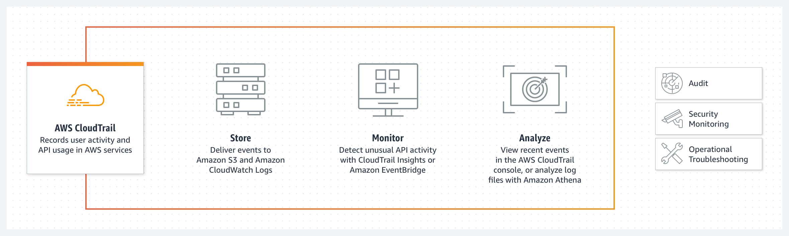
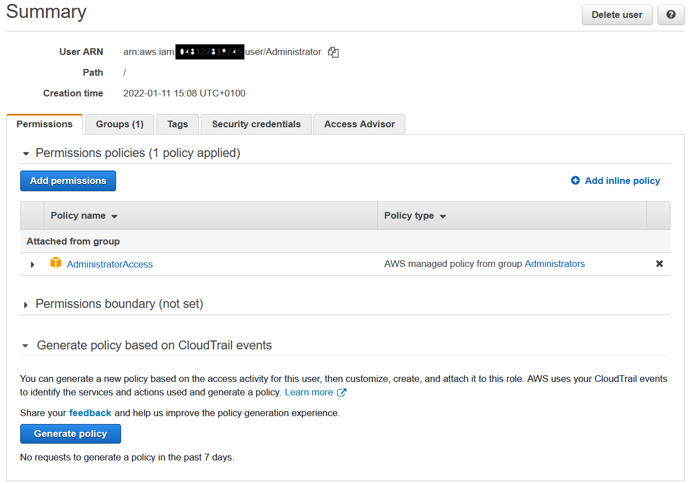

# CloudTrail
 Het stelt gebruikers in staat om governance, compliance, operationele audits en risico-audits van het AWS-account uit te voeren. Dit is erg handig in termen van wie wat doet in jouw applicatie, vooral wanneer we een ecosysteem hebben waar we een hele reeks AWS-accounts en veel gebruikers gebruiken. Het is een soort audittabel of een auditservice die logt en bijhoudt wie toegang heeft tot wat en wanneer in jouw AWS-ecosysteem.

Hoe werkt het:  

Ik heb een mindmap gemaakt van de features van AWS CloudTrail:  

## Key-terms
- Alle key-terms die betrekking hebben op AWS Cloud Practitioner, zijn te vinden in het document: [AWS-Cloud-Practitioner](../beschrijvingen/aws-cloud-practitioner.md)  

## Opdracht
[Performing a Basic Audit of your AWS Environment](https://amazon.qwiklabs.com/focuses/23459?catalog_rank=%7B%22rank%22%3A2%2C%22num_filters%22%3A0%2C%22has_search%22%3Atrue%7D&parent=catalog&search_id=15176538)  
**Onderwerpen:**  
- Review user permissions in IAM
- Capture audit evidence using IAM Policy Simulator
- Review Inbound and Outbound networking rules for EC2 Security Groups
- Review VPC configurations, subnets and Network ACLs
- Review CloudWatch performance metrics
- Review raw CloudTrail logs within Amazon S3
### Gebruikte bronnen
- https://aws.amazon.com/cloudtrail/
- https://docs.aws.amazon.com/awscloudtrail/latest/userguide/cloudtrail-user-guide.html

### Ervaren problemen
Geen

### Resultaat
**IAM - Summary User**:  

**IAM - Security Credentials**:  

