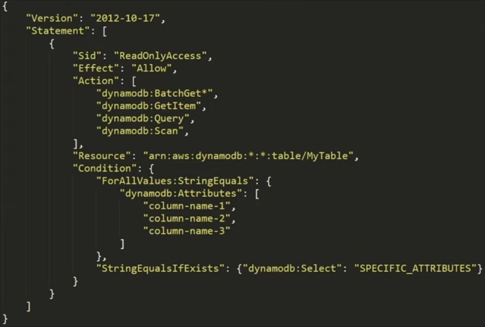
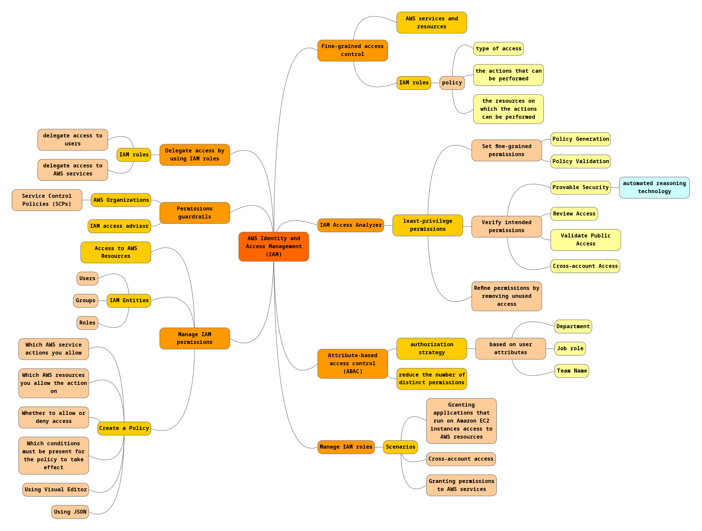
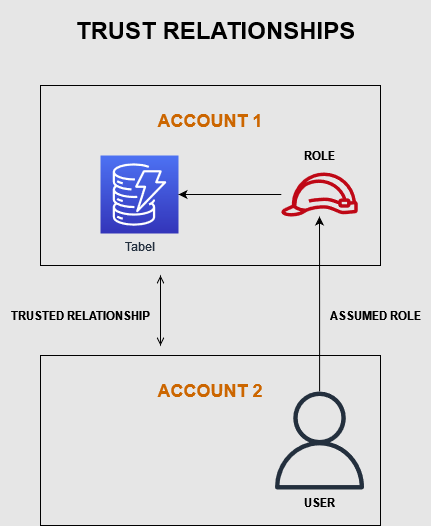

# Identity and Access Management (IAM)
Het staat voor Identity and Access Management en is de service die de toegang tot AWS-bronnen regelt. Aangezien toegang tot bronnen een van de meest elementaire dingen is die je op AWS kunt doen, is dit één van de belangrijkste onderwerpen.

IAM is gebasseerd op 3 elementen:  
1. **Resources** zijn de entiteiten die je in AWS maakt. Dit kan zoiets zijn als een S3-bucket, een S3-object of DynamoDB-tabellen. Alle bronnen in AWS worden vertegenwoordigd door iets dat een ARN- of Amazon-bronnaam wordt genoemd. Je hebt waarschijnlijk een van deze identifiers eerder gezien, ze zien er een beetje zo uit:  
*arn:aws:s3:::test-website-awssimplified*.  
1. **Actions** zijn de bewerkingen die gebruikers proberen uit te voeren op resources. Als ik bijvoorbeeld een lambda-functie heb gemaakt, wil ik misschien de configuratie bijwerken. Om dat te doen, moet ik een API gebruiken met de naam lambda:UpdateFunctionConfiguration. Om deze actie uit te voeren, moet ik toestemming hebben om deze API aan te roepen. Maar hoe krijg ik toestemmingen?  
Het antwoord ligt in de Policy...  
3. **Policy/Policy Document** Het hart van AWS IAM is de Policy. IAM-Policy verwijst naar specifieke JSON-documentatie die gebruikersmachtigingen definiëren voor toegang tot een resource. Met andere woorden, de autorisatie om een *Action* uit te voeren wordt bepaald door het al dan niet beschikken over het juiste policy document met bijbehorende rechten.  

## IAM Pro Tips
- Protect your **Root Account** at all cost
- Explicit **Effect:Deny** wins over **Effect:Allow**
- Use the **Least Privilege Model**
- Use the **Policy Simulator**

Voorbeeld van een Policy statement: DynamoDB tabel met Read-Only-Access voor specifieke kolommen.  

**Sid** = de naam van het Policy Statement  
**Effect** = Allow or Deny  
**Action** = Wat er wel of niet mag (*=wildcard)  
**Resource** = in dit geval de DynamoDB met specifieke tabel  
**Condition** = Voorwaarden en attributen

#### Mindmap
Ik heb een mindmap gemaakt van de features van IAM:  

### Samengevat
>We create **users** who use **credentials** that grant access based on their **policy document**

>We create **Roles** which can be assumed by **entities** within or across account boundaries with a **trust relationship**

#### Trust Relationship
In de afbeelding hieronder een weergave van een **trust relationship**.  
*Account 1* heeft toegang tot de DynamoDB tabel. *Account 2* wil graag toegang tot deze tabel hebben. Om dat te realiseren moet er een *Role* gemaakt worden met de juiste permissies.

Vervolgens moet er via IAM een trust relation gecreërd worden. Hierin geeft *Account 1* aan dat deze *Account 2* vertrouwd en vice versa.  
Daarnaast geeft *Account 1* de mogelijkheid aan *Account 2* om de rol aan te nemen: *Assumed Role*.  
Hierdoor krijgt *Account 2* toegang tot de tabel.  

## Key-terms
- Alle key-terms die betrekking hebben op AWS Cloud Practitioner, zijn te vinden in het document: [AWS-Cloud-Practitioner](../beschrijvingen/aws-cloud-practitioner.md)  

## Opdracht
[Introduction to AWS Identity and Access Management (IAM)](https://amazon.qwiklabs.com/focuses/22172?catalog_rank=%7B%22rank%22%3A2%2C%22num_filters%22%3A0%2C%22has_search%22%3Atrue%7D&parent=catalog&search_id=15177031)
### Gebruikte bronnen
- https://aws.amazon.com/iam/?nc=sn&loc=1
- https://www.youtube.com/watch?v=_ZCTvmaPgao

### Ervaren problemen
Geen

### Resultaat
Aan de hand van het lab (zie opdracht), worden er meerdere gebruikers aangemaakt. Die worden lid van User Groups.

Daarna inloggen en zien wat de gebruikers wel en niet mogen.
