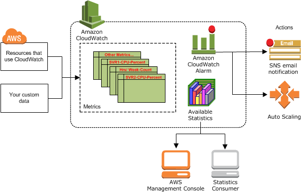
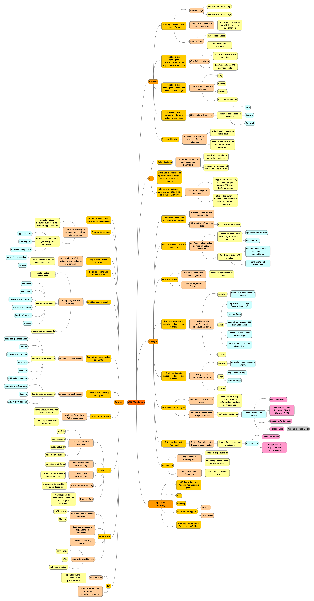
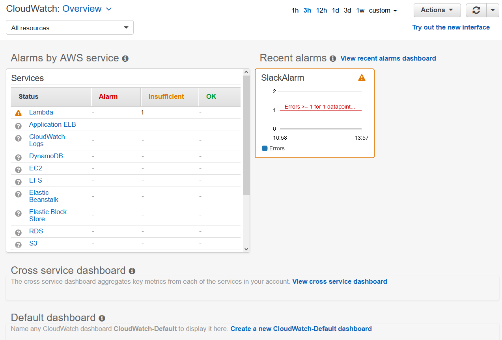
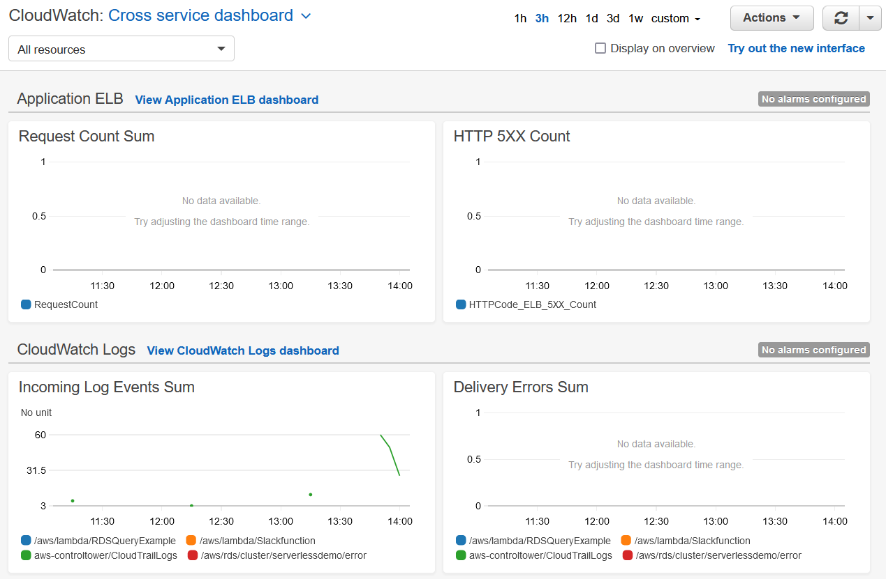
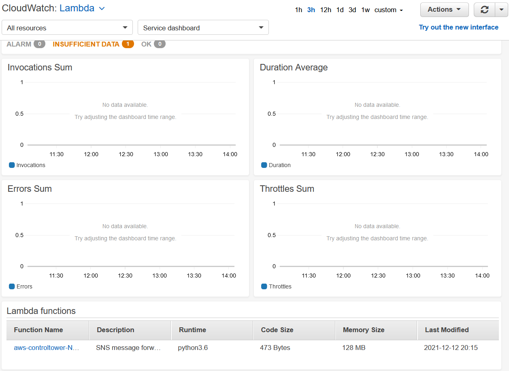
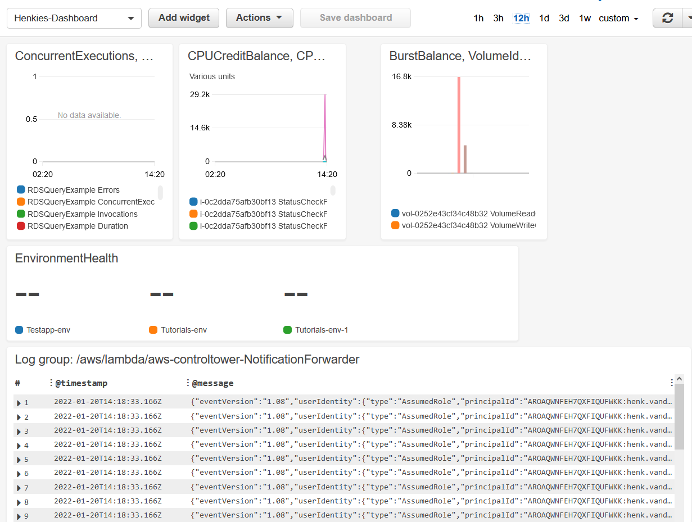
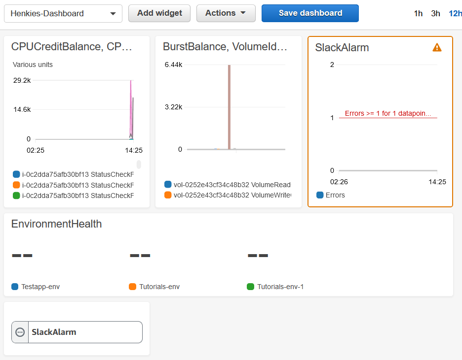

# CloudWatch
Amazon CloudWatch is een monitoring- en observatieservice die is gebouwd voor DevOps-technici, ontwikkelaars, site-betrouwbaarheidsingenieurs (SRE's), IT-managers en producteigenaren. CloudWatch biedt je gegevens en bruikbare inzichten om jouw applicaties te bewaken, te reageren op systeembrede prestatieveranderingen en het gebruik van resources te optimaliseren. CloudWatch verzamelt bewakings- en operationele gegevens in de vorm van logboeken, statistieken en gebeurtenissen. Je krijgt een uniform beeld van de operationele gezondheid en krijgt volledig inzicht in jouw AWS-resources, applicaties en services die op AWS en on-premises worden uitgevoerd. Je kunt CloudWatch gebruiken om afwijkend gedrag in jouw omgevingen te detecteren, alarmen in te stellen, logboeken en statistieken naast elkaar te visualiseren, geautomatiseerde acties te ondernemen, problemen op te lossen en inzichten te ontdekken om jouw applicaties soepel te laten werken.

## Hoe werkt CloudWatch
Amazon CloudWatch is in feite een opslagplaats voor statistieken. Een AWS-service, zoals Amazon EC2, plaatst statistieken in de repository en jij haalt statistieken op op basis van die metrics. Als jij jouw eigen aangepaste metrische gegevens in de repository plaatst, kun jij ook statistieken over deze metrische gegevens ophalen.  

Ik heb een mindmap gemaakt van de features van AWs CloudWatch:  

## Key-terms
- Alle key-terms die betrekking hebben op AWS Cloud Practitioner, zijn te vinden in het document: [AWS-Cloud-Practitioner](../beschrijvingen/aws-cloud-practitioner.md)  
- Voor meer key terms verwijs ik graag naar [What is Amazon CloudWatch?](https://docs.aws.amazon.com/AmazonCloudWatch/latest/monitoring/WhatIsCloudWatch.html)

## Opdracht
[Monitoring with CloudWatch Dashboards](https://www.wellarchitectedlabs.com/performance-efficiency/100_labs/100_monitoring_with_cloudwatch_dashboards/)  
[Creating a CloudWatch dashboard](https://docs.aws.amazon.com/AmazonCloudWatch/latest/monitoring/create_dashboard.html)
### Gebruikte bronnen
- https://aws.amazon.com/cloudwatch/
- https://docs.aws.amazon.com/AmazonCloudWatch/latest/monitoring/cloudwatch_architecture.html
- https://youtu.be/k7wuIrHU4UY

### Ervaren problemen
AJAX Error 401 bij het uploaden van een CloudFormation Stack file. Via Github terecht gekomen op deze [pagina](https://github.com/webcompat/web-bugs/issues/51082). Dus ik heb de Chrome browser geïnstalleerd en nu werkt het. Vervolgens bleek ik niet over de juiste rechten te beschikken. Opdracht afgekapt.

### Resultaat
#### CloudWatch Overview
Zodra je services in jouw AWS-account hebt geïmplementeerd, vult Cloudwatch automatisch het tabblad Overzicht met verschillende statistieken, zoals deze:  

#### CloudWatch Cross service dashboard
Het cross-service dashboard geeft automatisch de belangrijkste statistieken weer van elke AWS-service die je gebruikt, zonder dat je hoeft te kiezen welke statistieken je wilt bewaken of aangepaste dashboards te maken. Je kunt het ook gebruiken om naar elke AWS-service te gaan en nog meer belangrijke statistieken voor die service te bekijken.  

#### CloudWatch Lambda

#### CloudWatch: zelfgemaakt dashboard

**Met Alarm widgets toegevoegd***  

