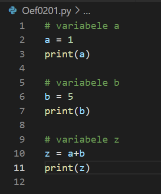
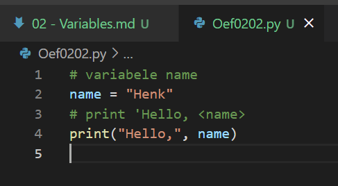
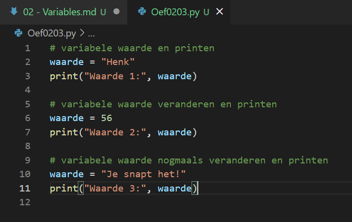

# Variabelen
Python maakt gebruik van variabelen om waardes in op te slaan. De waarde kun je benaderen door de variabele aan te roepen. Een variabele kan starten met een letter of de _underscore. Alle andere karakters levert een foutmelding op. 

## Oefening 1
### Code

### Resultaat

## Oefening 2
### Code

### Resultaat

## Oefening 3
### Code

### Resultaat

