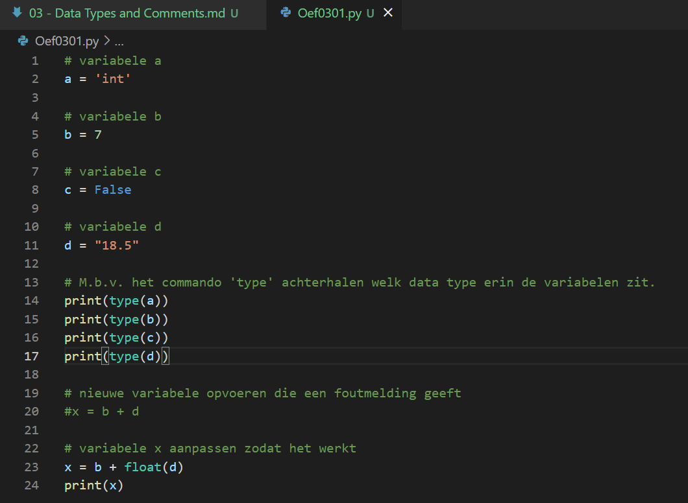
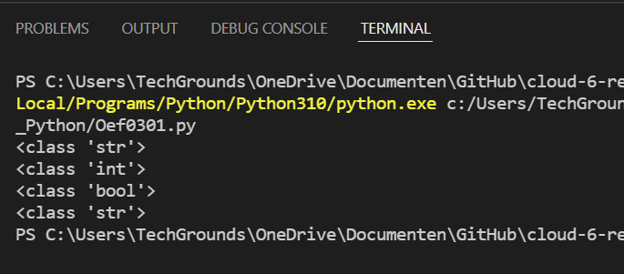
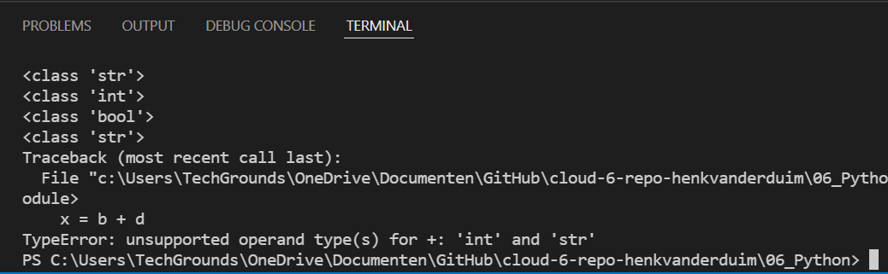
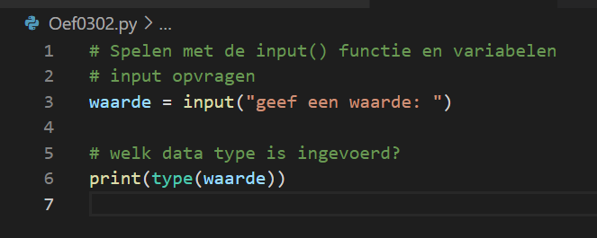
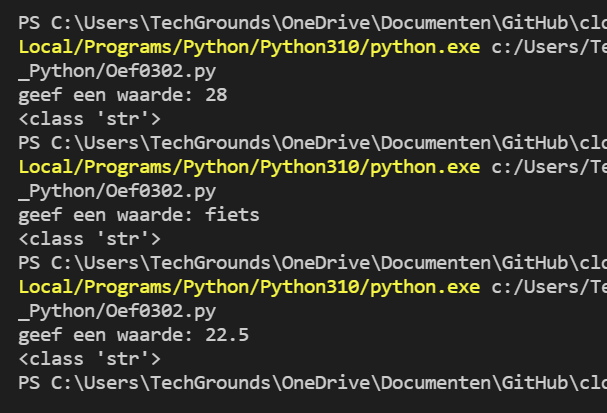

# Data Types en Comments
Een computer werkt met binaire code. Om te zien of een binaire code een getal of een letter is, zal het data type goed gedefinieerd moeten worden.  

## Data Typen
- Boolean: True of False
- String: Karakters, weergegeven tussen "" en ''
- Int: Integer oftewel een geheel getal. Kan zowel positief als negatief zijn
- Float: Een decimaal getal
- Comments: Dit wordt niet gezien als code. Dit kun je gebruiken om een korte beschrijving te geven van wat een stuk code doet. Ook kun je code op die manier 'uitzetten'.

## Oefening 1
### Code

### Resultaat
#### Data Types achterhalen

#### Nieuw variabele met foutmelding

#### Nu met de juiste syntax

## Oefening 2
De input() functie geeft altijd een 'str' klasse aan als data type. Als je dit anders wil, dan zul je bij het input() commando moeten aangeven wat je verwacht.  
- int(input("waarde: "))
- float(input("waarde: "))

### Code

### Resultaat
