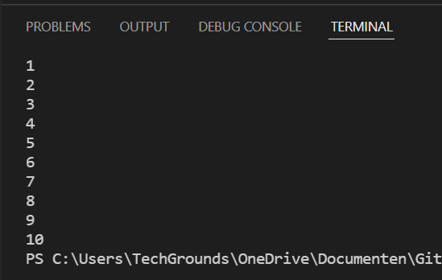
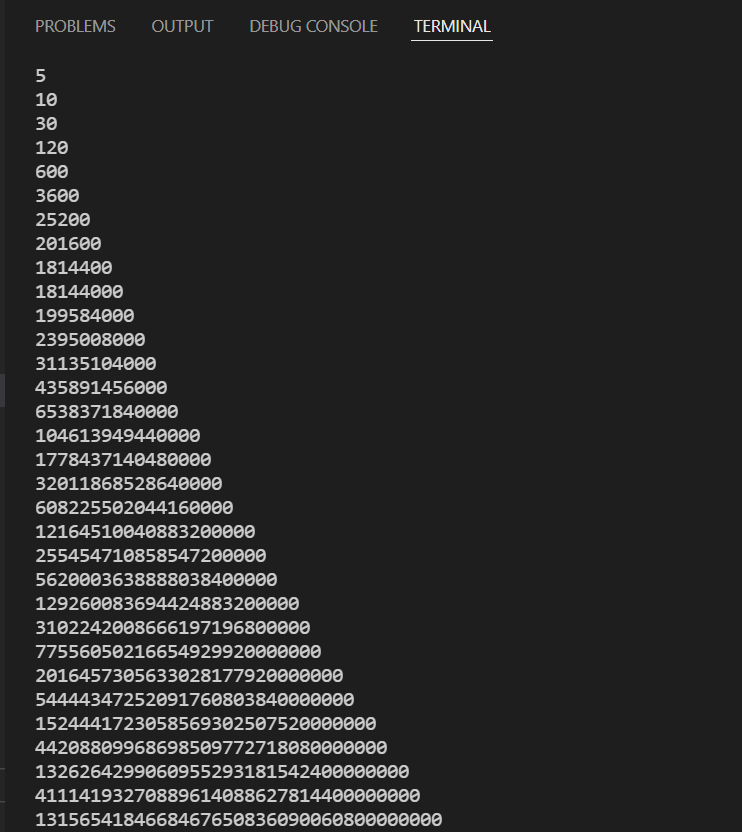
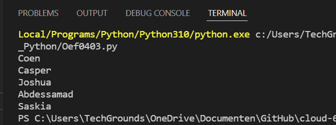

# Loops
Als je stuk code meerdere malen wilt laten lopen, dan kun je gebruik maken van loops in Python. Er zijn twee types loops in Python:  
- while loop: loopt zolang de conditie *waar* is.
- for loop: loopt zolang het voldoet aan de *teller*

## Oefening 1
### Code
```python
# een variabele in een loop
x = 0
while x <= 10:
    print(x)
    x += 1
```

### Resultaat


## Oefening 2
### Code
```python
# variabele x een waarde geven
x = 5

# geplakte code:
for i in range(1, 50):
    x = i*x
    print(x)
```

### Resultaat


## Oefening 3
### Code
```python
# stoeien met een array
arr = ["Coen", "Casper", "Joshua", "Abdessamad", "Saskia"]
for x in arr:
    print(x)
```
### Resultaat
