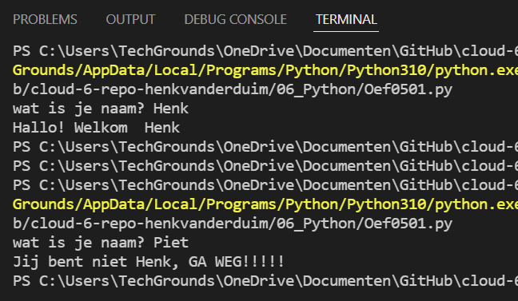

# Conditions
Code laten draaien onder bepaalde voorwaarden. Dat doe je met behulp van Conditions. Python maakt hiervoor gebruik van *if*, *elif* en *else* statements.

## Oefening 1
### Code
```python
# script om de juiste naam uit te vragen
# als niet de juiste naam wordt gegeven dan een foutmelding
#
# variabele naam
naam = input("wat is je naam? ")
if naam == "Henk":
    print("Hallo! Welkom ", naam)
else:
    print("Jij bent niet Henk, GA WEG!!!!!")
```
### Resultaat


## Oefening 2
### Code
```python
# vraag om een getal. 
# geef een reactie op basis van het volgende:
# - hoger dan 100 
# - lager dan 100
# - gelijk aan 100 en zo ja stop de loop
#
# Variabele getal
getal = int(input("Geef een willekeurig getal: "))
while getal != 100:
    if getal > 100:
        print(getal, "dit is hoger dan 100")
        getal = int(input("Geef een willekeurig getal: "))
    elif getal < 100:
        print(getal, "dit is lager aan 100")
        getal = int(input("Geef een willekeurig getal: "))
else:
    if getal == 100:
        print(getal, "dit is gelijk aan 100")
```
### Resultaat
