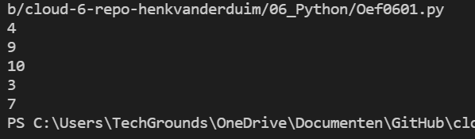
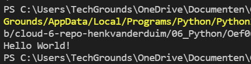
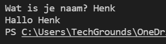
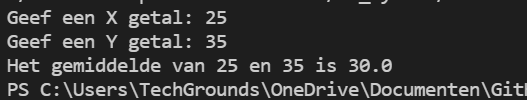

# Functions
In python is het mnogelijk om je eigen functies te definiëren. Dit doe je met behulp van *def <functienaam()>*. Tussen de haakjes achter de functienaam kun je data plaatsen, die gebruikt wordt in de functie.  
## Oefening 1
### Code
```python
# maak een scriopt waarbij gebruik gemaakt wordt van de random library
# print 5 random integers met een waarde tussen 0 en 100
#
# import random
import random

# definieer de functie
def willekeur():
    i = 1 
    while i !=6:
        print(random.randint(0, 10))
        i = i + 1

willekeur()
```
### Resultaat

## Oefening 2
### Code
```python
# maak een script die m.b.v. eigen functie de opgevraagde input uitprint
#
# functie: myfunction()
#
def myfunction():
    print("Hello World!")

myfunction()
```
### Resultaat


### Code (met string)
```python
def myfunction():
    naam = input("Wat is je naam? ")
    print("Hallo", naam)

myfunction()
```
### Resultaat


## Oefening 3
### Code
```python
# schrijf een script met de functie avg()
# plak opgegeven code en vervolmaak deze
#
def avg():
    x = int(input("Geef een X getal: "))
    y = int(input("Geef een Y getal: "))
    z = (x + y)/2
    print("Het gemiddelde van", x,"en", y,"is", z)

avg()
```
### Resultaat
