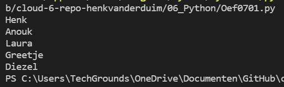
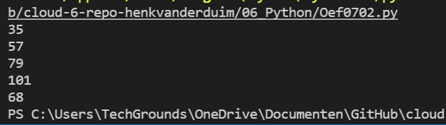

# Lists
Door een aantal waardes in één variabele te stoppen maak je een lijst. Een lijst wordt weergegeven door de waardes tussen [] haken te zetten. Elke waarde wordt gescheiden van de volgende door een komma.  
De lijst index start met 0, het volgende item heeft dan 1, enzovoort. Op die manier kun je items uit een lijst oproepen. De index kun je ook gebruiken als je een *loop* maakt.
## Oefening 1
### Code
```python
# maak een lijst met 5 namen
# maak een loop waarmee je de vijf namen op
# een afzonderlijke regel print
#
# lijst
namen = ["Henk", "Anouk", "Laura", "Greetje", "Diezel"]
for x in namen:
    print(x)
```
### Resultaat


## Oefening 2
### Code
```python
# Maak een lijst met 5 getallen (int)
# De uitvoer:
# tel het eerste getal op bij het tweede, tweede bij de derde, etc.
# laatste getal tel je op bij het eerste getal
#
# lijst
mylist = [12, 23, 34, 45, 56]
x = len(mylist)
# loop
for i in range(len(mylist)):
    while i != x-1:
        print(mylist[i] + mylist[i+1])
        i = i + 1
    else:
        print(mylist[i] + mylist[i-(x-1)])
        break
```
### Resultaat
