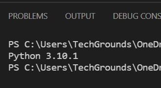
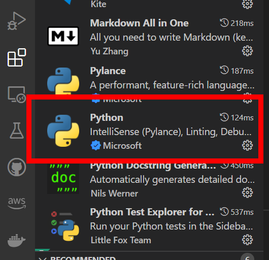
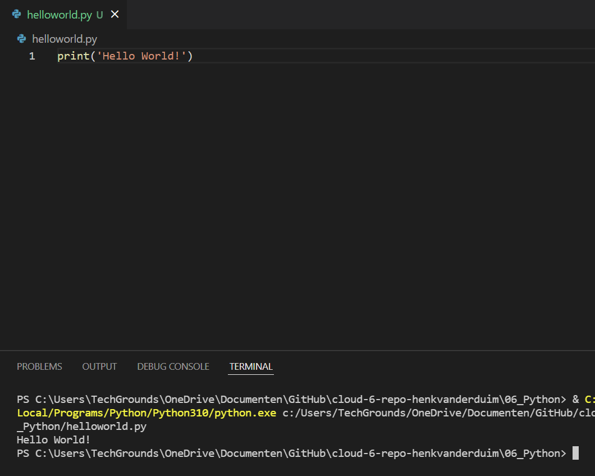

# PRG-01 Setting up
- De laatste versie van Python installeren
- VS Code installeren
- Installeer de Python plugin in VS Code
- Schrijf de hello world code

## Python versie

## Python plugin

## Hello World!

