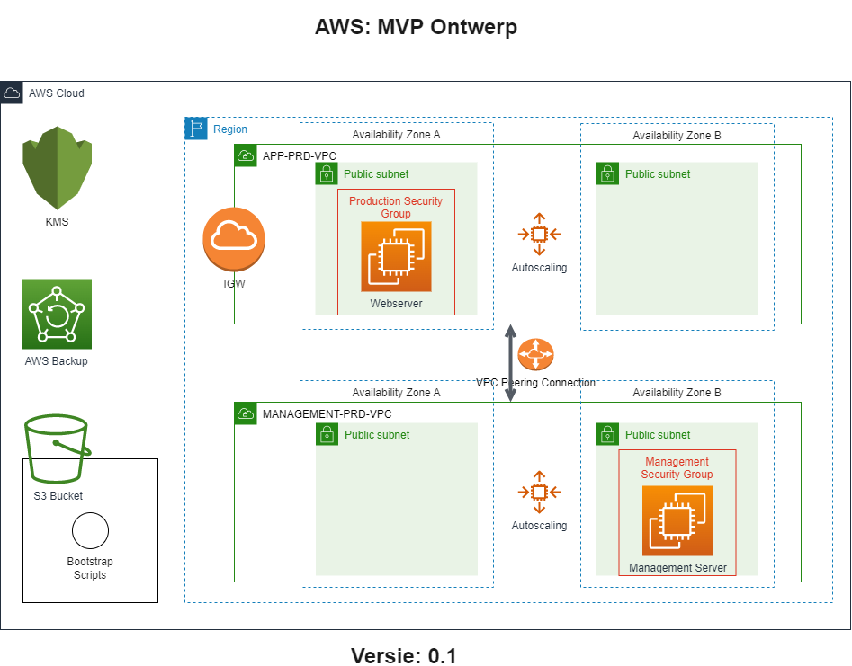

# Product Requirements Document
Version: 0.1
## Cloud6.Sentia1
- Shikha Jha
- Chris de Bont
- Henk van der Duim (Scrum Master)

## Product Owner
- Coen Meulenkamp (Learning Coach)

## Inhoud
1. Doel
2. Release
3. User Stories
4. Diagrammen

### Uitwerking
1. **Doel**
   | Item | Opmerking |
   | ---- | --------- |
   | Visie | *Wat is het uiteindelijke product* |
   | Doelen | *Overzicht van doelen, timelines en succes metrics* |
   | Initiatieven| *Overzicht High-level product initiatieven* |
   | Persona(s) | *Voor wie is het product* |

2. **Releases**
   | Item | Opmerking |
   | ---- | --------- |
   | Release | MVP v1.0 |
   | Datum | *release datum* |
   | Initiatief | *waar is de release voor bestemd* |
   | Mijlpalen | *release mijlpalen* |
   | Kenmerken | *kenmerken van de release* |
   | Afhankelijkheden | *release afhankelijkheden* |
  
3. **User Stories**
   | Item | Opmerking |
   | ---- | --------- |
   | Kenmerk | *user story* |
   | Omschrijving | Omschrijving van de user story* |
   | Doel | *wat wordt er bereikt* |
   | User problem | *Pijnpunt of uitdaging* | User value | *hoe helpt de oplossing de gebruiker* |
   | Aannames | *de aannames bij deze user story* |
   | Doen we niet | *alles wat buiten de scopen van deze user story ligt* |
   | Acceptatie criteria | *Acceptatiecondities* |
  
4. **Diagrammen**
Na het overleg met de Product Owner (op 10 februari 2022), adviseren wij onderstaand diagram voor het MVP.  

