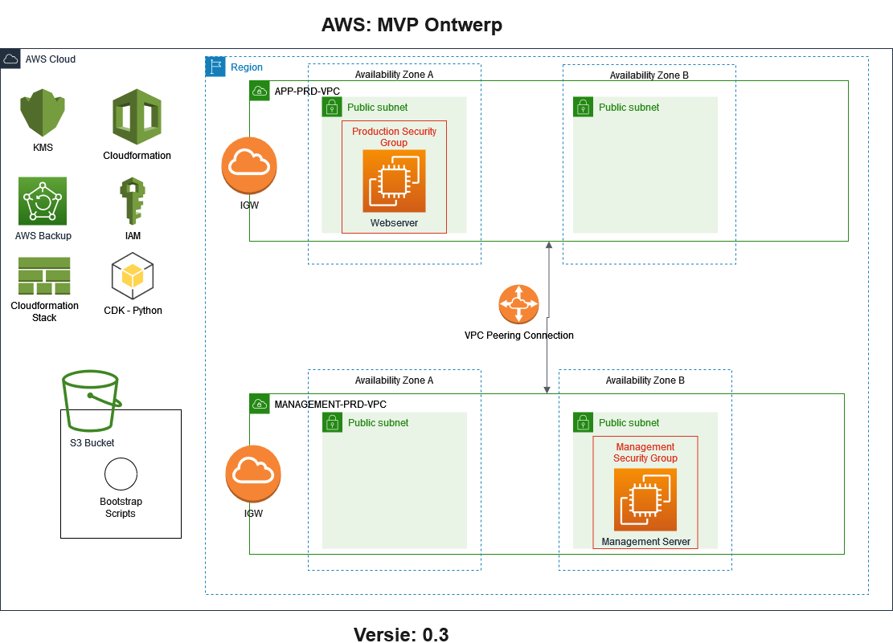

# Product Requirements Document
## Cloud6.Sentia1
- Shikha Jha
- Chris de Bont
- Henk van der Duim (Scrum Master)

## Product Owner
- Coen Meulenkamp (Learning Coach)

## Inhoud
1. Doel
2. Release
3. Epics
4. Diagrammen

### Uitwerking
1. **Doel**  
   | Item | Opmerking |
   | ---- | --------- |
   | Visie | *Wat is het uiteindelijke product* |
   | Doelen | *Overzicht van doelen, timelines en succes metrics* |
   | Initiatieven| *Overzicht High-level product initiatieven* |
   | Persona(s) | *Voor wie is het product* |

2. **Releases**  
   | Item | Opmerking |
   | ---- | --------- |
   | Release | MVP v1.0 |
   | Datum | *release datum* |
   | Initiatief | *waar is de release voor bestemd* |
   | Mijlpalen | *release mijlpalen* |
   | Kenmerken | *kenmerken van de release* |
   | Afhankelijkheden | *release afhankelijkheden* |
  
3. **Epics**  
   Alle Epics zijn beschreven in afzonderlijke documenten. Daar wordt per Epic alles besproken en uitgewerkt.  
   **Exploratie Epics**  
   - [Als team willen wij duidelijk hebben wat de eisen zijn van de applicaties](../07_Project/Epic01.md)
   - [Als team willen wij een duidelijk overzicht van de aannames die wij gemaakt hebben](../07_Project/Epic02.md)
   - [Als team willen wij een duidelijk overzicht hebben van de Cloud Infrastructuur die de applicatie nodig heeft](../07_Project/Epic03.md)  

   **v1.0**
   - [Als klant wil ik een werkende applicatie hebben waarmee ik een veilige netwerk kan deployen](../07_Project/Epic04.md)
   - [Als klant wil ik een werkende applicatie hebben waarmee ik een werkende webserver kan deployen](../07_Project/Epic05.md)
   - [Als klant wil ik een werkende applicatie hebben waarmee ik een werkende management server kan deployen](../07_Project/Epic06.md)
   - [Als klant wil ik een opslagoplossing hebben waarin bootstrap/post-deployment script opgeslagen kunnen worden](../07_Project/Epic07.md)
   - [Als klant wil ik dat al mijn data in de infrastructuur is versleuteld](../07_Project/Epic08.md)
   - [Als klant wil ik iedere dag een backup hebben dat 7 dagen behouden wordt](../07_Project/Epic09.md)
   - [Als klant wil ik weten hoe ik de applicatie kan gebruiken](../07_Project/Epic10.md)
   - [Als klant wil ik een MVP kunnen deployen om te testen](../07_Project/Epic11.md)
  
4. **Diagrammen**  
Na het overleg met de Product Owner (op 10 februari 2022), adviseren wij onderstaand diagram voor het MVP.  

