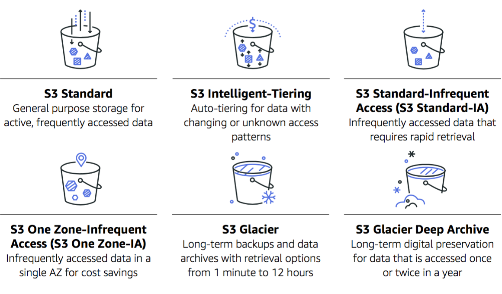
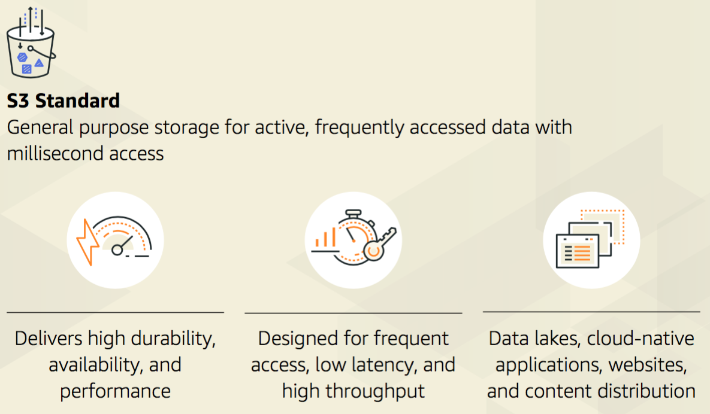
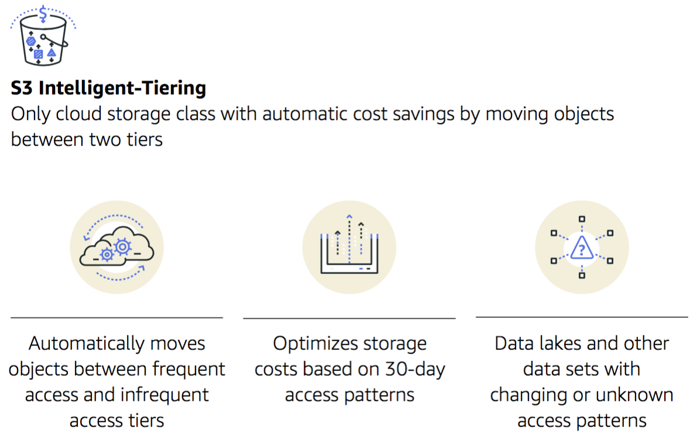
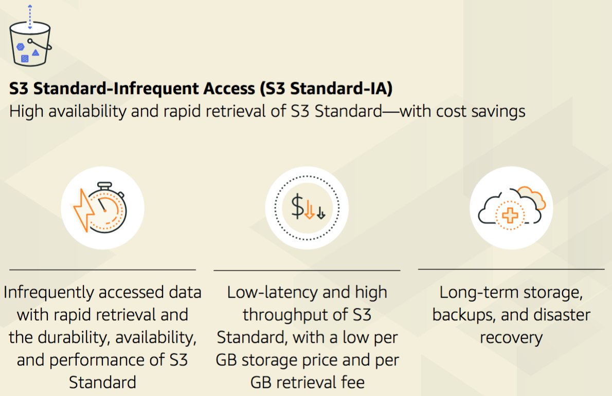
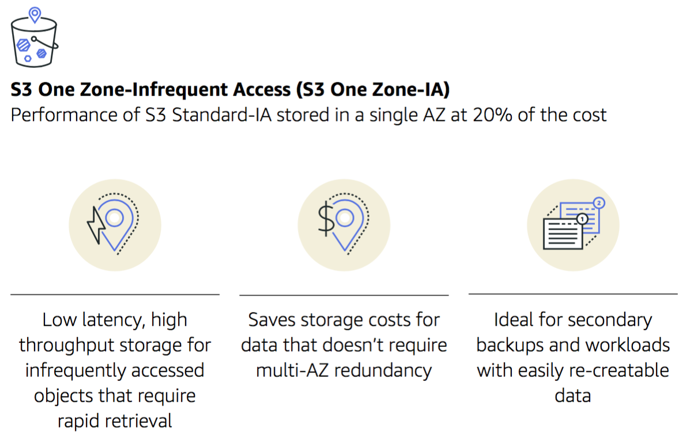
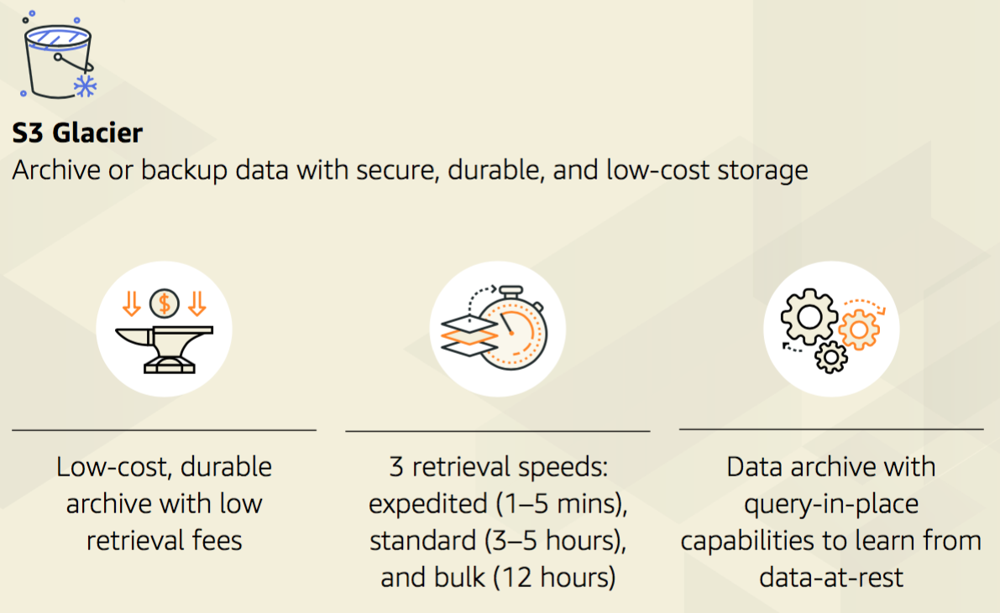
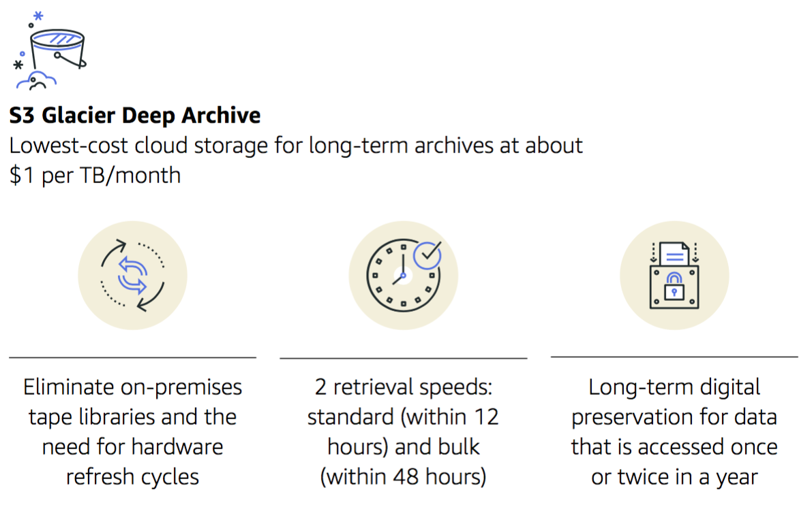

# AWS Cloud Practitioner Key Terms
Hier zijn de alle Key Terms te vinden die horen bij AWS Cloud Practitioner.

## AWSR
### AWS Regions
een fysieke locatie ergens op deze wereld, waar meerdere AZ's zich bevinden

## AZ 
### Availability Zones
een Az bestaat uit één of meerdere datacenters, elk met z'n eigen redundant energie voorziening, netwerk en verbindingen. Gehuisvest in gescheiden faciliteiten.

## Edge
### Edge Locations
dit zijn CDN (content delivery network) eindpunten voor AWS CloudFront

## Datacenter
ook wel aangeduid onder de Nederlandse naam rekencentrum, is een faciliteit waar bedrijfskritische ICT-apparatuur (bijvoorbeeld servers) kan worden ondergebracht. Een datacenter is uitgerust met diverse voorzieningen, waaronder klimaatbeheersing door middel van airconditioning, geavanceerde automatische brandblussystemen en back-up stroomvoorzieningen. Daarnaast bevat een datacenter doorgaans verbindingen met het internet en is het voorzien van fysieke veiligheidsmaatregelen. In verband met het bedrijfskritische karakter van de apparatuur in een datacenter, zijn de voorzieningen doorgaans redundant uitgevoerd.

## Cloudfront
AWS CloudFront is een CDN service specifiek gebouwd voor high performance, security en developer gemak.

## Redundant
Technische systemen kunnen zowel op component- als systeemniveau redundant worden uitgevoerd. Dit houdt in dat bepaalde onderdelen (onder regie van een speciaal algoritme) dubbel, of nog vaker, aanwezig zijn, zodat het geheel goed blijft functioneren wanneer een onderdeel uitvalt. Voorbeelden zijn: redundant array of independent disks (RAID) en Cluster Computing.

## LowLatency
### Low Latency
dit beschrijft een computernetwerk dat is geoptimaliseerd om een zeer grote hoeveelheid databerichten met minimale vertraging (latency) te verwerken. Deze netwerken zijn ontworpen om operaties te ondersteunen die bijna realtime toegang tot snel veranderende gegevens vereisen.

## Instance
Instances in AWS zijn in feite virtuele omgevingen. Deze virtuele omgevingen zijn geïsoleerd van het onderliggende basis-OS. Het is een on-demand service, d.w.z. een gebruiker kan de virtuele server(s) op uurbasis huren en zijn applicaties erop implementeren.

##### Soorten instancesa in AWS

Amazon biedt een breed scala aan instances voor verschillende gebruiksscenario's. Je kan degene kiezen die het beste bij je past. Laten we eens kijken naar verschillende soorten instances die je zullen helpen bij het selecteren van je perfecte match.

- **Instanties voor algemeen gebruik**  
Het is het meest gebruikte instance type. Het wordt voornamelijk gebruikt voor webservers en actieve implementatieomgevingen voor mobiele of gaming-applicaties. Het is perfect als je een nieuweling bent. Voorbeelden voor algemene doeleinden zijn: A1, M5, M5a, M4, T3, T3a, T2.

- ***Voor computer geoptimaliseerde instanties**  
Voor computer geoptimaliseerde instance typen zijn perfect wanneer je prioriteit moet geven aan onbewerkte rekenkracht, zoals gamingservers, wetenschappelijke modellering, krachtige webservers en mediatranscodering. Ze zijn sneller maar duurder (kosten gebaseerd op geheugen, CPU, instantieopslag, netwerk en EBS-bandbreedte). Compute Optimized-instance omvatten - C5, C5n, C4.

- **Voor geheugen geoptimaliseerde instanties**  
Deze instances zijn ideaal voor geheugengevoelige toepassingen, zoals realtime analyse van big data, krachtige databases, enz. Voor geheugen geoptimaliseerde instances omvatten: R5, R5a, R4, X1e, X1, Z1d, High Memory.

- **Versnelde computerinstanties**  
Versnelde (accelerated) computerinstances gebruiken afzonderlijke grafische verwerkingseenheden of veldprogrammeerbare poortarrays voor grafisch gevoelige berekeningen. Accelerated Computing-instances omvatten - P3, P2, G3, F1.

- **Voor opslag geoptimaliseerde instanties**  
Dit soort instances bieden hoge sequentiële lees-schrijfbewerkingen voor grote gegevenssets. Deze instanties worden gebruikt wanneer een gebruiker hoge SSD-opslag nodig heeft. Voor opslag geoptimaliseerde instanties omvatten - I3, I3en, D2, H1.

## EC2
Amazon Elastic Compute Cloud (Amazon EC2) biedt schaalbare rekencapaciteit in de Amazon Web Services (AWS) Cloud. Door Amazon EC2 te gebruiken, hoef je niet vooraf in hardware te investeren, zodat je applicaties sneller kunt ontwikkelen en implementeren. Je kunt Amazon EC2 gebruiken om zo veel of zo weinig virtuele servers te starten als je nodig hebt, beveiliging en netwerken te configureren en opslag te beheren. Met Amazon EC2 kunt je omhoog of omlaag schalen om veranderingen in vereisten of pieken in populariteit op te vangen, waardoor je minder verkeer hoeft te voorspellen.

## Elastic-IP
Een Elastic IP-adres is een gereserveerd openbaar IP-adres dat je kan toewijzen aan een EC2-instance in een bepaalde regio, totdat je ervoor kiest om het vrij te geven. 

Wanneer je een Elastic IP-adres koppelt aan een EC2-instance, vervangt dit het standaard openbare IP-adres. Als er vanuit jouw opstartinstellingen een externe hostnaam aan de instance is toegewezen, zal deze ook deze hostnaam vervangen; anders wordt er een voor de instance gemaakt. Het Elastic IP-adres blijft bestaan ondanks door de gebeurtenissen die er normaal gesproken voor zorgen dat het adres wordt gewijzigd, zoals het stoppen of opnieuw starten van de instantie.

## UPS
Noodstroomvoeding (UPS) is de voeding van een elektrisch netwerk, die in bedrijf komt zodra de gebruikelijke primaire voeding (bijvoorbeeld netspanning van het elektriciteitsbedrijf) uitvalt.  
bron: https://nl.wikipedia.org/wiki/Noodstroomvoeding

## Backup
Een goed Nederlands woord voor back-up is: reservekopie. Dat is dan ook precies wat een back-up is, een reservekopie van alle belangrijke bestanden die op de computer/server staan. Een kopie waarmee kan worden voorkomen dat er niets verloren gaat wanneer er onverhoopt iets mis mocht gaan. 

## Tier-1
Onder een Tier 1-netwerk verstaat men een IP-netwerk (van een internet service provider), dat uitsluitend via peering met de rest van het internet gekoppeld is. Anders gezegd, een provider die aan geen enkele andere provider geld betaalt voor IP-transit.

Een kenmerk van vrijwel alle Tier 1-providers is dat ze zowel in Noord-Amerika als in Europa uitgebreide netwerken beheren en exploiteren. 

## Data-Compliance
Datacompliance is de praktijk om ervoor te zorgen dat organisaties de voorschriften volgen om ervoor te zorgen dat de gevoelige digitale activa (gegevens) die ze bezitten, worden georganiseerd, opgeslagen en beheerd zodat ze worden beschermd tegen verlies, corruptie, diefstal en misbruik.

Deze voorschriften beschrijven welke gegevens moeten worden beschermd, welke processen acceptabel zijn en wat de sancties zijn als de regels niet worden nageleefd.

## AMI
Een AMI (Amazon Machine Interface) levert de informatie die nodig is om een instance te starten. Je moet een AMI opgeven wanneer je een instance start. U kunt meerdere instances starten vanuit één AMI wanneer je meerdere instances met dezelfde configuratie nodig heeft. Je kunt verschillende AMI's gebruiken om instances te starten wanneer je instances met verschillende configuraties nodig hebt.

Een AMI omvat het volgende:  
- Een of meer Amazon EBS (Amazon Elastic Block Store)-snapshots, of, bijvoorbeeld door e-store ondersteunende AMI's, een sjabloon voor het hoofdvolume van de instance (bijvoorbeeld een besturingssysteem, een toepassingsserver en toepassingen).  
- Startrechten die bepalen welke AWS-accounts de AMI kunnen gebruiken om instances te starten.  
- Een 'block device mapping' die de volumes specificeert die aan de instance moeten worden gekoppeld wanneer deze wordt gestart.

## Workload
Bij informatica is een werkbelasting (workload) meestal elk programma of elke toepassing die op de computer wordt uitgevoerd. Een workload kan een eenvoudige wekker- of contact-app zijn die op een smartphone draait, of een complexe bedrijfsapplicatie die wordt gehost op een of meer servers met duizenden client- (gebruikers)systemen die zijn verbonden en communiceren met de applicatieservers via een uitgebreid netwerk. Tegenwoordig worden de termen werklast, applicatie, software en programma door elkaar gebruikt.

Workload kan ook verwijzen naar de hoeveelheid werk (of belasting) die software oplegt aan de onderliggende computerbronnen. In grote lijnen is de werkbelasting van een applicatie gerelateerd aan de hoeveelheid tijd en computerbronnen die nodig zijn om een ​​specifieke taak uit te voeren of een output te produceren uit de geleverde input. Een lichte werklast bereikt de beoogde taken of prestatiedoelen met relatief weinig computerbronnen, zoals processors, CPU (central processing unit) klokcycli, opslag I/O (input/output) enzovoort. Een zware werklast vereist aanzienlijke hoeveelheden computerbronnen.

De taken van een werkbelasting variëren sterk, afhankelijk van de complexiteit en het beoogde doel van de toepassing. Een webservertoepassing kan bijvoorbeeld de belasting meten aan de hand van het aantal webpagina's dat de server per seconde levert, terwijl andere toepassingen de belasting kunnen meten aan de hand van het aantal transacties dat per seconde wordt uitgevoerd met een specifiek aantal gelijktijdige netwerkgebruikers. Gestandaardiseerde statistieken die worden gebruikt om de prestaties of belasting van een applicatie te meten en erover te rapporteren, worden gezamenlijk benchmarks genoemd.

## Local-Zones
AWS Local Zones plaatsen rekenkracht, opslag, database en andere geselecteerde AWS-services dichter bij de eindgebruikers.

Met AWS Local Zones kun je eenvoudig veeleisende applicaties uitvoeren die een milliseconde latency voor je eindgebruikers vereisen.

Elke AWS Local Zone-locatie is een uitbreiding van een AWS-regio waar je jouw latency gevoelige applicaties kunt uitvoeren met behulp van AWS-services zoals Amazon Elastic Compute Cloud, Amazon Virtual Private Cloud, Amazon Elastic Block Store, Amazon File Storage en Amazon Elastic Load Balancing in geografische nabijheid van je eindgebruikers.

AWS Local Zones bieden een veilige verbinding met hoge bandbreedte tussen lokale workloads en die in de AWS-regio, zodat je naadloos verbinding kunt maken met het volledige scala aan services in de regio via dezelfde API's en toolsets.

## AWS-Wavelength
Met AWS Wavelength kunnen ontwikkelaars applicaties bouwen die een milliseconde latency leveren aan mobiele apparaten en eindgebruikers.

AWS-ontwikkelaars kunnen hun applicaties implementeren in Wavelength Zones, AWS-infrastructuurimplementaties die AWS-computing- en opslagservices inbedden in de datacenters van de telecommunicatieproviders aan de rand van de 5G-netwerken, en naadloos toegang krijgen tot de breedte van AWS-services in de regio.

AWS Wavelength brengt AWS-services naar de rand van het 5G-netwerk en minimaliseert de latentie om vanaf een mobiel apparaat verbinding te maken met een applicatie.

## AWS-Outposts
AWS Outposts brengen native AWS-services, infrastructuur en operationele modellen naar vrijwel elk datacenter, co-locatieruimte of on-premises faciliteit.

U kunt dezelfde AWS API's, tools en infrastructuur gebruiken voor zowel on-premises als de AWS-cloud om een echt consistente hybride ervaring te bieden.

AWS Outposts is ontworpen voor verbonden omgevingen en kan worden gebruikt om workloads te ondersteunen die on-premises moeten blijven vanwege lage latentie of lokale gegevensverwerkingsbehoeften. 

## TCO
Total Cost of Ownership (TCO) heet ook wel life cycle cost analysis of levensduurcyclus. Niet alleen de aanschafkosten maar de gehele economische levensduur wordt berekend.  

De Total Cost of Ownership (de levensduurcyclus) is het totaalbedrag aan kosten voor de aanschaf en het bezit van een product of dienst gedurende de hele levenscyclus/gebruikscyclus. Behalve de aanschafprijs reken je alle kosten mee: vanaf het moment van aankoop tot het moment dat je er afstand van doet. Zo breng je de kosten van zakendoen met een bepaalde leverancier systematisch in kaart. Vervolgens kijk je niet alleen naar kostenreductie bij die leverancier, maar bekijk je ook wat je binnen je eigen organisatie kunt doen om kosten te besparen. TCO is een onderdeel van cost management.

Kosten die onderdeel zijn van TCO zijn bijvoorbeeld:
- Onderhoudskosten
- Reparatiekosten
- Afschrijvingen
- Verzekeringen
- Belastingen
- Financieringskosten
- Kosten voor training en scholing
- Personeelskosten
- Distributiekosten
- Voorraadkosten
- Etc.

## Capex
CAPEX is een afkorting van Capital expenditures oftewel investeringsuitgaven.  
Dit zijn uitgaven die pas in latere perioden als last worden opgeschreven. Een voorbeeld is de aankoop van een computer, waar de entiteit 5 jaar plezier van heeft. De uitgave aan de computer wordt in 5 jaar tijd ten laste van het resultaat gebracht onder aftrek van de veronderstelde restwaarde na 5 jaar. De jaarlijkse last heet de afschrijving.

## Opex
OPEX is een afkorting van Operational expenses oftewel operationele kosten. Dit zijn alle kosten die voortvloeien uit de bedrijfsactiviteiten, bijvoorbeeld arbeidskosten.  
Operating expenses zijn terugkerende kosten voor een product, systeem of onderneming.

**Verschil OPEX en CAPEX**  
De tegenhanger van OPEX is CAPEX, dit zijn investeringskosten.

Als je een printer als voorbeeld neemt dan valt de aanschaf ervan onder CAPEX en de jaarlijkse kosten voor papier en inkt onder OPEX.

Video over Opex: https://youtu.be/HluLXhmCP1g

## Encryptie
Binnen de cryptografie staat encryptie of versleuteling voor het omzetten van een bericht als leesbare tekst, de klare tekst, naar de versleutelde tekst, het geheimschrift, ook wel als cijfertekst aangeduid. Dit versleutelen is al een zeer oud gebruik. Het Caesarcijfer was bijvoorbeeld een geheimschrift dat al door Julius Caesar werd gebruikt. Een versleuteling die met de hand kan worden uitgevoerd, noemt men een handcijfer; maar tegenwoordig gebeurt het versleutelen en ontsleutelen meestal met behulp van een computer. De cijfertekst kan nadien weer worden ontsleuteld, zodat men de originele klare tekst weer terugkrijgt. Dit proces wordt decryptie genoemd. Een methode van encryptie wordt wel een cijfer genoemd.

Een van de bedoelingen van cryptografie is dat gegevens veilig tussen twee personen kunnen worden uitgewisseld over een onveilig communicatiekanaal, dat wil zeggen een communicatiekanaal waartoe ook derden toegang kunnen hebben, zoals het internet. De versleuteling zorgt er dan voor dat deze derden de gegevens niet kunnen lezen. Dit gebeurt meestal door het gebruik van sleutels. Wat precies een sleutel vormt verschilt per algoritme, maar meestal is een sleutel een reeks van tientallen of honderden cijfers en letters. Het doel van het cryptografische algoritme is ervoor te zorgen dat alleen de personen met de juiste sleutel de cijfertekst weer kunnen ontsleutelen. Het versleutelen en ontsleutelen kan met de huidige elektronica zo snel, dat het bijvoorbeeld mogelijk is een telefoongesprek te versleutelen zonder dat het opgemerkt wordt. De sleutel om een klare tekst te versleutelen, de codeersleutel, en de sleutel om de verkregen cijfertekst te ontsleutelen, de decodeersleutel, verschillen meestal van elkaar, maar zijn wel uit elkaar te berekenen. 

Zo had ik vroeger, samen met mijn broertje, een sjabloon wat wij over een geschreven tekst konden leggen. Dan kwam naar voren wat wij elkaar te vertellen hadden.  

## StorageTypes
AWS kent drie types Cloud Storage. Hieronder worden de drie verder uitgewerkt.

### ObjectStorage
Een object is een bestand plus metagegevens en een objectarchief is een verzameling objecten. Elk object heeft een unieke ID en je gebruikt dit ID om jouw objecten in je archief te vinden.

Hoewel object-ID's soms op bestandspaden lijken, zijn objectarchieven fundamenteel anders dan bestandsopslag. Objectopslagplaatsen bewaren gegevens op een manier die ze veel meer ruimte geeft om te schalen.

### BlockStorage
Block storage systemen worden gebruikt om databases te hosten, willekeurige lees-/schrijfbewerkingen te ondersteunen en systeembestanden van de draaiende virtuele machines te bewaren. Gegevens worden opgeslagen in volumes en blokken, waar bestanden worden opgesplitst in blokken van gelijke grootte. Elk blok heeft zijn eigen adres, maar in tegenstelling tot objecten hebben ze geen metadata. Bij het opslaan van grote hoeveelheden gegevens worden bestanden opgesplitst in kleinere brokken van een vaste grootte, de "blokken", die worden verdeeld over de opslagknooppunten. Dit ondersteunt ook de volume-IO-prestaties.

### FileStorage
Bestandsopslag in de cloud is een methode voor het opslaan van gegevens in de cloud die servers en applicaties toegang geeft tot gegevens via gedeelde bestandssystemen.

## API
Een application programming interface (API) is een verzameling definities op basis waarvan een computerprogramma kan communiceren met een ander programma of onderdeel (meestal in de vorm van bibliotheken).  Vaak vormen API's de scheiding tussen verschillende lagen van abstractie, zodat applicaties op een hoog niveau van abstractie kunnen werken en het minder abstracte werk uitbesteden aan andere programma's. Hierdoor hoeft bijvoorbeeld een tekenprogramma niet te weten hoe het de printer moet aansturen, maar roept het daarvoor een gespecialiseerd stuk software aan in een bibliotheek, via een afdruk-API.  
Bekende webservice API's zijn:  
- SOAP API  
- REST API  

### SOAP
SOAP (Simple Object Access Protocol) is een koppeling, waarbij je alle regels voor de koppeling strikt definieert. Hierdoor wordt er structuur aangebracht in de koppeling, waardoor het overzicht en de controle bewaard blijft. Door al deze regels is een SOAP koppeling zwaarder dan een REST koppeling en kan het technisch gezien een uitdaging zijn om de koppeling uit te lezen en tot stand te brengen.  

### REST
Bij een REST (Representational State Transfer) koppeling wordt er minder structuur en regels in de koppeling aangebracht. De REST koppeling is om deze reden een stuk lichter dan de SOAP koppeling. Dit zorgt er over het algemeen voor dat deze koppeling sneller is.  

## StorageClasses
Er zijn in totaal zes Storage Classes bij AWS. Zie onderstaande afbeelding:  
  

### S3-Standard
  

### S3 Intelligent Tiering
  

### S3 Standard Infrequent Access
  

### S3 One Zone-Infrequent Access
  

### S3 Glacier
  

### S3 Glacier Deep Archive
  

Voor de AWS S3 Storage Classes heb ik deze infographic gebruikt: [S3 Storage Classes](../00_includes/Amazon_S3_StorageClasses_Infographic_2020.pdf)  

## OSI-Model
Interconnectiemodel voor open systemen.  

Het OSI-model is ontworpen in 1977 en maakt sinds 1984 deel uit van de ISO-specificaties.  
Elke OSI-laag heeft een unieke taak voor netwerkcommunicatie.

## TCP  
TCP/IP is een verzamelnaam voor een reeks netwerkprotocollen die gebruikt worden voor het grootste deel van de netwerkcommunicatie tussen computers. Het internet is het grootste en bekendste TCP/IP-netwerk.  

## HTTP  
Hypertext Transfer Protocol (HTTP) is het protocol voor de communicatie tussen een webclient (meestal een webbrowser of een app) en een webserver. Dit protocol wordt niet alleen veel op het wereldwijde web gebruikt, maar ook op lokale netwerken (we spreken dan van een intranet).

In HTTP is vastgelegd welke vragen (de Engelse term hiervoor is requests) een cliënt aan een server kan stellen en welke antwoorden (de Engelse term is responses) een webserver daarop kan teruggeven. Elke vraag bevat een URL die naar een webcomponent of een statisch object zoals een webpagina of plaatje verwijst.

## UDP  
Het User Datagram Protocol (UDP) is een van de basisprotocollen van het internet. Het protocol opereert op hetzelfde niveau als TCP en wordt beschreven in RFC 768.  

## BGP  
Het Border Gateway Protocol (BGP) is het belangrijkste routeringsprotocol van het internet: het wordt gebruikt om verkeer tussen verschillende providers te routeren. Binnen het netwerk van een provider (een zogenaamd autonoom systeem) kiest de provider voor een bepaald intra-routeringsprotocol zoals OSPF of Routing Information Protocol, maar om routes uit te wisselen met andere providers wordt exclusief gebruikgemaakt van BGP. Het is dus niet zo dat BGP het meest gebruikte routeringsprotocol is, maar zonder BGP zou er geen internet zijn. Dan was er slechts een verzameling losse netwerken die niet met elkaar kunnen communiceren.  

## IAB  
Internet-architectuur Board (IAB): Verantwoordelijk voor het definiëren van de algemene architectuur van internet, het bieden van begeleiding en brede richting aan de IETF.  

## IETF  
Internet Engineering-taak Force (IETF): de protocol-engineering- en ontwikkelingstak van internet.  

## IESG  
Internet Engineering Steering Group (IESG): Verantwoordelijk voor technisch beheer van IETF-activiteiten en het proces van internetstandaarden.

## RFC
Request for Comment

## SSH
Secure Shell (kortweg: SSH) is een protocol uit de toepassingslaag van de TCP/IP-protocolgroep. De term ssh werd gemakshalve ook gebruikt voor het clientprogramma dat het protocol toepast (het serverprogramma heet sshd, 'Secure Shell daemon'). SSH vervangt oudere protocollen zoals telnet, rlogin, en rsh/rexec door een beveiligbare variant daarvan. De standaard poort van SSH is 22.

## RDP
Remote desktop is het volledig overnemen van een pc vanop afstand, inclusief het gebruik van het toetsenbord en de muis. Remote desktop is een Microsoft-technologie.

## EBS
Amazon Elastic Block Store (EBS) biedt onbewerkte opslag op blokniveau die kan worden gekoppeld aan Amazon EC2-instanties en wordt gebruikt door Amazon Relational Database Service (RDS).

Amazon EBS biedt een reeks opties voor opslagprestaties en kosten. Deze opties zijn onderverdeeld in twee hoofdcategorieën: SSD-backed storage voor transactionele workloads, zoals databases en opstartvolumes (prestaties zijn voornamelijk afhankelijk van IOPS), en disk-backed storage voor doorvoerintensieve workloads, zoals MapReduce en logverwerking (prestaties zijn afhankelijk van voornamelijk op MB/s).

## Firewall
Een firewall is een systeem dat de middelen van een netwerk of computer kan beschermen tegen misbruik van buitenaf.

Het beschermde netwerk is vaak een intranet of intern netwerk en dit wordt beschermd tegen het internet. Het ongewenste verkeer bestaat bijvoorbeeld uit aanvallen van hackers en computerkrakers, inbraken en/of uitbraken van computervirussen, spyware, spam en denial of service attacks.

## SSD
Een solid state drive of solid state disk (SSD) is een medium waarop digitaal gegevens bewaard kunnen worden met behulp van niet-vluchtig (zoals flash) of vluchtig geheugen (bijvoorbeeld SDRAM). SSD's worden voornamelijk gebruikt in computertoepassingen waar traditioneel een harde schijf gebruikt werd. SSD's staan bekend om hun korte zoek- en toegangstijd. Tegenwoordig hebben SSD's een toegangstijd van amper 0,1 milliseconde.  

## Snapshot
EBS Snapshots zijn een kopie van je gegevens (van een bepaald punt in de tijd), die worden gebruikt om noodherstel mogelijk te maken. Je kunt tevens gegevens over regio's en accounts migreren en de backup-compliance te verbeteren.  

## VPC
Amazon's Virtual Private Cloud (VPC) is een fundamentele AWS-service. Fundamenteel zijn betekent dat andere AWS-services, zoals Elastic Compute Cloud (EC2), niet toegankelijk zijn zonder een onderliggend VPC-netwerk.

Het maken van een VPC is van cruciaal belang voor het draaien in de AWS-cloud.

## StatefulFirewall
Stateful firewalls bewaken alle aspecten van de verkeersstromen, hun kenmerken en communicatiekanalen. Deze firewalls kunnen codering of tunnels integreren, TCP-verbindingsstadia, pakketstatus en andere belangrijke statusupdates identificeren.

Standaard verwerkt de Stateful Firewall de regels in de volgorde van hun actie-instelling, waarbij 'pass rules' eerst worden verwerkt, vervolgens worden verwijderd en vervolgens een waarschuwing (alert). De firewall stopt met verwerken wanneer er een overeenkomst wordt gevonden.

## StatelessFirewall
Stateless firewalls gebruiken aanwijzingen van het bestemmingsadres, de bron en andere sleutelwaarden om te beoordelen of er bedreigingen aanwezig zijn, en blokkeren of beperken vervolgens de als onbetrouwbaar beschouwde bedreigingen. Vooraf ingestelde regels bepalen of verkeer wordt toegestaan of geweigerd, maar het systeem is doorgaans niet in staat om het verschil te bepalen tussen echt gewenste communicatie en geavanceerde pogingen om ongeautoriseerde communicatie te vermommen als vertrouwde communicatie. Als één van de eerdere iteraties van firewalls, kijken stateless firewalls niet verder dan de header van pakketinhoud om te bepalen of verkeer is geautoriseerd.

De Stateless Firewall verwerkt de regels in de volgorde waarin jij ze prioriteit geeft en stopt met verwerken wanneer er een overeenkomst wordt gevonden.

## SecurityGroups
Een AWS-Security Group fungeert als een virtuele firewall voor uw EC2-instances om inkomend en uitgaand verkeer te controleren. Zowel inkomende als uitgaande regels bepalen respectievelijk de verkeersstroom naar en het verkeer van uw instantie.

AWS-Security Groups helpen je om je cloudomgeving te beveiligen door te bepalen hoe verkeer naar je EC2-machines wordt toegelaten. Met beveiligingsgroepen kunt je ervoor zorgen dat al het verkeer dat op instance-niveau stroomt, alleen via jouw vastgestelde poorten en protocollen verloopt.

Beveiligingsgroepen zijn stateful, wat betekent dat als een inkomend verzoek wordt doorgegeven, het uitgaande verzoek ook wordt doorgegeven.

## NACL
In AWS regelt een netwerk-ACL (of NACL) het verkeer van of naar een subnet volgens een set inkomende en uitgaande regels. Dit betekent dat het de beveiliging op netwerkniveau vertegenwoordigt. Een inkomende regel kan bijvoorbeeld inkomend verkeer van een reeks IP-adressen weigeren, terwijl een uitgaande regel kan toestaan dat al het verkeer het subnet verlaat.

Omdat NACL's werken op het subnetniveau van een VPC, kan elke NACL worden toegepast op een of meer subnetten, maar elk subnet moet worden gekoppeld aan één NACL.

Wanneer je een VPC maakt, maakt AWS er automatisch een standaard NACL voor. Je kunt regels toevoegen aan en verwijderen uit een standaard-NACL, maar je kan de NACL zelf niet verwijderen.

## Suricata
Suricata is een onafhankelijke open source-engine voor detectie van bedreigingen. Door inbraakdetectie (IDS), inbraakpreventie (IPS), netwerkbeveiligingsmonitoring (NSM) en PCAP-verwerking te combineren, kan Suricata de meest geavanceerde aanvallen snel identificeren, stoppen en beoordelen.

## IDS
Een intrusion detection system of IDS is een geautomatiseerd systeem dat hackpogingen en voorkomens van ongeautoriseerde toegang tot een informatiesysteem of netwerk detecteert.

## IPS
Zie  ook IDS.  
Systemen met responsmogelijkheden worden doorgaans een inbraakpreventiesysteem genoemd.  Inbraakdetectiesystemen kunnen ook specifieke doelen dienen door ze uit te breiden met aangepaste tools, zoals het gebruik van een honeypot om kwaadaardig verkeer aan te trekken en te karakteriseren.

## NSM
Network Security Monitoring (NSM) omvat het verzamelen en analyseren van gegevens, die op hun beurt bedrijven de mogelijkheid bieden om indringers in hun netwerk te detecteren en erop te reageren.

Op deze manier kunnen bedrijven actie ondernemen voordat indringers hun missie kunnen volbrengen en zo verdere schade aan het bedrijf voorkomen.

## PCAP
Packet Capture of PCAP (ook bekend als libpcap) is een Application Programming Interface (API) die live netwerkpakketgegevens van OSI-model Lagen 2-7 vastlegt. Netwerkanalysatoren zoals Wireshark maken pcap-bestanden om pakketgegevens van een netwerk te verzamelen en vast te leggen. PCAP wordt geleverd in een reeks formaten, waaronder Libpcap, WinPcap en PCAPng.

Deze PCAP-bestanden kunnen worden gebruikt om TCP/IP- en UDP-netwerkpakketten te bekijken. Als je netwerkverkeer wilt opnemen, moet je een .pcap-bestand maken. Je kunt een .pcap-bestand maken met behulp van een netwerkanalysator of pakketsniffingtool zoals Wireshark of tcpdump.

## IOPS
De term input/output-bewerkingen per seconde (IOPS) is een metriek die de prestaties van een opslagapparaat meet. Het geeft aan hoeveel verschillende invoer- of uitvoerbewerkingen een apparaat in één seconde kan uitvoeren.

## Inherited-Controls
Controle-middelelen die een klant volledig overneemt van AWS. Zowel de fysieke alsmede de omgeving.

## Shared-Controls
Controle-middelen die zowel de infrastructuur-laag alsmede de klanten-laag bevatten, maar in compleet gescheiden perspectief en context.  
De klant zorgt bijvoorbeeld voor:  
- Patch Management
- Configuration Management
- Awareness en Training

## Customer-Specific
Controle-middelen die de verantwoordelijkheid zijn van de klant, gebasseerd op de applicatie die zij in de cloud draaien.

## NIST
Cyber Security Frameworks.  
NIST Cybersecurity Framework is een reeks richtlijnen voor het beperken van organisatorische cyberbeveiligingsrisico's, gepubliceerd door het Amerikaanse National Institute of Standards and Technology op basis van bestaande normen, richtlijnen en praktijken.  
PDF met meer informatie over: [CSF](../00_includes/NIST_Cybersecurity_Framework_CSF.pdf)  

## IP-adres
Een IP-adres, waarin IP staat voor Internet Protocol, is in een computernetwerk een adres waarmee een NIC, of in het Nederlands 'netwerkkaart', van een host in het netwerk eenduidig geadresseerd kan worden binnen het TCP/IP-model, de standaard van "het" internet. 

## IPv4
Internet Protocol versie 4 (IPv4) is de vierde versie van de standaard voor het routen van internetverkeer en andere packet switched (pakketgeschakelde) netwerken, geïntroduceerd in 1982 door de Internet Engineering Task Force (IETF). IPv4 is de meest gebruikte versie van het protocol, ondanks de beperkingen van de 32-bits adresruimte. Met iets minder dan 4,3 miljard beschikbare unieke adressen begon het beschikbare aantal adressen snel op te raken. 

## IPv6
Internet Protocol versie 6 of IPv6 is versie 6 van het internetprotocol voor het gebruik van IP-adressen. Het is de opvolger van Internet Protocol versie 4 en is de tweede versie van het internetprotocol die in gebruik is genomen. De tussenliggende versie IPv5 was een experimentele aanvulling op IPv4, maar deze werd nooit geïmplementeerd. De IPv6 adressen worden hexadecimaal weergegeven (0-f).

## Public-IP
Een public (openbaar) IP-adres is een IP-adres dat rechtstreeks via internet toegankelijk is en dat door je internetprovider (ISP) aan jouw netwerkrouter wordt toegewezen. Jouw persoonlijke apparaat heeft ook een privé-IP die verborgen blijft wanneer je verbinding maakt met internet via het openbare IP-adres van je router.

Het gebruik van een openbaar IP-adres om verbinding te maken met internet is als het gebruik van een postbus voor je post, in plaats van je huisadres op te geven. Het is een beetje veiliger, maar veel beter zichtbaar.

## Private-IP
Een Private IP-adres is het adres dat je netwerkrouter aan je apparaat toewijst. Elk apparaat binnen hetzelfde netwerk krijgt een uniek Private IP-adres toegewezen (soms een privé-netwerkadres genoemd) - dit is hoe apparaten op hetzelfde interne netwerk met elkaar praten.

Met Private IP-adressen kunnen apparaten die op hetzelfde netwerk zijn aangesloten met elkaar communiceren zonder verbinding te maken met het hele internet. Door het voor een externe host of gebruiker moeilijker te maken om een verbinding tot stand te brengen, helpen Private IP's de beveiliging binnen een specifiek netwerk te versterken, zoals bij je thuis of op kantoor. Dit is de reden waarom je documenten via een draadloze verbinding met je printer thuis kunt afdrukken, maar je buren kunnen hun bestanden niet per ongeluk naar je printer sturen.

Lokale IP-adressen zijn ook de manier waarop je router het internetverkeer intern stuurt - met andere woorden, hoe je router zoekresultaten naar je computer stuurt in plaats van naar een ander apparaat dat op je netwerk is aangesloten.

## NAT
Network address translation (NAT, ook wel network masquerading of IP masquerading) is een verzamelnaam voor technieken die gebruikt worden in computernetwerken waarbij de adresinformatie in de datapakketjes veranderd wordt. Zodoende kunnen verschillende netwerken aan elkaar worden verbonden. De techniek wordt hoofdzakelijk in routers ingezet.

Technisch worden IP-adressen veranderd in de header van een IP-bericht dat een router passeert. Vaak wordt ook het TCP/UDP-poortnummer veranderd, opdat men kan bijhouden welke veranderingen hebben plaatsgevonden. Een veel voorkomende toepassing is het toelaten van meerdere gebruikers van een thuisnetwerk tot het internet via één IP-adres. 

## Subnet
Een subnet is een deelnetwerk in een netwerk, dat werkt volgens het Internet Protocol. Het werkwoord subnetten betekent het opdelen van een set opeenvolgende IP-adressen (een IP-range) voor adressering op gescheiden fysieke netwerken. Het subnetten vindt zijn uitdrukking in het zogenaamde subnetmasker. Met dit masker wordt door de netwerkbeheerder bepaald welk gedeelte van een IP-adres het netwerk-ID is, en welk deel het host-ID. Door de subnetmaskers weten de routers in het netwerk op welk fysiek segment zich een bepaald adres bevindt, en dus waarheen de gegevens voor dat bepaalde adres moeten worden gerouteerd.

Elk IP-adres in een subnet start in de binaire notatie met hetzelfde binaire getal. Dit getal geeft het netwerk-ID weer. Soms wordt dit ook wel aangeduid als netwerkadres of subnet-ID. Omdat de term netwerkadres ook vaak wordt gebruikt om het volledige IP-adres aan te duiden, wordt hier verder steeds de term netwerk-ID gebruikt. De overblijvende bits in het IP-adres vormen het host-ID of hostadres. Om van een IP-adres te weten welk deel behoort tot het netwerk-ID en welk deel tot het host-ID maakt men gebruik van een subnetmasker. In binaire notatie bestaat een subnetmasker uit een rij enen, een voor elke bit van het netwerk-ID deel van het IP-adres, gevolgd door een rij nullen, een voor elke bit van het host-ID deel van het IP-adres.

Een subnet wordt geïdentificeerd aan de hand van zijn algemeen IP-adres samen met zijn subnetmasker. Een alternatieve methode voor het subnetmasker is de CIDR-notatie, waarbij men het getal gebruikt dat het aantal bits van het netwerk-ID aangeeft.  
Bron: https://nl.wikipedia.org/wiki/Subnet

## Public-Subnet
Een public subnet is een subnet dat is gekoppeld aan een routetabel met een route naar een internetgateway.

## Private-Subnet
Een private subnet is een subnet die geen inkomend verkeer van internet accepteert en daarom geen openbare IP-adressen heeft.

## Internet-Gateway
Een computer die zich tussen verschillende netwerken of applicaties bevindt. De gateway converteert informatie, gegevens of andere communicatie van het ene protocol of formaat naar het andere. Een router kan enkele van de functies van een gateway uitvoeren. Een internetgateway kan communicatie tussen een bedrijfsnetwerk en internet overbrengen.

## CIDR
Classless Inter-Domain routing (CIDR) is een methode voor het aanduiden van IP-adressen. CIDR werd in 1993 geïntroduceerd als vervanger voor de vroegere adressering op basis van klassen (A/B/C), met als doel de snelle groei van de routingtabellen tegen te houden en het probleem van de beperkte IP-adresruimte aan te pakken.

Het belangrijkste verschil met adressering op basis van klassen, is dat bij CIDR exact (op bit-niveau) wordt aangeduid welke bits van een 32-bit IPv4-adres tot het netwerkgedeelte behoren en welke gebruikt worden om de hosts in dat netwerk aan te duiden. De CIDR notatie is dezelfde als bij een IPv4-adres, maar met een "/" (slash) erachter, gevolgd door een decimaal getal tussen 0 en 32 dat het aantal significante bits aanduidt.

## LAN
Een local area network, afgekort LAN, is een netwerk dat computers en andere toestellen die zich in een lokaal beperkt gebied bevinden, zodanig met elkaar verbindt dat deze met elkaar kunnen communiceren. Toestellen kunnen hierbij fysiek via een gedeeld medium of rechtstreeks met elkaar verbonden zijn.

## Subnet-Mask
Een netwerkmasker, subnetmask of ook wel netmask is een binair getal dat wordt gebruikt om een scheiding, ofwel subnet aan te brengen in de IP-adressering. De IP-adressen binnen dit subnet vallen binnen hetzelfde broadcast-domain. Dit heeft tot gevolg dat een broadcast niet over het gehele internet wordt verzonden.

Het 'netmask' bestaat binair geschreven uit een aantal  opeenvolgende "énen" vanaf het MSB (Most Significant Bit) van een 32-bits IP-adres (8 bits maal 4), gevolgd door 32 − n "nullen". Voor de bij dit netmask behorende IP-adressen geldt dat de eerste n bits het (sub-)netnummer zijn, en de opvolgende 32 − n bits het hostadres.

## VLSM
VLSM (Variable Lenght Subnet Mask) is de term die wordt gebruikt voor het gebruik van verschillende subnetmaskers voor verschillende sun netwerken. Met andere woorden, het is het mechanisme dat verschillende subnetmaskers toestaat en een verdeling van een netwerk in subnetwerken mogelijk maakt. Het is als een subnet van subnetten.

## Netwerkapparaten
Netwerkapparaten zijn componenten die worden gebruikt om computers of andere elektronische apparaten met elkaar te verbinden, zodat ze bestanden of bronnen zoals printers of faxmachines kunnen delen. Apparaten die worden gebruikt om een Local Area Network (LAN) in te stellen, zijn het meest voorkomende type netwerkapparaten dat door het publiek wordt gebruikt. Een LAN vereist een hub, router, bekabeling of radiotechnologie, netwerkkaarten en, indien online toegang gewenst is, een high-speed modem.

## DHCP
Dynamic Host Configuration Protocol is een computerprotocol dat beschrijft hoe een computer dynamisch zijn netwerkinstelling van een DHCP-server kan verkrijgen. Het DHCP-protocol is gebaseerd op het Internet Protocol IP en werkt met UDP-pakketten.

## 