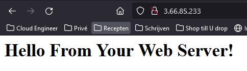
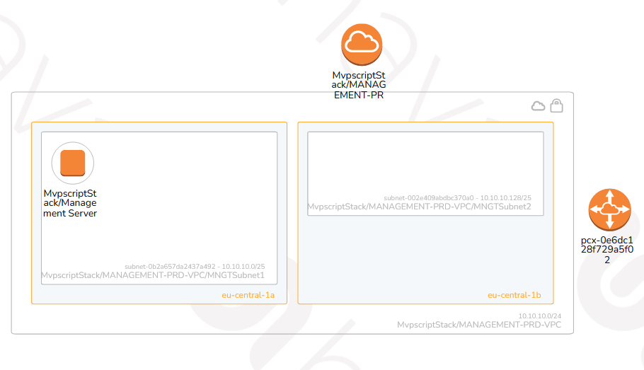

# Epic Document

## Inhoud
- [Epic-12: Wat zijn de wijzigingen](https://github.com/techgrounds/cloud-6-repo-henkvanderduim/blob/main/mvpfinal/Epic%20Document%20v1.1.md#epic-12-wat-zijn-de-wijzigingen)
- [Epic-13: Infrastructuur](https://github.com/techgrounds/cloud-6-repo-henkvanderduim/blob/main/mvpfinal/Epic%20Document%20v1.1.md#epic-13-infrastructuur)
- [Epic-14: Er moet een Load Balancer komen](https://github.com/techgrounds/cloud-6-repo-henkvanderduim/blob/main/mvpfinal/Epic%20Document%20v1.1.md#epic-14-er-moet-een-load-balancer-komen)
- [Epic-15: Auto Scaling Group](https://github.com/techgrounds/cloud-6-repo-henkvanderduim/blob/main/mvpfinal/Epic%20Document%20v1.1.md#epic-15-auto-scaling-group)
- [Epic-16: HTTP verbindingen](https://github.com/techgrounds/cloud-6-repo-henkvanderduim/blob/main/mvpfinal/Epic%20Document%20v1.1.md#epic-16-http-verbindingen)
- [Epic-17: Health Check van de Webserver](https://github.com/techgrounds/cloud-6-repo-henkvanderduim/blob/main/mvpfinal/Epic%20Document%20v1.1.md#epic-17-health-check-van-de-webserver)
  
## Epic-12: Wat zijn de wijzigingen
| Item                | Opmerking                                                                                                                                                           |
| :------------------ | :------------------------------------------------------------------------------------------------------------------------------------------------------------------ |
| Kenmerk             | Exploratie                                                                                                                                                          |
| Omschrijving        | Wij hebben nieuwe informatie ontvangen met een aantal aanvullingen/aanpassingen t.o.v. MVP v1.0. Dit brengt nieuwe eisen en eventuele nieuwe aannames met zich mee. |
| Doel                | Een puntsgewijze overzicht van alle eisen en besluiten                                                                                                              |
| Team problem        | Projectdocument is op een aantal punten niet duidelijk genoeg                                                                                                       |
| Team value          | A.d.h.v. best practices en AWS documentatie duidelijkheid krijgen over de nieuwe eisen                                                                              |
| Aannames            | Geen aannames                                                                                                                                                       |
| Doen we niet        | Afwijken van de aanpassingen/aanvullingen in het nieuwe project document                                                                                            |
| Acceptatie criteria | Door te testen zien wij of alles naar behoren werkt                                                                                                                 |

### Opsomming van de Eisen en Besluiten
| Eisen                                                                                                                                                                                                                                         |
| :-------------------------------------------------------------------------------------------------------------------------------------------------------------------------------------------------------------------------------------------- |
| De webserver moet niet meer “naakt” op het internet te benaderen zijn. Het liefst ziet de klant dat een load balancer ertussen komt. Ook zal de server geen publiek IP adres meer moeten hebben.                                              |
| Mocht een gebruiker via HTTP verbinden maken met de load balancer dan zou deze verbinding automatisch geupgrade moeten worden naar HTTPS.                                                                                                     |
| Hierbij moet de verbinding beveiligd zijn met minimaal TLS 1.2 of hoger.                                                                                                                                                                      |
| De webserver moet met enige regelmaat een ‘health check’ ondergaan.                                                                                                                                                                           |
| Mocht de webserver deze health check falen dan zou de server automatisch hersteld moeten worden.                                                                                                                                              |
| Mocht de webserver onder aanhoudende belasting komen te staan dan zou er een tijdelijke extra server opgestart moeten worden. De klant denkt dat er nooit meer dan 3 servers totaal nodig zijn gezien de gebruikersaantallen in het verleden. |
|                                                                                                                                                                                                                                               |

| Besluiten                                                                                                                |
| :----------------------------------------------------------------------------------------------------------------------- |
| De VPC waar de webserver gesitueerd is zal naast Public Subnets nu ook Private Subnets bevatten                          |
| Er wordt een Application Load Balancer (ALB) geïnstalleerd                                                               |
| Via HTTP verbinden? Dan wordt de verbinding automatisch geupgrade naar HTTPS. Dit vindt plaats in de ALB                 |
| Vanuit de ALB zal regelmatig een health check worden uitgevoerd op de webserver(s)                                       |
| Om de aanhoudende belasting van de webserver het hoofd te bieden, installeren wij een Auto Scaling Group (max 3 servers) |
| Best Practices en AWS Documentatie zijn leidend!                                                                         |
| Documentatie wordt geschreven voor een Engineer                                                                          |

[naar boven](https://github.com/techgrounds/cloud-6-repo-henkvanderduim/blob/main/mvpfinal/Epic%20Document%20v1.1.md#inhoud)
## Epic-13: Infrastructuur
| Item                | Opmerking                                                                                                        |
| :------------------ | :--------------------------------------------------------------------------------------------------------------- |
| Kenmerk             | Exploratie                                                                                                       |
| Omschrijving        | Bij het nieuwe document is geen diagram of te gebruiken AWS diensten meegegeven. Deze zijn door ons zelf gemaakt |
| Doel                | Een overzicht van de infrastructuur en alle diensten die gebruikt gaan worden                                    |
| Team problem        | Geen diagram en geen AWS diensten zijn aanwezig                                                                  |
| Team value          | Overzicht van de infrastructuur en AWS diensten die gebruikt gaan worden                                         |
| Aannames            | Best practices en AWS documentatie is voldoende                                                                  |
| Doen we niet        | Zelf van alles verzinnen!                                                                                        |
| Acceptatie criteria | Overzicht van de infrastructuur en de te gebruiken AWS diensten                                                  |

### Infrastructuur
.drawio.png)  

### Overzicht AWS diensten
  

[naar boven](https://github.com/techgrounds/cloud-6-repo-henkvanderduim/blob/main/mvpfinal/Epic%20Document%20v1.1.md#inhoud)

## Epic-14: Er moet een Load Balancer komen
| Item                | Opmerking                                                                                                                                                                                        |
| :------------------ | :----------------------------------------------------------------------------------------------------------------------------------------------------------------------------------------------- |
| Kenmerk             | v1.1                                                                                                                                                                                             |
| Omschrijving        | De webserver moet niet meer “naakt” op het internet te benaderen zijn. Het liefst ziet de klant dat een load balancer ertussen komt. Ook zal de server geen publiek IP adres meer moeten hebben. |
| Doel                | De webserver wordt geplaatst in een Private Subnet, het Public Subnet krijgt een NAT Gateway. Er wordt tevens een Application Load Balancer geïnstalleerd                                        |
| User problem        | Webserver is "naakt" op het internet te benaderen                                                                                                                                                |
| User value          | Webserver niet meer te benaderen via een eigen public IP, maar slechts via de Load Balancer                                                                                                      |
| Aannames            | Best Practices en AWS documentatie voorzien in de juiste configuratie                                                                                                                            |
| Doen we niet        | Afwijken van het hier gestelde                                                                                                                                                                   |
| Acceptatie criteria | Bij het testen moet de webserver alleen maar te benaderen zijn via de Load Balancer                                                                                                              |

### Netwerk tekening
.jpg)   

[naar boven](https://github.com/techgrounds/cloud-6-repo-henkvanderduim/blob/main/mvpfinal/Epic%20Document%20v1.1.md#inhoud)
## Epic-15: Auto Scaling Group
| Item                | Opmerking                                                                                                                                                                                                                                    |
| ------------------- | -------------------------------------------------------------------------------------------------------------------------------------------------------------------------------------------------------------------------------------------- |
| Kenmerk             | v1.1                                                                                                                                                                                                                                         |
| Omschrijving        | Mocht de webserver onder aanhoudende belasting komen te staan dan zou er een tijdelijke extra server opgestart moeten worden. De klant denkt dat er nooit meer dan 3 servers totaal nodig zijn gezien de gebruikersaantallen in het verleden |
| Doel                | Een Auto Scaling Group installeren die bij aanhoudende belasting extra webservers inzet                                                                                                                                                      |
| User problem        | Bij aanhoudende belasting van de webserver zal deze er aan onder door gaan                                                                                                                                                                   |
| User value          | De Auto Scaling Group zorgt ervoor dat bij aanhoudende belasting van de webserver, deze meer webservers zal opstarten, zodat de website bereikbaar blijft                                                                                    |
| Aannames            | Best Practices en AWS documentatie voorzien in de juiste configuratie                                                                                                                                                                        |
| Doen we niet        | Afwijken van het hierboven gestelde                                                                                                                                                                                                          |
| Acceptatie criteria | Als bij het testen blijkt dat bij aanhoudende belasting er meerdere webservers worden opgestart. En bij afnemende belasting de extra webservers ook weer verdwijnen                                                                          |

### Webserver in de lucht
  

[naar boven](https://github.com/techgrounds/cloud-6-repo-henkvanderduim/blob/main/mvpfinal/Epic%20Document%20v1.1.md#inhoud)
## Epic-16: HTTP verbindingen
| Item                | Opmerking                                                                                                                                                                                                         |
| ------------------- | ----------------------------------------------------------------------------------------------------------------------------------------------------------------------------------------------------------------- |
| Kenmerk             | v1.1                                                                                                                                                                                                              |
| Omschrijving        | Mocht een gebruiker via HTTP verbinden maken met de load balancer dan zou deze verbinding automatisch geupgrade moeten worden naar HTTPS. Hierbij moet de verbinding beveiligd zijn met minimaal TLS 1.2 of hoger |
| Doel                | alleen HTTPS verbindingen naar de webserver                                                                                                                                                                       |
| User problem        | Geen HTTP verbindingen naar de webserver                                                                                                                                                                          |
| User value          | Alleen HTTPS verbindingen naar de webserver, beveiligd met minimaal TLS 1.2                                                                                                                                       |
| Aannames            | Best Practices en AWS documentatie voorzien in de juiste configuratie. Wij maken een self-signed certificaat voor de test doeleinden                                                                              |
| Doen we niet        | Afwijken van het hierboven gestelde                                                                                                                                                                               |
| Acceptatie criteria | Als getest is dat de toegang beperkt is tot hoe wij het ingericht hebben                                                                                                                                          |

### Management Server Stack
  

[naar boven](https://github.com/techgrounds/cloud-6-repo-henkvanderduim/blob/main/mvpfinal/Epic%20Document%20v1.1.md#inhoud)
## Epic-17: Health Check van de Webserver
| Item                                                                                            | Opmerking                                                                                                                                                              |
| :---------------------------------------------------------------------------------------------- | :--------------------------------------------------------------------------------------------------------------------------------------------------------------------- |
| Kenmerk                                                                                         | v1.1                                                                                                                                                                   |
| Omschrijving                                                                                    | De webserver moet met enige regelmaat een ‘health check’ ondergaan.                                                                                                    |
| Mocht de webserver deze health check falen dan zou de server automatisch hersteld moeten worden |
| Doel                                                                                            | Zorgen voor een regelmatige health check van de webserver. Indien de health check faalt, moet er terstond een nieuwe webserver opgestart worden                        |
| User problem                                                                                    | Nu geen inzicht in de 'health' van de webserver                                                                                                                        |
| User value                                                                                      | Door regelmatig een health check uit te voeren en automatisch te laten ingrijpen als het noodzakelijk is, is dit proes geautomatiseerd en zorgt voor rust bij de klant |
| Aannames                                                                                        | S3 bucket wordt gebruikt met versioning en encryptie                                                                                                                   |
| Doen we niet                                                                                    | Best Practices en AWS documentatie voorzien in de juiste configuratie                                                                                                  |
| Acceptatie criteria                                                                             | Als bij het testen blijkt dat bij het uitvallen van de webserver er automatisch een nieuwe wordt opgestart                                                             |

### Schema van de S3 Bucket in het diagram
.jpg)  
 

[naar boven](https://github.com/techgrounds/cloud-6-repo-henkvanderduim/blob/main/mvpfinal/Epic%20Document%20v1.1.md#inhoud)
