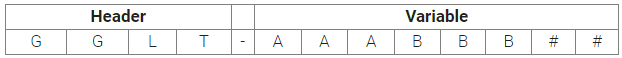

# Parameters
In de tabel hieronder wordt uitleg gegeven over de Parameters die gebruikt worden in het bestand 'mvpscript_stack.py'.  
Als bepaalde termen je als Cloud Engineer onbekend voorkomen dan heb ik hier de oplossing: [Cloud Engineer](https://techgrounds.nl/wp-content/uploads/2022/02/Cloud-opleiding-voor-deelnemers.pdf).  
Dit bestand hoort bij MVP v1.1.  

## Naamgevingsconventie
Tijdens het volgen van deze opleiding, heb ik ontdekt dat ik een proces nodig heb voor het bouwen van een effectieve naamgevingsconventie voor projecten. Server- en desktopvirtualisatie verhoogt het aantal objecten binnen organisaties aanzienlijk.Een effectieve naamgevingsconventie die beschrijft wat een object is, zijn locatie, functie en doel, is van cruciaal belang. Hierdoor kunnen we objecten op een snelle manier identificeren, maar het biedt ook een gestructureerde manier om op een logische manier naar objecten te zoeken met behulp van trefwoorden.  
  
### Basisrichtlijnen
- Een naam moet de locatie van het apparaat en zijn doel/functie/service identificeren.
- Een naam moet eenvoudig zijn maar toch betekenisvol zijn voor systeembeheerders, systeemondersteuning en operations.
- De norm moet consistent zijn. Eenmaal ingesteld, mag de naam niet veranderen.
- Vermijd speciale tekens; gebruik alleen alfanumerieke tekens.
- Vermijd het gebruik van numerieke cijfers, behalve het eindvolgnummer.
- Vermijd het gebruik van specifieke product- of leveranciersnamen, aangezien deze aan verandering onderhevig kunnen zijn. (Er zijn enkele algemeen - aanvaarde uitzonderingen: Oracle, SMS, SQL, CTX, VMW)

### Enkele basisaanbevelingen:
- De naam moet beginnen met een star kopgedeelte dat de locatie identificeert en optioneel een type-ID. Deze moeten worden gevolgd door een scheidingsteken om het einde van het kopgedeelte aan te duiden. Dit scheidingsteken moet een "-" (streepje) zijn, tenzij het systeem een ​​"-" niet herkent. Vervang in dit geval het streepje door een ander geschikt overeengekomen teken (bijv. _ of $ of #).
- Zorg voor een variabele sectie die de identificatie voltooit (functie, dienst, doel, toepassing).
- Beëindig de naam met een uniek ID, een volgnummer, dat multifunctioneel kan zijn.
- Zorg voor flexibiliteit. Aangezien de technologie voortdurend evolueert, moet ook deze standaard kunnen evolueren. Indien nodig kan deze standaard worden aangepast om rekening te houden met technologische, infrastructuur- en/of zakelijke veranderingen.
- Er moet handhaving zijn, samen met nauwkeurige en actuele documentatie voor alle apparaten.

### Voorbeeld
**Structuur**  
  

*Header*:  
GG -- Geografische locatie  
L -- Locatie moet generiek zijn en niet leverancier- of gebouwspecifiek om verhuizingen, naamsveranderingen van gebouwen als gevolg van fusies, overnames of ontbinding van het bedrijf, enz. te vergemakkelijken.  
T -- Type  
"-" -- Liggend streepje is een vereist scheidingsteken om het einde van het kopgedeelte aan te duiden  

*Variable*:  
AAA -- Functie/Service/Doel  
BBB -- Toepassing  
(Unieke ID)  
"##" -- 2-cijferige reeks #  

**Waarden gedefinieerd**:  

Geografisch:  
AM -- Amsterdam  
HV -- Hilversum  
FF -- Frankfurt  
LO -- London  
MA -- Madrid  
SI -- Singapore  
MU -- Mumbai  
GL -- Global  

Plaats:  
D -- Hoofddatacentrum  
C -- COLO-datacentrum  
T -- Testgebied (moet worden gebruikt voor testmachines die permanent in de testomgeving moeten blijven)  

Soort (optioneel):  
V -- Virtueel  
C -- Clusterserver  
P -- Fysiek  
O -- Uitbesteed of door een leverancier ondersteund systeem  

Scheidingsteken (vereist):  
Er wordt een "-" (liggend streepje) gebruikt, tenzij het systeem een "-" niet herkent, waarna een overeengekomen teken kan worden vervangen. Dit kan een _ of $ of # of een ander teken zijn.  

**Variabele portie - AAA**  
Identificeer het primaire doel van het apparaat:  

DC -- Domeincontroller  
FS -- Bestandsserver  
PS -- Afdrukserver  
ORA -- Oracle-database  
SQL -- SQL-database  
DB -- andere database(s)  
EXH -- Microsoft Exchange  
CTX -- Citrix Server  
ESX -- VMware ESX-server  

**Variabele portie BBB**  
Identificeer de toepassing op deze server. Als de server voor een specifieke applicatie is, moet een applicatie-ID het tweede deel van dit gedeelte van de naam zijn, voorafgegaan door de service:

JDE -- JDEdwards  
DYN -- Dyna  
EPC -- Episch  

Dit deel van de naam biedt veel flexibiliteit om identifiers voor specifieke doeleinden, functies en/of toepassingen te verwerken. Er zijn veel uitdagingen om identifiers te selecteren die zinvol en consistent zijn en niet vaak worden gewijzigd. Hier zijn enkele voorbeelden gebaseerd op de richtlijnen die ik hierboven voorstel:

CHD-DC01 -- Chicago Office, datacenter, domeincontroller, volgorde # 1  
CHD-FS01 -- Chicago Office, datacenter, bestandsserver, volgorde # 1  
CHD-EXH01 -- Chicago Office, Data Center, Microsoft Exchange, reeks # 1  
CHD-ESX01 -- Chicago Office, Data Center, VMware ESX Server, volgorde # 1  
CHC-CTXJDE01 -- Chicago Office, Data Center, Citrix Server, JDEdwards-toepassing, volgorde # 1  
CHC-WEB01 -- Chicago Office, datacenter, webserver, volgorde # 1  

Uniek ID/volgnummer  
"##" Dit is een 2-cijferig volgnummer  

### Tagging beperkingen
- Maximaal aantal tags per resource – 10  
- Maximale sleutellengte (key) – 127 Unicode-tekens  
- Maximale waardelengte (value) – 255 Unicode-tekens  
- Tagsleutels en -waarden zijn hoofdlettergevoelig  
- Tagsleutels moeten uniek zijn per resource  
- Gebruik het voorvoegsel "aws:" niet in je tagnaam of -waarden omdat het is gereserveerd voor AWS-gebruik

### Oh ja
Alle variabelen moeten tussen aanhalingstekens gezet worden (zie cdk.json) (" "). Getallen en Booleans (true/false) mogen geen aanhalingstekens hebben.  

## CDK JSON Tabel
| Parameter                         | wat wordt er ingevuld                                                                                          | Voorbeeld                                                                                 |
| :-------------------------------- | :------------------------------------------------------------------------------------------------------------- | :---------------------------------------------------------------------------------------- |
| **VPC**                           |                                                                                                                |                                                                                           |
| mngt_name                         | Naam van de VPC voor de MANAGEMENT-PRD-VPC                                                                     | "FFDV-VPVMNG01"                                                                           |
| mngt_cidr_block                   | CIDR Block voor de MANAGEMENT-PRD-VPC                                                                          | "10.0.0.0/24"                                                                             |
| mngt_cidr_mask                    | CIDR Mask voor de subnets in de MANAGEMENT-PRD-VPC                                                             | 26                                                                                        |
| mngt_subnet_name                  | Subnet naam voor de subnets in de MANAGEMENT-PRD-VPC                                                           | "MNGT"                                                                                    |
| mngt_max_azs                      | Aantal Availability Zones (AZ) in de MANAGEMENT-PRD-VPC                                                        | 3                                                                                         |
| asg_name                          | Naam van de VPC voor de Autoscaling APP-PRD-VPC                                                                | "FFDV-VPCASG01"                                                                           |
| asg_cidr_block                    | CIDR Block voor de APP-PRD-VPC                                                                                 | "10.10.0.0/24"                                                                            |
| asg_cidr_mask                     | CIDR Mask voor de subnets in de APP-PRD-VPC                                                                    | 26                                                                                        |
| public_asg_subnet_name            | Subnet naam voor de Public subnets in de APP-PRD-VPC                                                           | "ASG-Public"                                                                              |
| private_asg_subnet_name           | Subnet naam voor de Private subnets in de APP-PRD-VPC                                                          | "ASG-Private"                                                                             |
| asg_max_azs                       | Aantal Availability Zones (AZ) in de APP-PRD-VPC                                                               | 3                                                                                         |
| vpcp_name                         | De naam van de VPC Peering Connectie                                                                           | "VPCPeeringConnection"                                                                    |
| vpcp_region                       | De regio waarin de VPC Peering plaatsvindt                                                                     | "eu-central-1"                                                                            |
| mngt_vpcp_route                   | VPC Route Table naam voor MANAGEMENT-PRD-VPC                                                                   | "MNGT-Route"                                                                              |
| asg_vpcp_route                    | VPC Route Table naam voor APP-PRD-VPC                                                                          | "ASG-Route"                                                                               |
| **Role**                          |                                                                                                                |                                                                                           |
| iam_ssm_role                      | Naam van de Role                                                                                               | "InstanceSSM"                                                                             |
| iam_ssm_principal                 | De Principal van de Role, in dit geval de ec2                                                                  | "ec2.amazonaws.com"                                                                       |
| **Bucket**                        |                                                                                                                |                                                                                           |
| bucket_name                       | Naam van de Bucket                                                                                             | "GLDV-S3BUC01"                                                                            |
| versioned                         | Versioned toepassen                                                                                            | true/false                                                                                |
| auto_delete_objects               | Bij verwijderen van de bucket, automatisch de inhoud van de bucket verwijderen                                 | true/false                                                                                |
| deployment_name                   | Naam van de bucket deployment                                                                                  | "GLDV-S3BUCDP"                                                                            |
| asset_bucket                      | Bron van de file(s) die in de bucket geplaatst worden                                                          | "./bucket"                                                                                |
| **Security Groups**               |                                                                                                                |                                                                                           |
| mngt_sg_name                      | Naam van de Security Group in het subnet van de  MANAGEMENT-PRD-VPC omgeving                                   | "FFDV-SGMNG01"                                                                            |
| mngt_sg_description               | Omschrijving van de Security Group in het subnet van de MANAGEMENT-PRD-VPC omgeving                            | "Management Security Group"                                                               |
| mngt_sg_allow_all_outbound        | *Rule* voor al het uitgaande verkeer in het subnet van de MANAGEMENT-PRD-VPC omgeving                          | true/false                                                                                |
| mngt_trusted_ip_ssh               | Lijst van *trusted* IP Adressen voor SSH toegang                                                               | ["10.10.10.0", "10.10.10.1", 10.10.10.2"]                                                 |
| mngt_trusted_ip_rdp               | Lijst van *trusted* IP Adressen voor RDP teogang                                                               | ["10.10.10.0", "10.10.10.1", 10.10.10.2"]                                                 |
| mngt_sg_ssh_rule_port             | De poort waarmee er via SSH toegang verkregen wordt                                                            | 22                                                                                        |
| mngt_sg_rdp_rule_port             | De poort waarmee er via RDP toegang verkregen wordt                                                            | 3389                                                                                      |
| asg_sg_name                       | Naam van de Security Group in het subnet van de APP-PRD-VPC omgeving                                           | "FFDV-SGASG01"                                                                            |
| asg_sg_description                | Omschrijving van de Security Group in het subnet van de APP-PRD-VPC omgeving                                   | "Auto-Scaling-Security-Group"                                                             |
| asg_sg_allow_all_outbound         | *Rule* voor al het uitgaande verkeer in het subnet van de APP-PRD-VPC omgeving                                 | true/false                                                                                |
| asg_sg_rule_port                  | De poort waarmee via SHH toegang verkregen wordt                                                               | 22                                                                                        |
| asg_sg_http_rule_port             | De poort waarmee via HTTP toegang verkregen wordt                                                              | 80                                                                                        |
| asg_sg_https_rule_port            | De poort waarmee via HTTPS toegang verkregen wordt                                                             | 443                                                                                       |
| asgsg_elb_port                    | De poort waarmee via HTTP toegang verkregen wordt                                                              | 80                                                                                        |
| elbsg_name                        | Naam van de Security Group voor de Load Balancer                                                               | "FFDV-ALBSG01"                                                                            |
| elbsg_description                 | Omschrijving van de Security Group voor de Load Balancer                                                       | "Load Balancer Security Group"                                                            |
| elbsg_allow_all_outbound          | *Rule* voor al het uitgaande verkeer van de Load Balancer                                                      | true/false                                                                                |
| elbsg_http_rule_port              | De poort waarmee via HTTP toegang verkregen wordt                                                              | 80                                                                                        |
| elbsg_https_rule_port             | De poort waarmee via HTTPS toegang verkregen wordt                                                             | 443                                                                                       |
| **Key Pairs**                     |                                                                                                                |                                                                                           |
| mngt_kp                           | Key Pair voor de EC2 instance in MANAGEMENT-PRD-VPC omgeving                                                   | "FFDV-KPMNG01"                                                                            |
| mngt_kp_name                      | Naam van het Key Pair voor de EC2 instance in de MANAGEMENT-PRD-VPC omgeving                                   | "FFDV-KPMNG01"                                                                            |
| mngt_kp_description               | Omschrijving van de Key Pair voor de EC2 Instance in de MANAGEMENT-PRD-VPC omgeving                            | "Key Pair MNGT"                                                                           |
| mngt_kp_store                     | Moet de *Public Key* van het Key Pair voor de EC2 instance in de MANAGEMENT-PRD-VPC omgeving worden opgeslagen | true/false                                                                                |
| asg_kp                            | Key Pair voor de EC2 instance in APP-PRD-VPC omgeving                                                          | "FFDV-KPASG01"                                                                            |
| asg_kp_name                       | Naam van de Key Pair voor de EC2 instance in de APP-PRD-VPC omgeving                                           | "FFDV-KPASG01"                                                                            |
| asg_kp_description                | Omschrijving van de Key Pair voor de EC2 Instance in de APP-PRD-VPC omgeving                                   | "Key Pair ASG"                                                                            |
| asg_kp_store                      | Moet de *Public Key* van het Key Pair voor de EC2 instance in de APP-PRD-VPC omgeving worden opgeslagen        | true/false                                                                                |
| **Load Balancer**                 |                                                                                                                |                                                                                           |
| lb_name                           | Naam van de Load Balancer                                                                                      | "FFDV-ALBASG01"                                                                           |
| lb_if                             | Is de Load Balancer *Internet Facing*                                                                          | true/false                                                                                |
| arn_cert                          | Certificaat voor SSL/TLS                                                                                       | "arn:aws:acm:eu-central-1:ACCOUNTNUMMER:certificate/2342992a-8903-4b4b-8ea5-0cd4d9bafc0b" |
| list_name                         | Naam van de Listener                                                                                           | "ASG-LB-Listener"                                                                         |
| list_name                         | De *Target Group* van de Listener                                                                              | "ASG-LB-Target-Group"                                                                     |
| **EC2 Instances**                 |                                                                                                                |                                                                                           |
| mngt_ec2_name                     | Naam van de EC2 Instance in de MANAGEMENT-PRD-VPC omgeving                                                     | "FFDV-EC2MNG01"                                                                           |
| mngt_ec2_instance_type            | Het type van de EC2 Instance in de MANAGEMENT-PRD-VPC omgeving                                                 | "t2.micro"                                                                                |
| mngt_ec2_encrypted                | Aangeven of alles versleuteld dient te worden van de EC2 Instance in de MANAGEMENT-PRD-VPC omgeving            | true/false                                                                                |
| asg_ec2_name                      | Naam van de EC2 Instance in de APP-PRD-VPC omgeving                                                            | "FFDV-EC2ASG01"                                                                           |
| asg_ec2_instance_type             | Het type van de EC2 Instance in de APP-PRD-VPC omgeving                                                        | "t2.micro"                                                                                |
| asg_ec2_encrypted                 | Aangeven of alles versleuteld dient te worden van de EC2 Instance in de APP-PRD-VPC omgeving                   | true/false                                                                                |
| asg_delete                        | Moet de EC2 Instance verwijderd worden in geval van *Termination*                                              | true/false                                                                                |
| **Webscript**                     |                                                                                                                |                                                                                           |
| wsrv_asset_name                   | Naam van de asset die je gebruikt om het webscript te lanceren                                                 | "Asset"                                                                                   |
| wsrv_asset_path                   | Pad incl. bash script                                                                                          | "./bucket/webtestserver.sh"                                                               |
| wsrv_asset_region                 | Regio waarin het webscript gelanceerd moet worden                                                              | "eu-central-1"                                                                            |
| **Tags**                          |                                                                                                                |                                                                                           |
| mngt_tag_key                      | De key waarde van de tag in de MANAGEMENT-PRD-VPC omgeving                                                     | "Management Server"                                                                       |
| mngt_tag_value                    | De Value behorende bij de key in de MANAGEMENT-PRD-VPC omgeving                                                | "MSBackup"                                                                                |
| asg_tag_key                       | De key waarde van de tag in de APP-PRD-VPC omgeving                                                            | "ASG"                                                                                     |
| asg_tag_value                     | De Value behordende bij de key in de APP-PRD-VPC omgeving                                                      | "ASGBackup"                                                                               |
| **Bus** Backup Vaults/Plans/Rules |                                                                                                                |                                                                                           |
| mngt_vault_key                    | Naam van de sleutel van de Backup Vault in de MANAGEMENT-PRD-VPC omgeving                                      | "MNGT-BACKUP-KEY"                                                                         |
| mngt_vault_name                   | Naam van de vault in de MANAGEMENT-PRD-VPC omgeving                                                            | "MNGT-Backup-Vault"                                                                       |
| mngt_backup_vault_name            | Naam van de Backup Vault in de MANAGEMENT-PRD-VPC omgeving                                                     | "MNGT-Backup-Vault"                                                                       |
| mngt_backup_plan                  | Naam van het Plan in de MANAGEMENT-PRD-VPC omgeving                                                            | "MNGT-BACKUP-PLAN"                                                                        |
| mngt_backup_plan_name             | Naam van het Backup Plan in de MANAGEMENT-PRD-VPC omgeving                                                     | "MNGT-BACKUP-PLAN"                                                                        |
| mngt_rule_name                    | Naam van de Backup Rule in de MANAGEMENT-PRD-VPC omgeving                                                      | "MNGT-Backup-Rule"                                                                        |
| mngt_minute                       | De minuut van de cron job in de Backup Rule in de MANAGEMENT-PRD-VPC omgeving                                  | "0"                                                                                       |
| mngt_hour                         | Het uur van de cron job in de Backup Rule in de MANAGEMENT-PRD-VPC omgeving                                    | "0"                                                                                       |
| mngt_month                        | De maand(en) van de cron job in de Backup Rule in de MANAGEMENT-PRD-VPC omgeving                               | "1-12"                                                                                    |
| mngt_weekday                      | De dag(en) van de week van de cron job in de Backup Rule in de MANAGEMENT-PRD-VPC omgeving                     | "4"                                                                                       |
| mngt_duration                     | Het aantal dagen dat de backups bewaart blijven in de MANAGEMENT-PRD-VPC omgeving                              | 13                                                                                        |
| asg_vault_key                     | Naam van de sleutel van de Backup Vault in de APP-PRD-VPC omgeving                                             | "ASG-BACKUP-KEY"                                                                          |
| asg_vault_name                    | Naam van de vault in de APP-PRD-VPC omgeving                                                                   | "ASG-Backup-Vault"                                                                        |
| asg_backup_vault_name             | Naam van de Backup Vault in de APP-PRD-VPC omgeving                                                            | "ASG-Backup-Vault"                                                                        |
| asg_backup_plan                   | Naam van het Plan in de APP-PRD-VPC omgeving                                                                   | "ASG-BACKUP-PLAN"                                                                         |
| asg_backup_plan_name              | Naam van het Backup Plan in de APP-PRD-VPC omgeving                                                            | "ASG-BACKUP-PLAN"                                                                         |
| asg_rule_name                     | Naam van de Backup Rule in de APP-PRD-VPC omgeving                                                             | "ASG-Backup-Rule"                                                                         |
| asg_minute                        | De minuut van de cron job in de Backup Rule in de APP-PRD-VPC omgeving                                         | "30"                                                                                      |
| asg_hour                          | Het uur van de cron job in de Backup Rule in de APP-PRD-VPC omgeving                                           | "4"                                                                                       |
| asg_month                         | De maand(en) van de cron job in de Backup Rule in de APP-PRD-VPC omgeving                                      | "1-12"                                                                                    |
| asg_weekday                       | De dag(en) van de week van de cron job in de Backup Rule in de APP-PRD-VPC omgeving                            | "*"                                                                                       |
| asg_duration                      | Het aantal dagen dat de backups bewaart blijven in de APP-PRD-VPC omgeving                                     | 7                                                                                         |
